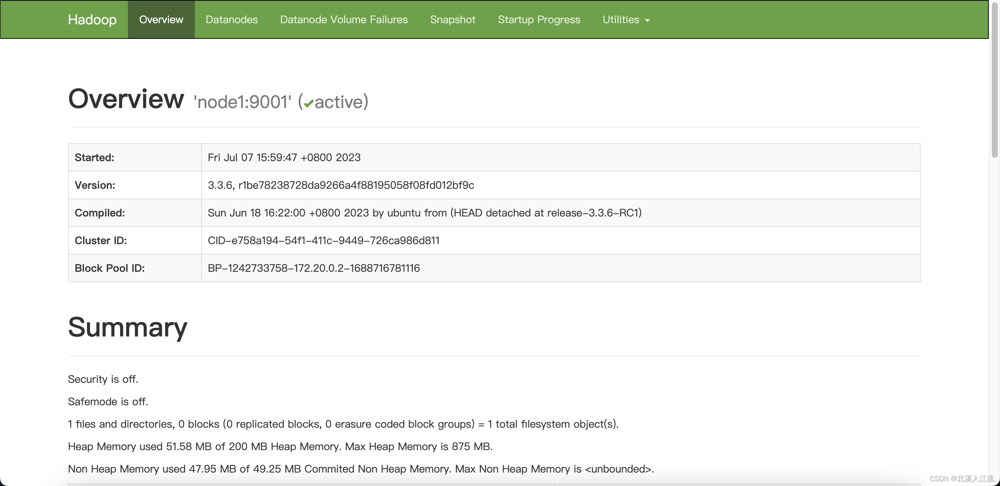

# HDFS简介
HDFS（Hadoop Distributed File System）Hadoop分布式文件系统，是Hadoop项目中关于数据存储的组件，是Hadoop项目的一部分。
## HDFS数据存储访问方式
HDFS采用主从模式的分布式存储方式存储文件。对于超大的数据而言，单个服务器无法承担对改数据的存储和读取工作。所以采用分布式的架构对文件进行存储。HDFS将大数据分割成不同的小部分数据，将分割后的数据存储在不同的服务器上，环境了服务器的存储压力。且在对数据进行传输的过程中，单服务器存储数据只能利用自己本身的网络传输，而在分布式的存储中，可以充分利用到多台主机进行网络传输，更好的利用到了网络带宽。HDFS会冗余性的为数据创建副本，保证了数据的安全性，避免因为硬件或软件的损坏导致数据的丢失。且HDFS将副本分布在多台主机中，当需要读取数据时，HDFS会自动根据请求地址，所以传输效率最高的副本进行网络传输。
## HDFS节点
在HDFS中，节点按照功能和类型可以划分为NameNode（主节点）、SecondaryNameNode（辅助节点）、DataNode（从节点）
- NameNode（主节点）：
	- HDFS系统的主节点
	- 管理整个文件系统
	- 管理DataNode从节点
```xml
# 在 ${HADOOP_CONF_DIR}/core-site.xml文件中对主节点的通讯路径进行配置
# 在节点间通过hdfs协议进行数据通讯
<property>
	<name>fs.defaultFS</name>
	<value>hdfs://node1:9001</value>
</property>
```
- SecondaryNameNode（辅助节点）：
	- NameNode的辅助节点
	- 主要帮助NameNode完成对元数据的处理工作
	- 在调用`start-dfs.sh`脚本的主机中自动启动SecondaryNameNode进程
- DataNode（从节点）：
	- 主要负责数据的存储与管理
```xml
# 在 ${HADOOP_CONF_DIR}/hdfs-site.xml文件中对DataNode进行配置
<property>
	<name>dfs.namenode.hosts</name>
	<value>node1, node2, node3</value>
</property>
```
## HDFS的数据存储原理
- HDFS将文件分割成多个部分进行分布式存储，在进行存储时，为更好的对文件进行统一管理，HDFS以block块结构统一文件的大小，方便管理
```xml
# 在 ${HADOOP_CONF_DIR}/hdfs-site.xml文件中对block大小进行配置
<property>
	<name>dfs.blocksize</name>
	<value>268435456</value>
</property>
```
- 为防止因为丢失block块或块损坏而造成的文件不完整，HDFS在存储时采用多个副本的方式对数据进行备份操作
```xml
# 在 ${HADOOP_CONF_DIR}/hdfs-site.xml文件中对副本数量进行配置
<property>
	<name>dfs.replication</name>
	<value>3</value>
</property>
```
## HDFS元数据（Block块管理）
在HDFS中，由NameNode主节点来对Block块进行管理。NameNode通过edits和fsimage在完成对整个文件系统的管理和维护
- edits文件：
	- edits文件记录hdfs文件系统的每一次操作，以及操作影响到的block块结构
	- 随着记录的增加，edits会越来越大，影响对数据的检索效果，edits当文件到一定大小时会创建新的edits文件，多个edits文件确保系统的检索性能
- fsimage文件：
	- 在进行检索时，需要从多个edits文件中从头到尾进行检索
	- 为解决需要全部检索的问题，hdfs定期或事务数达到一定值的时候对edits进行合并，生成最终的结果，确保文件的检索效率
```xml
# 在 ${HADOOP_CONF_DIR}/hdfs-site.xml文件中设置edits文件合并时间
<property>
	<name>dfs.namenode.checkpoint.period</name>
	<value>3600</value>
</property>
# 在 ${HADOOP_CONF_DIR}/hdfs-site.xml文件中设置edits文件合并事务数
<property>
	<name>dfs.namenode.checkpoint.txns</name>
	<value>1000000</value>
</property>
```
- 以上两个条件满足一个即进行文件的合并操作
- 文件的合并操作主要由SecondaryNameNode节点执行
## HDFS的数据读写流程
### HDFS数据写入流程
- 客户端向NameNode发起写入请求
	- NameNode节点只负责元数据的记录和权限审批，不经手数据 
- NameNode审核用户权限和节点的剩余空间
- NameNode告知客户端写入DataNode的地址
	- 该DataNode节点一般是和客户端网络距离最近的节点
- 客户端向DataNode发送数据，写入DataNode
- 由DataNode写入数据，并将数据发送给其他节点，完成数据的备份
	- 数据备份操作由DataNode节点之间自行完成
- 写入完成后，客户端发送NameNode写入完成通知
- NameNode记录写入的元数据
### HDFS数据读取流程
- 客户端向NameNode申请访问请求
- NameNode判断客户端权限
- NameNode告知客户端block列表
	- NameNode根据网络距离返回block列表
- DataNode根据block列表读取数据
# 启动HDFS
## HDFS初始化配置
根据前文配置好Hadoop的环境变量
### `${HADOOP_CONF_DIR}/hdfs-site.xml`
`hdfs-site.xml`文件主要为hdfs组件的核心配置。
```xml
# hdfs web ui界面
<property>
	<name>dfs.namenode.http-address</name>
	<value>node1:9000</value>
</property>
# hdfs文件系统默认创建的文件权限
<property>
	<name>dfs.datanode.data.dir.perm</name>
	<value>700</value>
</property>
# NameNode元数据存储位置
<property>
	<name>dfs.namenode.name.dir</name>
	<value>${HADOOP_DATA_HOME}/nn/</value>
</property>
# 允许加入NameNode的DataNode
<property>
	<name>dfs.namenode.hosts</name>
	<value>${nameNodeHosts}</value>
</property>
# hdfs block块大小
<property>
	<name>dfs.blocksize</name>
	<value>268435456</value>
</property>
# NameNode处理的并发线程数
<property>
	<name>dfs.namenode.handler.count</name>
	<value>100</value>
</property>
# DataNode的数据存储目录
<property>
	<name>dfs.datanode.data.dir</name>
	<value>${HADOOP_DATA_HOME}/dn/</value>
</property>
```
### 文件系统格式化
在存储namenode时，需要对文件系统进行格式化。
```shell
hadoop namenode -format
```
### 启动HDFS
执行完以上操作和配置后，即可调用hadoop的hdfs启动脚本启动HDFS
```shell
# 启动hdfs组件
start-hdfs.sh
# 关闭hdfs组件
stop-hdfs.sj
```
xxx-hdfs.sh脚本存放在hadoop的sbin路径下，配置好环境变量后直接执行即可。
### 查看启动状态
hadoop通过`jps`命令查看当前主机中部署的节点
```shell
$ jps
272 NameNode
448 Jps
408 DataNode
```
也可以通过配置的hdfs的web ui界面查看节点运行状态

