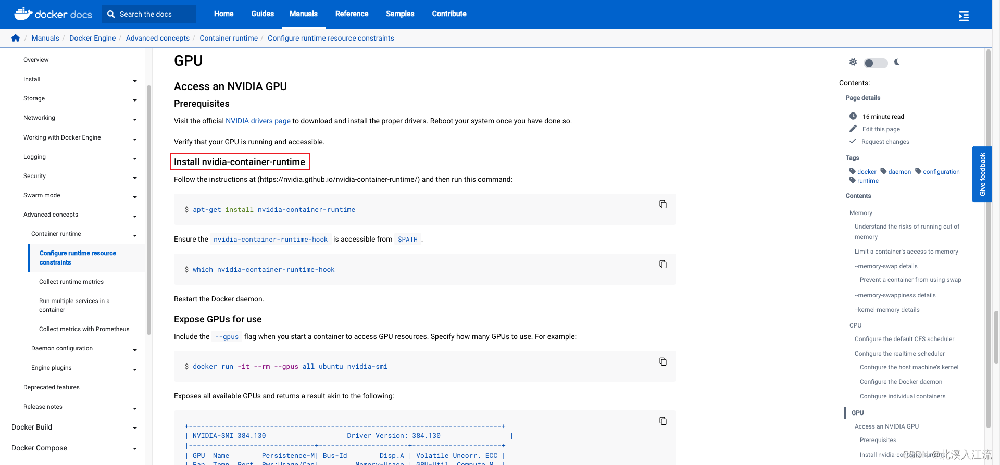
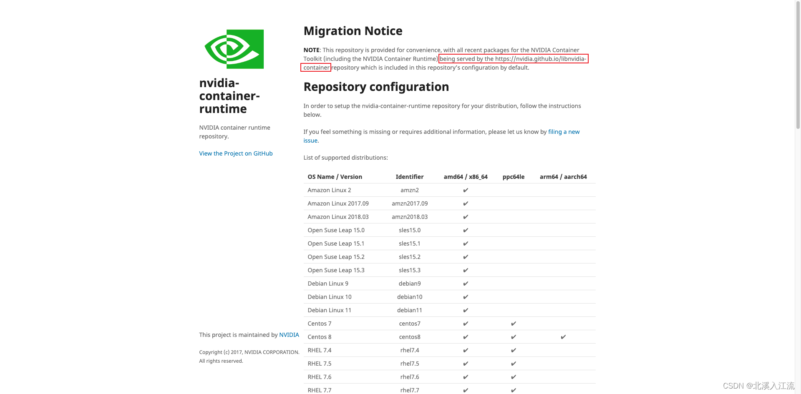

# docker 环境离线二进制安装
- [docker 二进制包下载位置](https://download.docker.com/linux/static/stable/)

## 下载二进制包
在无法联网的环境中安装软件包，我们无法依赖于现成的包管理工具，只能通过一个一个的下载包的方式来进行软件的下载安装，但这样操作难免会遇到依赖问题，复杂的依赖问题会严重的影响我们环境的下载。所以可以通过下载二进制可执行文件的方式来避免下载依赖的问题。

在 https://download.docker.com/linux/ 路径下选择static目录而不是其他Linux发行版来选择下载的包。根据系统CPU架构和docker版本选择相应的tgz压缩包。

docker下载位置包括`docker-${version}.tgz`和`docker-rootless-extras-${version}.tgz`两种版本的docker二进制文件压缩包。其他rootless-extras版本是为解决docker使用root身份存在的运行安全风险提出的rootless mode方案，目的是让dockerd守护进程以非root身份运行，根据需要选择对应版本。

## 解压.tgz包
解压`.tgz`压缩包：
```shell
tar -xzvf docker-xxx.tgz
```

添加可执行权限：（若是从其他系统上传到linux，可能会导致文件的权限信息更改，需要给相关文件添加权限以保证文件执行权限正常）
```shell
chmod +x docker/*
```

## 迁移文件到/usr/bin/目录下
`/usr/bin/`目录是Linux用户可执行文件存放位置，将可执行文件存储在该路径下，在任意位置都可调用可执行脚本，否则就只能在当前路径下调用可执行脚本
```shell
cp -p docker/* /usr/bin/
```

## 启动docker
将`docker/*`等可执行文件迁移到/usr/bin目录下，理论上在任意位置都可直接调用docker命令。但此时所谓的docker只是个空壳子，docker实际上分为客户端和服务端，docker命令本质上是一个客户端调用器，调用docker命令，向docker引擎发送信号，由服务端dockerd引擎来具体执行docker容器的操作，所以我们需要在后台启动`dockerd`和`containerd`服务。

dockerd是docker用来管理容器的守护进程。

containerd是从docker中剥离的容器虚拟化技术，docker对容器的管理和操作基本都是通过containerd完成的

### 手动启动docker
由于二进制文件不是直接通过包管理工具安装的，所以不会被systemctl进行管理。

通过手动启动docker引擎，而不是由systemctl来管理，操作简单，不容易出错，但缺点是每次主机重启都需要手动启动引擎。
```shell
nohup dockerd &
nohup containerd &
```

### systemctl启动docker
若觉得每次主机重启都需要手动启动docker引擎的操作麻烦，可以添加配置文件，通过systemctl来管理docker引擎。

systemctl docker配置文件：
- /usr/lib/systemd/system/docker.service
- /usr/lib/systemd/system/docker.socket
- /usr/lib/systemd/system/containerd.service

#### docker.service
/usr/lib/systemd/system/docker.service
```shell
[Unit]
Description=Docker Application Container Engine
Documentation=https://docs.docker.com
After=network-online.target firewalld.service containerd.service
Wants=network-online.target
Requires=docker.socket containerd.service

[Service]
Type=notify
# the default is not to use systemd for cgroups because the delegate issues still
# exists and systemd currently does not support the cgroup feature set required
# for containers run by docker
ExecStart=/usr/bin/dockerd -H fd:// --containerd=/run/containerd/containerd.sock
ExecReload=/bin/kill -s HUP $MAINPID
TimeoutSec=0
RestartSec=2
Restart=always

# Note that StartLimit* options were moved from "Service" to "Unit" in systemd 229.
# Both the old, and new location are accepted by systemd 229 and up, so using the old location
# to make them work for either version of systemd.
StartLimitBurst=3

# Note that StartLimitInterval was renamed to StartLimitIntervalSec in systemd 230.
# Both the old, and new name are accepted by systemd 230 and up, so using the old name to make
# this option work for either version of systemd.
StartLimitInterval=60s

# Having non-zero Limit*s causes performance problems due to accounting overhead
# in the kernel. We recommend using cgroups to do container-local accounting.
LimitNOFILE=infinity
LimitNPROC=infinity
LimitCORE=infinity

# Comment TasksMax if your systemd version does not support it.
# Only systemd 226 and above support this option.
TasksMax=infinity

# set delegate yes so that systemd does not reset the cgroups of docker containers
Delegate=yes

# kill only the docker process, not all processes in the cgroup
KillMode=process
OOMScoreAdjust=-500

[Install]
WantedBy=multi-user.target
```

#### docker.socket
/usr/lib/systemd/system/docker.socket
```shell
[Unit]
Description=Docker Socket for the API

[Socket]
ListenStream=/var/run/docker.sock
SocketMode=0660
SocketUser=root
SocketGroup=docker

[Install]
WantedBy=sockets.target
```

#### containerd.service
/usr/lib/systemd/system/containerd.service
```shell
[Unit]
Description=containerd container runtime
Documentation=https://containerd.io
After=network.target local-fs.target

[Service]
ExecStartPre=-/sbin/modprobe overlay
ExecStart=/usr/bin/containerd

Type=notify
Delegate=yes
KillMode=process
Restart=always
RestartSec=5
# Having non-zero Limit*s causes performance problems due to accounting overhead
# in the kernel. We recommend using cgroups to do container-local accounting.
LimitNPROC=infinity
LimitCORE=infinity
LimitNOFILE=1048576
# Comment TasksMax if your systemd version does not supports it.
# Only systemd 226 and above support this version.
TasksMax=infinity
OOMScoreAdjust=-999

[Install]
WantedBy=multi-user.target
```

#### 设置开机重启
```shell
systemctl enable docker.service
```

#### 启动docker服务
```shell
systemctl start docker.service
```


# 离线安装nvidia-docker（docker容器内部使用GPU资源）
- [Docker GPU Support](https://docs.docker.com/config/containers/resource_constraints/#gpu)
- [libnvidia-container（软件包下载地址）](https://github.com/NVIDIA/libnvidia-container/tree/gh-pages)



阅读docker官方文档可知，docker runtime在运行使用Nvidia GPU时，需要`nvidia-container-runtime`插件才可以使用。经过在nvidia-container-runtime（repo）的文档查阅可知，nvidia容器工具包的相关软件包目前已由`https://nvidia.github.io/libnvidia-container`存储库提供服务。在GitHub libnvidia-container仓库的gh-pages分支下，可以看到相关的软件包（建议选择stable文件夹下稳定版本的软件包来进行离线下载）。

libnvidia-container核心包包括：
- libnvidia-container-devel
- libnvidia-container-static
- libnvidia-container-tools
- libnvidia-container1
- nvidia-container-runtime
- nvidia-container-toolkit
- nvidia-docker2

根据自己的系统环境和CPU架构来选择合适的软件包进行下载。

## rpm源安装离线软件包
```shell
rpm -Uvh *.rpm --nodeps --force
```
rpm文件调用以上命令强制安装当前路径下的所有离线`.rpm`软件包。

## deb源安装离线软件包
```shell
dpkg -i --force-overwrite *.deb
```
deb文件通过以上命令强制安装当前路径下的所有离线`.deb`软件包。

## 修改daemon文件，指定docker runtime配置
修改配置`/etc/docker/daemon.json`
```json
{
	"default-runtime": "nvidia",
	"runtimes": {
		"nvidia": {
			"path": "nvidia-container-runtime",
			"runtimeArgs": []
		}	
	}
}
```

## 测试nvidia-container-runtime
### 测试nvidia-container-runtime是否安装成功
```shell
nvidia-container-runtime -v
```
调用以上命令，显示runc等信息，即表示nvidia-container-runtime插件已完成安装。

### 测试nvidia-container-runtime运行状态
```shell
docker run --rm --runtime=nvidia nvidia/cuda nvidia-smi
```
调用以上命令，运行一个容器，在容器内部调用nvidia-smi命令，查看容器是否正常运行。若报错详细检查是否缺少相关依赖库。

# docker设置默认runtime
下载安装nvidia-container-runtime后，若需要在容器内部调用GPU，仍需要在启动容器或compose等配置文件中指定runtime，若不想在启动容器时指定runtime，可以将nvidia-container-runtime设置为docker默认runtime。

docker runtime由dockerd在启动时指定。dockerd是docker用来管理容器的守护进程。docker实际上分为服务端和客户端。客户端调用docker命令向服务端dockerd引擎发送命令，由dockerd引擎来执行容器的具体操作，dockerd直接控制docker的daemon行为。通过在启动dockerd时指定runtime。

## 关闭当前运行dockerd进程
查看dockerd进程号
```shell
ps -ef | grep dockerd
```

kill掉dockerd运行进程
```shell
kill -9 pid
```

## 重启dockerd并指定runtime
```shell
nohup dockerd --default-runtime nvidia &
```

## 修改docker.service配置文件（systemctl）
若是通过systemctl启动的docker服务，需要修改docker.service文件，确保每次重启都会启动nvidia-container-runtime而不是docker原生runtime。
修改`/usr/lib/systemd/system/docker.service`文件的ExecStart配置项：
```shell
ExecStart=/usr/bin/dockerd --default-runtime nvidia -H fd:// --containerd=/run/containerd/containerd.sock
```
