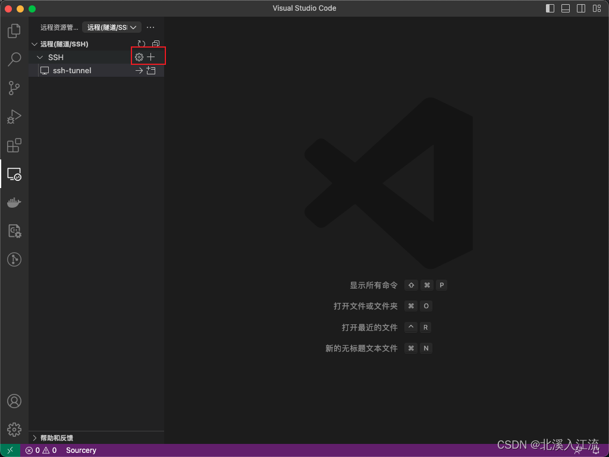
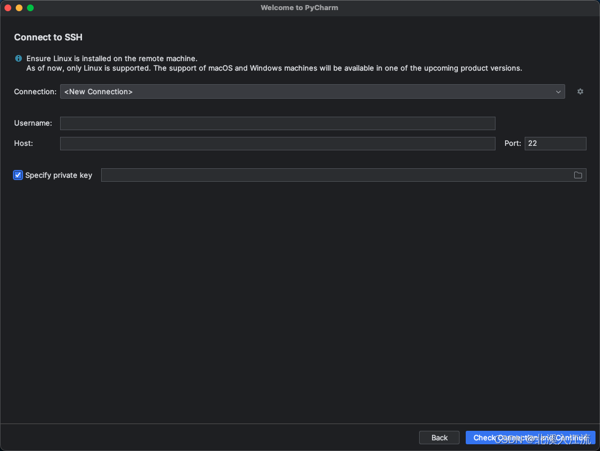

在进行定制化的服务开发时，我们有时候只能在固定的服务器上进行服务的开发。此时，通过命令行的方式进行开发的难度较大。我们可以考虑通过SSH打洞的方式，通过本地IDE的SSH连接功能来获取远程的环境进行代码的开发修改。
随着容器化技术的发展，越来越多的产品服务打包进容器内运行，对容器内部代码的定制化开发需求越来越多。容器本身可以简单理解为一个更轻量的虚拟机，针对容器的定制化开发的实现也可以参考服务器开发相关技术。
本文为更好的讲解SSH打洞开发的方式，采用容器化开发技术进行讲解。

# SSH容器服务打包
## 测试服务文件
为更好的测试SSH打洞功能，特开发一个简易的Python的Flask框架脚本以供测试。
**requirements.txt：**
```python
Flask==2.3.2
```
**app.py**
```python
from flask import Flask

app = Flask(__name__)

@app.route("/")
def hello():
    return "Hello World!"

if __name__ == "__main__":
    app.run(host="0.0.0.0", port=5000, debug=True)
```
Flask在启动时，默认绑定`127.0.0.1:5000`的IP和端口。当启动容器的`ports`参数进行端口映射时，会将容器内绑定在`0.0.0.0`IP上的服务映射到主机端口上而不是容器内的`127.0.0.1`，所以我们在启动Flask或相关服务时，需要指定绑定host为`0.0.0.0`。
**.entrypoint.sh**
```shell
cd /data

# 启动SSH服务
/etc/init.d/ssh start

# 启动Flask服务
python app.py
```
- 启动SSH服务和Flask服务的顺序不能更改。直接调用`python app.py`会启动一个前台进程，若`python app.py`命令在前，其后的启动`/etc/init.d/ssh start`命令将不会执行。
- 容器在启动时会执行`CMD`或`ENTRYPOINT`中指定的命令启动一个`PID=1`的守护进程，该进程负责整个容器的初始化，监控子进程运行情况，信号传输、退出容器等操作。当这个进程销毁时，整个容器也会停止运行，所以一般情况下，需要在启动的命令或脚本中启动一个一直运行的守护进程，保证`PID=1`的进程不会因为执行完毕而默认销毁导致容器的停止。
- `python app.py`命令在这里主要就是作为守护进程的存在确保`PID=1`的进程不会主动销毁。
	- 以Flask程序作为守护进程固然可以很好的使容器运行起来，但是当我们在进行开发时，可能会多次重启Flask进程以测试代码，此时一旦最开始的Flask进程关闭，`PID=1`进程也会主动销毁，导致容器退出
	- 当容器内包含有Python服务时，我们可以通过Python自带的脚本启动一个简易的守护进程，其他服务也可以参考启动一个守护进程来代替应用程序的守护进程

**优化后.entrypoint.sh**
```shell
cd /data

# 启动SSH服务
/etc/init.d/ssh start

# 启动Flask服务
nohup python app.py &

# 启动python自带脚本http.server作为守护进程
python -m http.server
```

## 镜像打包
**镜像打包文件**
```shell
# 接收docker build参数
ARG ROOT_PASSWORD=focus

FROM python:3.8.17

# 重新声明所有参数以继承入口的参数传递
ARG ROOT_PASSWORD

COPY ./data /data

WORKDIR /data

# 安装操作系统依赖库
RUN  \
    apt update && \
    apt -y upgrade && \
    # 安装SSH
    apt -y install sudo openssh-client openssh-server sshpass && \
    pip install -r /data/requirements.txt && \
    # root免密设置
    echo "root ALL=(ALL) NOPASSWD:ALL" >> /etc/sudoers && \
    # 设置root密码
    echo "root:${ROOT_PASSWORD:-focus}" | chpasswd && \
    # ssh配置修改
    # 允许root用户登录
    sed -i "/PermitRootLogin/c PermitRootLogin yes" /etc/ssh/sshd_config && \
    # 允许使用密码登录
    sed -i "/PasswordAuthentication/c PasswordAuthentication yes" /etc/ssh/sshd_config

CMD [ "sh", "/data/.entrypoint.sh" ]
```
- 打包镜像主要是为了在容器中安装SSH相关服务，也可根据现有的镜像启动容器后在容器内安装SSH服务（需要每次新建容器后都要安装）
```shell
# 允许root用户登录
sed -i "/PermitRootLogin/c PermitRootLogin yes" /etc/ssh/sshd_config
# 允许使用密码登录
sed -i "/PasswordAuthentication/c PasswordAuthentication yes" /etc/ssh/sshd_config
```
- 以上命令是实现SSH打洞登录的关键，其本质就是修改`/etc/ssh/sshd_config`文件中的`PermitRootLogin`和`PasswordAuthentication`配置

**镜像打包脚本**
```shell
docker build . \
    --platform 'linux/amd64' \
    --label 'maintainer=focus<https://focus-wind.com/>' \
    --build-arg 'ROOT_PASSWORD=focus' \
    --file ./Dockerfile \
    --tag "python-ssh-tunnel:3.8.17-dev"
```

# SSH打洞开发
## 部署带SSH的容器
通过上述操作，我们目前已经打包好了一个带有SSH服务的镜像，通过docker compose进行服务的部署。
**compose.yaml配置文件**
```yaml
version: '3.8'
services:
  ssh-tunnel:
    image: python-ssh-tunnel:3.8.17-dev
    hostname: ssh-tunnel
    container_name: ssh-tunnel
    ports:
      - 8080:22
      - 5000:5000
```
**启动容器**
```shell
docker compose up -d
```

## SSH连接服务器（容器内部）
通过端口映射，我们将容器内部的22端口映射到了本地的8080端口上。此时，如果我们需要访问容器内部的服务，可以通过指定IP为本机来访问容器内部。
```shell
ssh -p 8080 root@localhost
```

如上所示，我们将容器内部的SSH的22端口映射到宿主机后，通过访问宿主机的相应端口即可进入到容器内部中。

### SSH访问容器内的缺陷
通过上图SSH连接容器内部时的输出可以看到，SSH客户端在连接服务端时自动生成了SSH公钥。
SSH客户端在首次连接SSH服务端时，客户端会记录服务端返回的公钥保存在`~/.ssh/known_hosts`文件中，当再次进行SSH连接时客户端都会验证known_hosts文件中的公钥和服务端返回公钥是否一致。由于每次根据镜像新建的容器都是一个全新的容器，此时在进行SSH连接时，会导致返回的公钥和known_hosts文件中的公钥不一致，所以无法进行SSH连接。
若是因known_hosts导致的公钥不一致无法连接的问题，可以编辑`~/.ssh/known_hosts`文件，删除对应的IP公钥信息重新SSH连接即可。

## IDE远程SSH开发
现有的IDE大部分都支持SSH远程开发，现在大部分都开发都是在IDE上进行的开发，IDE提供的环境能够很好的帮助我们提升开发效率。

### VSCode远程SSH开发
VSCode自带有远程SSH功能，在VSCode的左侧功能栏的远程资源管理器中可以进行远程SSH操作。
- 在VSCode的远程资源管理器中，在SSH管理栏右侧点击`+`按钮新建SSH连接


- VSCode会默认读取`~/.ssh/config`文件中已有的SSH配置，在`~/.ssh/config`文件中添加服务器SSH配置后，刷新即可在远程资源管理器中显示
```shell
Host ssh-tunnel
    HostName localhost
    User root
    Port 8080
    # %p: Port %r: User %h: HostName
    LocalCommand ssh -p %p %r:%h
```
- 通过VSCode连接服务器或内部容器后即可像平常使用VSCode开发一样用VSCode进行集成开发

### Jetbrains系列产品SSH远程开发
Jetbrains系统虽然产品众多，但其使用SSH远程开发的逻辑是一致的，这里以PyCharm为例介绍Jetbrains系列产品的SSH远程开发。


- Jetbrains系列产品打开后在Remote Development的SSH中新建项目完成SSH的创建
- Jetbrains产品可在Specify private key可选配置项中配置公钥文件