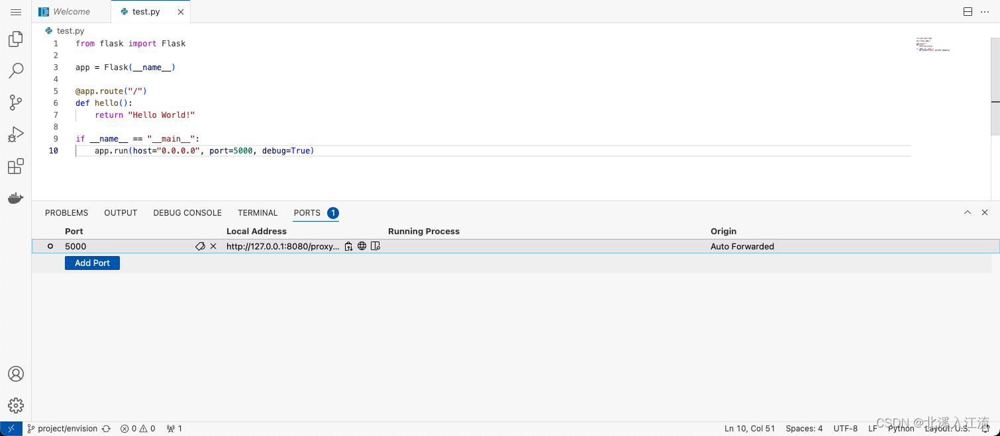

# code-server简介

**code-server**：运行在浏览器上的VSCode。 

自VSCode发布以来，VSCode就受到了广大程序员的青睐。VSCode丰富的插件能够满足使用者各色各样的需求。但VSCode使用受限于图形化界面的需求，只能安装在客户端而不能安装在服务器上。code-server的出现完美的解决了VSCode不能安装在服务端的缺陷。

code-server是一款运行在浏览器界面上的可以安装在任何机器上的VSCode程序，code-server不仅继承了VSCode的使用逻辑，丰富的插件，在VSCode的基础上还提供了更多VSCode所没有的特性，满足更多的使用场景和业务需求。

code-server具有以下特性：
- 绿色安装：code-server可以通过压缩包解压运行，不需要直接安装，相比软件包安装的方式更加绿色
- 一次部署，终身开箱即用：每次安装完VSCode后，都需要重新进行VSCode的相关配置，安装插件。code-server由于其绿色安装的特性，可以将相关配置和插件安装在指定路径，这样在机器中需要code-server时，只需要拷贝运行即可，不需要在额外安装插件，进行软件配置
- 服务器部署，容器集成：code-server只需要部署后，其他任何能够访问到部署机器的地方都可以通过code-server访问服务，相比传统IDE，更容易集成进服务器和容器内进行开发
- 端口转发：code-server相比传统IDE和VSCode，自带有端口转发功能。通过code-server，在服务器因防火墙或容器内等开放端口受限等情况下，自动代理转发服务，减少额外的端口开放操作。

# code-server的安装与使用
## code-server的安装
- [官方下载地址](https://github.com/coder/code-server/releases)

通过在GitHub上下载code-server解压之后即可使用code-server。GitHub上提供了code-server的软件包安装和压缩包解压方式，这里推荐使用压缩包绿色安装方式进行下载，方便后期的使用和迁移。这里以4.16.1版本为例进行安装使用。

**根据系统环境和CPU架构选择安装包：**
```shell
wget https://github.com/coder/code-server/releases/download/v4.16.1/code-server-4.16.1-linux-amd64.tar.gz
```

**解压指定位置：**
```shell
tar -xzvf code-server-4.16.1-linux-amd64.tar.gz --strip-components 1 -C ${target_path}/code-server
```
- 指定路径解压前，通过`mkdir -p`命令确保指定路径存在
- `--strip-components Number`: 解压时清除Number个引导目录，一般情况下，Number为1表示不包含打包前原目录，若无此参数，将会解压到`${target_path}/code-server/code-server-4.16.1-linux-amd64`路径下，而不是`${target_path}/code-server`路径下
- `-C`: 指定解压路径

## code-server的启动
code-server解压后即可使用。默认的可执行二进制文件在解压位置的bin目录下: `${target_path}/code-server/bin/code-server`。执行该文件即可启动code-server。

### code-server的简单启动
**执行code-server可执行文件，启动code-server：**
```shell
${target_path}/code-server/bin/code-server
```
- code-server支持以登录密码的方式启动，在网页中访问code-server时。code-server需要读取配置文件，判断认证方式实现登录认证。在不指定认证方式和配置文件的情况下，首次启动code-server时，code-server会自动以密码认证方式生成`~/.config/code-server/config.yaml`文件。
- code-server在使用时需要有相应的数据存放路径，存放其缓存、配置、插件等文件内容。code-server默认包括user-data用户数据目录和extensions插件存放目录。默认情况下extensions目录在user-data目录下。在不指定数据目录的情况下，首次启动code-server时，code-server会在`~/.local/share/code-server`路径中生成需要的文件。
- code-server在不指定绑定IP和PORT的情况下，默认绑定在`127.0.0.1:8080`端口上，可以通过访问`127.0.0.1:8080`在访问code-server服务。

### 指定配置启动code-server
在不指定配置文件和数据目录的情况下，code-server默认会以`~`路径下的配置为主。这样在我们进行迁移时还需额外迁移备份其他路径下的文件，无法做到一次配置，终身开箱即用。所以我们可以在启动code-server时，通过指定数据路径，将配置文件和数据目录以及插件默认生成在解压缩位置。

code-server支持密码认证，为了安全起见，code-server不允许在启动时指定密码，而是通过写入配置文件的方式执行密码认证。若采用密码认证方式使用code-server，需提前新建`config.yaml`文件。

**创建`${target_path}/code-server/config.yaml`文件并写入：**
```yaml
bind-addr: 0.0.0.0:8080
auth: password
password: ${password}
cert: false
```

指定配置启动code-server：
```shell
nohup ${target_path}/code-server/bin/code-server --auth password --bind-addr 0.0.0.0:8080 --config ${target_path}/code-server/config.yaml --user-data-dir ${target_path}/code-server/user-data --extensions-dir ${target_path}/code-server/extensions ${workdir} &
```
- `--auth`: code-server目前只支持`[password, none]`两种认证方式，密码无法通过命令行方式设置，需要写入配置文件中
- `--bind-addr`：code-server启动服务默认绑定`127.0.0.1:8080`，可以根据实际情况绑定需要的IP和PORT
- `--user-data-dir`: 指定code-server默认用户数据目录，存放缓存、配置、插件等文件内容。默认路径`~/.local/share/code-server`
- `--extensions-dir`: 插件路径，默认情况下在`--user-data-dir`路径下
- `${work-path}`: 工作空间，指定的情况下，登录code-server后默认打开配置的`${work-path}`路径

## code-server环境变量配置
通过以上方式操作code-server，在每次执行时都需要指定具体路径，为方便起见，可以将`code-server`路径写入环境变量中方便使用。

在`.bash_profile`或`.bashrc`文件中写入以下配置：
```shell
export PATH="${target_path}/code-server/bin:$PATH"
```
重载配置文件：
```shell
source [~/.bashrc | ~/.bash_profile]
```
# code-server端口转发
在服务器环境中，为了保证安全性，一般只会开发部分端口供外网使用。在服务众多而端口有限的情况下，可以通过部署code-server，即能够通过code-server访问服务端环境进行内部开发，也可以使用code-server特有的端口转发功能，替代nginx的一部分功能实现服务代理。

code-server支持自动端口转发和手动添加端口转发服务来实现端口转发功能

## 自动端口转发
在code-server软件中启动的服务，code-server都会默认转发该服务到`${--bind-addr}/proxy/${source_port}`上，访问该地址即可访问转发到服务。

## 手动添加转发端口

在code-server中打开终端，在`PORTS`栏中手动输入需要转发到端口号，code-server即可帮助我们转发端口。

# nginx反向代理code-server
在具体的使用中，有时我们会希望将code-server代理到指定端口或者指定域名上。code-server在使用中需要通过websocket机制进行通信，所以在进行nginx代理时，需要配置相关配置。

创建`code-server.conf`文件，配置对code-server对代理。
```shell
server {
    listen 80;
    server_name ${target_domain_name};

    location / {
        proxy_pass http://127.0.0.1:8080/;
        # 代理WebSocket
        proxy_http_version 1.1;
        proxy_set_header Upgrade $http_upgrade;
        proxy_set_header Connection "Upgrade";
        proxy_set_header Host $host;
    }
}
```
在`nginx.conf`文件中引入`code-server.conf`配置：
```shell
...

http {
	...
	
	include ${code-server_conf_path}/code-server.conf
	
	...
}
```

# code-server打包开发版镜像
**Dockerfile打包文件内容如下：**
```shell
FROM ubuntu:22.04

COPY ./code-server /data/code-server

ENV PATH="/data/code-server/bin:${PATH}"

WORKDIR /data

EXPOSE 8080
VOLUME [ "/data" ]

CMD ["code-server", "--auth", "password", "--bind-addr", "0.0.0.0:8080", "--config", "/data/code-server/config.yaml", "--user-data-dir", "/data/code-server/user-data", "--extensions-dir", "/data/code-server/extensions", "/data"]
```
- 在以密码的方式启动code-server时，会读取`config.yaml`文件，所以在通过密码认证的情况下，建议提前将`config.yaml`文件存在在导入路径下。
- 通过打包code-server到镜像中的方式 ，在访问code-server时，访问的是容器内部的服务环境，更适合对服务端代码进行远程修改，不适合直接对服务器环境和Docker环境进行运维等操作