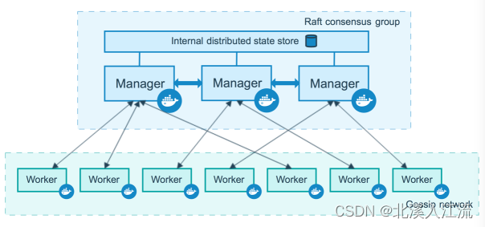
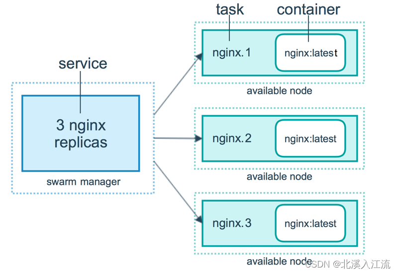
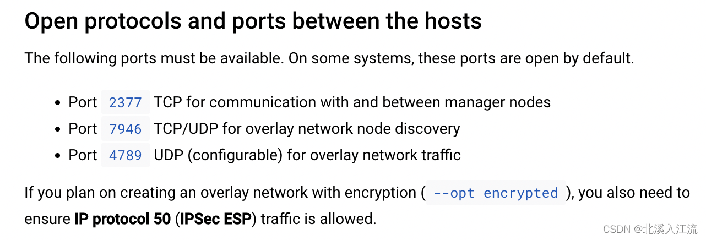

- [Docker Swarm官方文档](https://docs.docker.com/engine/swarm/)

Docker Swarm是Docker引擎原生内置的容器集群管理工具。
## 基本概念
### Swarm节点
运行Docker的主机可以主动初始化一个Swarm集群作为Leader节点或者加入一个已存在的Swarm集群，这样这个运行Docker的主机就成为一个Swarm集群的节点。
Swarm集群节点可以分为**manager管理节点**和**work工作节点**。

管理节点用于Swarm集群的管理，`docker swarm`命令基本只能在管理节点执行。一个Swarm集群可以有多个管理节点，但只有一个管理节点可以成为**Leader。**

为了利用Swarm模式的容错特性，Docker建议您根据组织的高可用性要求实现奇数个节点。当您有多个管理器时，您可以从管理器节点的故障中恢复而无需停机。Docker建议一个Swarm最多使用七个管理器节点。一个N管理器集群最多可以容忍丢失$\frac{N - 1}{2}$管理器。如：一个三管理器群最多可以容忍一名管理器的损失。

工作节点是任务执行节点，管理节点将服务(service)下发至工作节点执行。管理节点默认也作为工作节点。也可以通过配置让服务只运行在管理节点。

### 任务与服务
- 任务（task）是Swarm中的最小的调度单位，目前来说就是一个单一的容器。
- 服务（services）是指一组任务的集合，服务定义了任务的属性。

## 集群管理
### 端口配置

- 2377(TCP): 用来与管理器节点之间进行通信。不开放2377端口，可能会导致无法加入集群中。
- 7946(TCP/UDP): 用于docker节点之间的通信。
- 4789(UDP): 覆盖网络流量。
	-  4789端口是Swarm数据路径端口的默认值，也称为VXLAN端口。防止任何不受信任的流量到达此端口很重要，因为VXLAN不提供身份验证。此端口应只对受信任的网络开放，而绝不能在外围防火墙上开放。

### 创建集群
```bash
$ docker swarm init --advertise-addr ${IP}

Swarm initialized: current node (xxx) is now a manager.

To add a worker to this swarm, run the following command:

    docker swarm join --token xxx IP:2377

To add a manager to this swarm, run 'docker swarm join-token manager' and follow the instructions.
```
在服务器上调用`docker swarm init`若输出正常即集群模式创建成功。本主机自动成为Leader管理员节点。当一台主机有多个网卡多个IP时，需要使用`--advertise-addr`参数来指定IP。

### 加入集群
在加入集群时，需要保证两个主机之间可以正常通讯。在加入集群时，需要Leader节点的token信息。在Leader节点中输入：
```bash
$ docker swarm join-token [manager|worker]

To add a manager to this swarm, run the following command:

    docker swarm join --token xxx IP:2377
```
根据需要加入工作节点还是管理节点选择参数，生成加入节点的语句。在主机中键入命令即可加入Leader节点。
```bash
$ docker swarm join --token xxx IP:2377
```

### 查看集群
```bash
$ docker node ls
ID      HOSTNAME         STATUS    AVAILABILITY   MANAGER STATUS   ENGINE VERSION
xxx *   docker-desktop   Ready     Active         Leader           20.10.23
```
通过`docker node ls`命令查看当前集群中有多少节点，节点的活动状况。

### 退出集群
```bash
$ docker swarm leave --force
Node left the swarm.
```
通过`docker swarm leave`来离开集群，对于Leader节点或退出集群失败的情况可以通过`--force`参数来强制退出。

## 节点设置
### 节点标签设置
在集群环境中，因为不同节点的系统、配置、环境等的不同，导致有的服务只能在只能在指定的机器上跑（如：只在带GPU机器上跑人工智能相关模型的服务），或者由于业务原因导致我们需要在特定的节点上跑相关服务。我们可以通过给节点设置label标签的方式来使节点固定在相关的机器上。
```bash
$ docker node update --label-add ${key}=${value} ${node_id}
```
`${node_id}`可以根据`docker node ls`命令进行查看，通过给节点添加label，在docker-compose文件中添加如下配置使服务只能在指定节点中运行。
```yaml
deploy:
      placement:
        constraints:
          - node.labels.${key} == ${value}
```

### 节点信息查询
```bash
$ docker inspect ${node_id}
...
"Spec": {
            "Labels": {
                "arch": "x86_64"
            },
            "Role": "manager",
            "Availability": "active"
        },
...
```
通过`docker inspect ${node_id}`命令来查看节点的详情信息，如：我们可以通过inspect命令来查看我们对节点设置的标签信息。

## 服务管理
Docker Swarm采用懒加载的方式进行服务的部署，当调用完部署服务的命令后，可能会长时间看到服务没有正常启动，日志也没有任何输出，此时有可能是因为系统中还没有下载相关的镜像，Docker引擎正在后台默默的下载镜像。
### 部署服务
Swarm内置docker compose，可以通过docker-compose文件来进行部署，一次启动多个关联的服务。在Swarm中，我们可以使用`docker stack deploy`来进行Swarm服务的部署。
```bash
$ docker stack deploy ${services_name} -c ${compose_file_path}
```
其中`-c`指定docker-compose文件，在一次部署中可以指定多个服务部署文件进行多服务的部署。

### 查看服务
```bash
$ docker stack ls
```
通过`docker stack ls`可以查看本集群中有多少服务集，各个服务集里面有多少个服务
```bash
$ docker stack services ${services_name|servicves_id}
```
通过`docker stack services ${services_name|servicves_id}`命令查看该服务集下面有多少具体的服务，服务里面有多少个分片或任务，各个服务的具体运行情况。

### 服务日志查看
在docker服务中，可以通过volume挂在目录的方式将数据和日志等文件信息挂载到容器外。通过这种方式，可以有效健壮的保留容器的运行信息可进行容器迁移。在使用Docker时，建议将数据和日志挂载到外部磁盘上，这样可以打开外部文件进行日志信息的查看和传输管理等操作。<br />也可以使用如下命令：
```bash
docker service logs ${service_name|service_id} -f -t
```
注意查看日志的名称为`${service_name|service_id}`。可以通过`docker stack services ${services_name|servicves_id}`命令来查看具体的`${service_name|service_id}`信息、其中`-t`参数表示显示日志的时间戳，`-f`参数表示跟踪日志输出，即当在查看服务日志时，仍有日志输出，控制台会同步显示更新的日志信息。根据需要添加参数。

### 服务重启
```bash
docker service update --force
```
若服务因系统资源不足或出现错误等而出现挂掉的情况，等解决完问题后，可以使用`docker service update --force`命令来强制重启挂掉的服务。
