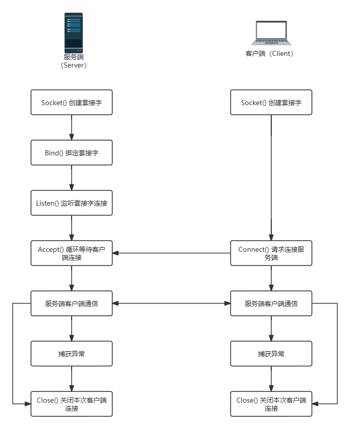

# 什么是Socket
Socket是用于计算机之间进行网络通信的端口的抽象。提供了应用进程利用底层网络协议交换数据的机制。

通过TCP/IP协议栈进行网络通信的过程中，每个设备都需要唯一的IP地址信息进行标识，Socket允许应用程序通过IP地址进行通信，而不需要关心底层TCP/IP协议的具体实现，在这个过程中，可以将Socket理解为对TCP/IP的进一步封装。

同时，Socket也可以在本地进程之间通信，Socket允许应用绑定本地Socket文件，通过Socket文件进行进程之间数据的交换。

# Socket通信过程



- 服务端：
    1. 创建Socket
    2. 绑定Socket: Socket支持绑定本地Socket或者IP端口
    3. 服务端开始监听客户端连接请求，当监听到连接请求后，调用accept()接收连接请求，建立服务端客户端连接
    4. 服务端客户端开始通信
        - send(): 通过send接口发送数据
        - receive(): 通过receive接口接收数据
    5. 服务端客户端处理通信异常信息
    6. 服务端主动关闭连接，或监听到客户端异常断开后，关闭连接
- 客户端：
    1. 创建Socket
    2. 请求连接服务端Socket
    3. 服务端客户端开始通信
        - send(): 通过send接口发送数据
        - receive(): 通过receive接口接收数据
    4. 服务端客户端处理通信异常信息
    5. 客户端主动关闭连接，或监听到服务端异常断开后，关闭连接

# C++ Socket通信API
C++在进行Socket通信时，通常有以下常用接口：

## int socket(int domain, int type, int protocol);
> 以下参数信息为常用参数信息，更多内容参考`man socket`

- int socket(int domain, int type, int protocol)：用于创建Socket
- 头文件：
    - #include <sys/types.h>
    - #include <sys/socket.h>
- 参数：
    - domain：网络连接协议簇的标识
        - AF_INET：IPv4协议簇
        - AF_INET6：IPv6协议簇
        - AF_UNIX/AF_LOCAL：本地Socket
    - type：Socket通信的语义类型
        - SOCK_STREAM：提供有序、可靠、双向、基于连接的字节流。可以支持带外数据传输机制（TCP通信常用）
        - SOCK_DGRAM：支持数据报（固定最大长度的无连接、不可靠的消息）（UDP通信常用）。
    - protocol：与Socket通信语义相匹配的协议类型，注意，protocol的选择需要和语义类型匹配，不可以随意组合
        - 0：根据type自动匹配protocol
        - IPPROTO_TCP：TCP协议
        - IPPROTO_UDP：UDP协议
- 返回值：
    - 成功：返回Socket文件描述符ID
    - 失败：返回-1，并设置errno

## int bind(int sockfd, const struct sockaddr *addr, socklen_t addrlen);
- int bind(int sockfd, const struct sockaddr *addr, socklen_t addrlen)：socket()创建socket指定其协议类型后，我们还需要把socket绑定到具体的地址上才可以使用
- 头文件：
    - #include <sys/types.h>
    - #include <sys/socket.h>
- 参数：
    - sockfd：上述通过`socket()`函数创建的socketID信息
    - addr：socket绑定的协议地址，该参数需要与socket创建时指定的协议类型相关联
    - addrlen：addr结构的字节大小
- 返回值：
    - 成功：返回0
    - 失败：返回-1，并设置errno

### struct sockaddr
```C++
#include <sys/types.h>
#include <sys/socket.h>

struct sockaddr {
    sa_family_t sa_family;      // socket addr family
    char        sa_data[14];    // socket addr data
}
```
在`sockaddr`结构体中，数据信息混合在了一起，针对TCP/UDP这种包含IP和Port等多个数据的类型时，不是很好区分，所以一般情况下通过定义对应协议的addr信息，然后通过类型转换为`soctaddr`结构体

### struct sockaddr_un
```C++
#include <sys/socket.h>
#include <sys/un.h>

struct sockaddr_un {
    sa_family_t sun_family;     // AF_UNIX
    char        sun_path[108];  // 本地Socket路径
};
```

### struct sockaddr_in / struct sockaddr_in6
```C++
#include <netinet/in.h>

struct sockaddr_in {
    sa_family_t     sin_family;     // AF_INET
    in_port_t       sin_port;       // Port: 端口号
    struct in_addr  sin_addr;       // IPv4地址信息
};

struct sockaddr_in6 {
    sa_family_t     sin6_family;    // AF_INET6
    in_port_t       sin6_port;      // Port: 端口号
    uint32_t        sin6_flowinfo;  // IPv6流标识符，用于标识特定的数据流，在发送数据时附加到数据包头部
    struct in6_addr sin6_addr;      // IPv6地址信息
    uint32_t        sin6_scope_id;  // Scope Id：用于确定IPv6地址的使用范围和权限
};
```

## int connect(int sockfd, const struct sockaddr *addr, socklen_t addrlen);
- int connect(int sockfd, const struct sockaddr *addr, socklen_t addrlen)：客户端向服务端发送连接请求，等待连接
- 头文件：
    - #include <sys/types.h>
    - #include <sys/socket.h>
- 参数：
    - sockfd：上述通过`socket()`函数创建的socketID信息，该sockfd为客户端向服务端发起请求的socket
    - addr：socket绑定的协议地址，该参数需要与socket创建时指定的协议类型相关联
    - addrlen：addr结构的字节大小
- 返回值：
    - 成功：返回0
    - 失败：返回-1，并设置errno

## int listen(int sockfd, int backlog);
- int listen(int sockfd, int backlog)：设置socket队列，监听socket请求，以处理客户端的连接、断开操作
- 头文件：
    - #include <sys/types.h>
    - #include <sys/socket.h>
- 参数：
    - sockfd：上述通过`socket()`函数创建的socketID信息
    - backlog: socket监听可能的最大连接长度，若队列已满，新的客户端连接请求会收到`ECONNREFUSED`错误
- 返回值：
    - 成功：返回0
    - 失败：返回-1，并设置errno

## int accept(int sockfd, struct sockaddr *addr, socklen_t *addrlen);
- int accept(int sockfd, struct sockaddr *addr, socklen_t *addrlen)：监听sockfd队列的第一个连接请求，创建连接socket，并返回引用该socket的文件描述符
- 头文件：
    - #include <sys/types.h>
    - #include <sys/socket.h>
- 参数：
    - sockfd：上述通过`socket()`函数创建的socketID信息，该sockfd为客户端向服务端发起请求的socket
    - addr：socket绑定的协议地址，该参数需要与socket创建时指定的协议类型相关联
    - addrlen：addr结构的字节大小
- 返回值：
    - 成功：返回socket文件描述符ID
    - 失败：返回-1，并设置errno

## ssize_t send(int sockfd, const void *buf, size_t len, int flags);
> socket 数据的常用发送接收还有`read()`,`write()`和其他方法。
> 
> `read()`和`write()`方法在遇到`\0`类型数据时会终止，所以通过该方法发送数据是受限的，这里不做介绍

- ssize_t send(int sockfd, const void *buf, size_t len, int flags)：发送指定长度的数据
- 头文件：
    - #include <sys/types.h>
    - #include <sys/socket.h>
- 参数：
    - sockfd：客户端和服务端已建立的socketID文件描述符信息
    - buf：需要发送的数据内容
    - len: buffer数据长度
    - flags: 消息发送或运算的特性，默认可为0
- 返回值：
    - 成功：成功发送数据的字节数
    - 失败：返回-1，并设置errno

## ssize_t recv(int sockfd, void *buf, size_t len, int flags);
- ssize_t recv(int sockfd, void *buf, size_t len, int flags)：接收指定长度的数据
- 头文件：
    - #include <sys/types.h>
    - #include <sys/socket.h>
- 参数：
    - sockfd：客户端和服务端已建立的socketID文件描述符信息
    - buf：接收数据的地址
    - len: buffer数据长度
    - flags: 消息接收或运算的特性，默认可为0
- 返回值：
    - 成功：成功发送数据的字节数
    - 失败：返回-1，并设置errno

## int close(int fd);
- int close(int fd)：关闭socket连接
- 头文件：
    - #include <unistd.h>
- 参数：
    - fd：已连接的文件描述符ID
- 返回值：
    - 成功：0
    - 失败：返回-1，并设置errno

# C++ Socket通信
> 若要使用IPv4-TCP通信，请注释UNIX，取消注释IPv4
>
> 本示例不对IPv6通信进行说明

## 服务端
```C++
// socket
#include <sys/types.h>
#include <sys/socket.h>

// socket addr
#include <sys/un.h>
#include <netinet/in.h>

// file close
#include <unistd.h>

// htons
#include <arpa/inet.h>

#include <iostream>


int main() {
    // 1. 创建服务端Socket
    // IPv4
    // int server_socket = socket(AF_INET, SOCK_STREAM, 0);
    // UNIX
    int server_socket = socket(AF_UNIX, SOCK_STREAM, 0);

    if (server_socket < 0) {
        std::cerr << "socket error: 创建失败" << std::endl;
        throw std::runtime_error("socket error: 创建失败");
    } else {
        std::cout << "socket 创建成功，socketId：" << server_socket << std::endl;
    }

    // 2. 绑定Socket
    // IPv4
    // struct sockaddr_in server_addr;
    // server_addr.sin_family = AF_INET;
    // // INADDR_ANY: 0.0.0.0(绑定到本机的所有网卡上)
    // server_addr.sin_addr.s_addr = INADDR_ANY;
    // // htons: 将 unsigned short 转换为网络字节序
    // server_addr.sin_port = htons(8888);

    // UNIX
    struct sockaddr_un server_addr;
    server_addr.sun_family = AF_UNIX;
    strcpy(server_addr.sun_path, "/var/tmp/socket_test");

    if (bind(server_socket, (struct sockaddr*)&server_addr, sizeof(server_addr)) < 0) {
        std::cerr << "socket bind error: 绑定套接字失败，请检查本地套接字是否被占用" << std::endl;
        throw std::runtime_error("socket bind error: 绑定套接字失败，请检查本地套接字是否被占用");
    }

    // 3. 创建socket监听队列，并开始监听
    int listen_ret = listen(server_socket, 2048);
    if (listen_ret < 0) {
        std::cerr << "socket listen error: Socket监听失败" << std::endl;
        throw std::runtime_error("socket listen error: Socket监听失败");
    } 

    // 4. 接收客户端连接请求
    // IPv4
    // struct sockaddr_in client_addr;
    // UNIX
    struct sockaddr_un client_addr;
    
    int client_addr_len = sizeof(client_addr);
    int client_socket = accept(server_socket, (struct sockaddr*)&client_addr, (socklen_t *) &client_addr_len);
    if (client_socket < 0) {
        std::cerr << "socket client accpet error: Socket监听失败" << std::endl;
        throw std::runtime_error("socket listen error: Socket监听失败");
    }

    // 5. 接收客户端发送信息
    int recv_data_length = 15;
    char recv_data[recv_data_length];
    if (recv(client_socket, recv_data, recv_data_length, 0) < 0) {
        std::cerr << "socket recv error: 接收数据失败" << std::endl;
        throw std::runtime_error("socket recv error: 接收数据失败");
    } else {
        std::cout << "socket recv data: " << recv_data << std::endl;
    }

    // 6. 关闭socket
    close(server_socket);
    close(client_socket);

    return 0;
}
```

## 客户端
```c++
// socket
#include <sys/types.h>
#include <sys/socket.h>

// socket addr
#include <sys/un.h>
#include <netinet/in.h>

// file close
#include <unistd.h>

// htons
#include <arpa/inet.h>

#include <iostream>
#include <string.h>


int main() {
    // 1. 创建客户端Socket
    // IPv4
    // int client_socket = socket(AF_INET, SOCK_STREAM, 0);
    // UNIX
    int client_socket = socket(AF_UNIX, SOCK_STREAM, 0);

    if (client_socket < 0) {
        std::cerr << "socket error: 创建失败" << std::endl;
        throw std::runtime_error("socket error: 创建失败");
    } else {
        std::cout << "socket 创建成功，socketId：" << client_socket << std::endl;
    }

    // 2. 绑定Socket
    // IPv4
    // struct sockaddr_in client_addr;
    // client_addr.sin_family = AF_INET;
    // // INADDR_ANY: 0.0.0.0(绑定到本机的所有网卡上)
    // client_addr.sin_addr.s_addr = INADDR_ANY;
    // // htons: 将 unsigned short 转换为网络字节序
    // client_addr.sin_port = htons(8888);

    // UNIX
    struct sockaddr_un client_addr;
    client_addr.sun_family = AF_UNIX;
    strcpy(client_addr.sun_path, "/var/tmp/socket_test");

    if (connect(client_socket, (struct sockaddr*)&client_addr, sizeof(client_addr)) < 0) {
        std::cerr << "socket connect error: 连接服务端socket失败" << std::endl;
        throw std::runtime_error("socket connect error: 连接服务端socket失败");
    }

    // 3. 客户端发送信息
    std::string send_data = "Hello, Focus!!!";
    if (send(client_socket, send_data.c_str(), send_data.length(), 0) < 0) {
        std::cerr << "socket send error: 发送数据失败" << std::endl;
        throw std::runtime_error("socket send error: 发送数据失败");
    } 

    // 4. 关闭socket
    close(client_socket);

    return 0;
}
```

# C++ Socket通信改进
以上代码可以实现简单的Socket通信流程，但是存在问题：
- 服务端在第一次启动时，会创建本地Socket套接字文件，在以IP协议进行通信的Socket网络通信中，Socket关闭会释放端口，但是以UNIX本地Socket进行通信的Socket网络通信在关闭后，不会主动删除创建的Socket文件。在再次通信的过程中，会绑定失败
    - 解决方案：在程序第一次绑定时，判断文件是否存在，存在则删除
- 在Socket通信过程中，`send`,`recv`,`accept`,`connect`等函数为阻塞函数，所以一旦调用此类方法，程序阻塞，就不能接收其他连接和处理了
    - 解决方案1：采用非阻塞模型进行Socket通信
    - 解决方案2：采用线程的方式，当新的socket连接建立后，将socket通信的过程放在线程中执行，线程结束释放该socket通信，这样可以通过`accept`方法以阻塞的方式一直等待新的客户端连接
    - 这里采用方案2进行改进
- Socket通信过程中，采用`send`，`recv`方法虽然解决了`write`，`read`方法不能发送`\0`的问题，但是存在的问题是，通过`send`，`recv`传输数据需要已知数据大小，在数据大小确定的情况下，该方案很符合场景需要，但是在数据大小不确定的情况下。
    - 解决方案1: 确定"大"数据长度，数据长度不足后面补标志位、
    - 解决方案2：在传输数据前，先发送数据大小，然后初始化buffer接收数据
    - 这里采用方案2进行改进

> 在以下改进中，统一采用UNIX模型进行通信，IP模型请自行替换

## UNIX socket文件已存在
```C++
#include <unistd.h>

#include <iostream>
#include <string.h>


void make_sure_socket_path(char *socket_path) {
    // F_OK：判断文件是否可读，若文件不存在则不可读
    if (access(socket_path, F_OK) == 0) {
        // unlink：删除文件
        if (unlink(socket_path) < 0) {
            std::cerr << "删除 socket：" << socket_path << " 失败" << std::endl;
            throw std::runtime_error("socket error: 创建失败");
        }
    }
}
```

## 子线程通信
头文件：
```C++
// socket
#include <sys/types.h>
#include <sys/socket.h>

// socket addr
#include <sys/un.h>
#include <netinet/in.h>

#include <pthread.h>

#include <unistd.h>

// htons
#include <arpa/inet.h>

#include <iostream>

class UnixSocketServer {
    private:
        std::string socket_path;

        // 记录服务端socket配置
        int socket_id;

        // 客户端最大连接数
        int max_client = 5;

        static void *thread_working(void *args);

    public:
        UnixSocketServer(std::string socket_path);

        ~UnixSocketServer();

        void run();
};
```

```C++
#include "socket.h"

UnixSocketServer::UnixSocketServer(std::string socket_path) {
    this->socket_path = socket_path;

    if (access(this->socket_path.c_str(), F_OK) == 0) {
        // unlink：删除文件
        if (unlink(this->socket_path.c_str()) < 0) {
            std::cerr << "删除 socket：" << this->socket_path << " 失败" << std::endl;
            throw std::runtime_error("socket error: 创建失败");
        }
    }

    // 1. 创建服务端socket
    this->socket_id = socket(AF_UNIX, SOCK_STREAM, 0);
    if (this->socket_id < 0) {
        std::cerr << "socket error: 创建失败" << std::endl;
        throw std::runtime_error("socket error: 创建失败");
    } else {
        std::cout << "socket 创建成功，socketId：" << this->socket_id << std::endl;
    }
    
    // 2. 绑定Socket
    struct sockaddr_un server_addr;
    server_addr.sun_family = AF_UNIX;
    strcpy(server_addr.sun_path, this->socket_path.c_str());

    if (bind(this->socket_id, (struct sockaddr*)&server_addr, sizeof(server_addr)) < 0) {
        std::cerr << "socket bind error: 绑定套接字失败，请检查本地套接字是否被占用" << std::endl;
        throw std::runtime_error("socket bind error: 绑定套接字失败，请检查本地套接字是否被占用");
    }

    // 3. 创建socket监听队列，并开始监听
    int listen_ret = listen(this->socket_id, this->max_client);
    if (listen_ret < 0) {
        std::cerr << "socket listen error: Socket监听失败" << std::endl;
        throw std::runtime_error("socket listen error: Socket监听失败");
    } 
}

UnixSocketServer::~UnixSocketServer() {
    close(this->socket_id);
    unlink(this->socket_path.c_str());
}

void *UnixSocketServer::thread_working(void *args) {
   
}

void UnixSocketServer::run() {
    while(true) {

        struct sockaddr_un client_addr;
    
        int client_addr_len = sizeof(client_addr);
        int client_id = accept(this->socket_id, (struct sockaddr*)&client_addr, (socklen_t *) &client_addr_len);
        if (client_id < 0) {
            std::cerr << "socket client accpet error: Socket监听失败" << std::endl;
            throw std::runtime_error("socket listen error: Socket监听失败");
        } else {
            std::cout << "socket client accpet success: 客户端：" << client_id << "连接成功" << std::endl;
        }

        pthread_t thread_id = client_id;
        pthread_create(&thread_id, NULL, this->thread_working, (void *) &client_id);
        pthread_detach(thread_id);
    }
}

int main() {
    UnixSocketServer *unixSocketServer = new UnixSocketServer("/var/tmp/socket_test");

    unixSocketServer->run();

    return 0;
}
```

## Socket通信流程改进
### 服务端
#### 核心代码
```C++
void *UnixSocketServer::thread_working(void *args) {
    int client_id = *(int *) args;

    while (true) {
        // 1. 接收数据长度
        // 注意这里不能采用 size_t 等类型定义，该类型会导致在不同架构编译器生成的 sizeof 大小不一致
        int receive_data_length;
        
        if (recv(client_id, &receive_data_length, sizeof(receive_data_length), 0) <= 0) {
            std::cerr << "socket communication error: 接收客户端数据长度失败" << std::endl;
            break;
        } else {
            std::cout << "socket communication success: 客户端原始数据长度：" << receive_data_length << std::endl;
        }

        // 2. 接收数据
        char receive_data[receive_data_length];
        if (recv(client_id, &receive_data, receive_data_length, 0) <= 0) {
            std::cerr << "socket communication error: 接收客户端数据失败" << std::endl;
            break;
        } else { 
            // 这里通过 std::string 构造函数初始化接收数据
            // 接收数据长度没有 `\0`，C/C++在输出 char 时，遇到 `\0` 才会停止
            std::cout << "socket communication success: 客户端原始数据：" << std::string(receive_data, receive_data_length) << std::endl;
        }

        // 3. 发送数据长度
        std::string send_data = "Hello, Focus!!!";
        int send_data_length = send_data.length();

        if (send(client_id, &send_data_length, sizeof(send_data_length), 0) < 0) {
            std::cerr << "socket communication error: 发送客户端数据长度失败" << std::endl;
            break;
        }

        // 4. 发送数据
        if (send(client_id, send_data.c_str(), send_data_length, 0) < 0) {
            std::cerr << "socket communication error: 发送客户端数据失败" << std::endl;
            break;
        } 
    }

    std::cout << "socket client close：客户端 " << client_id << " 已断开连接" << std::endl;
    close(client_id);
}
```

#### 头文件
```C++
// socket
#include <sys/types.h>
#include <sys/socket.h>

// socket addr
#include <sys/un.h>
#include <netinet/in.h>

#include <pthread.h>

#include <unistd.h>

// htons
#include <arpa/inet.h>

#include <iostream>

class UnixSocketServer {
    private:
        std::string socket_path;

        // 记录服务端socket配置
        int socket_id;

        // 客户端最大连接数
        int max_client = 5;

        static void *thread_working(void *args);

    public:
        UnixSocketServer(std::string socket_path);

        ~UnixSocketServer();

        void run();
};
```

#### 全代码
```C++
#include "socket.h"

UnixSocketServer::UnixSocketServer(std::string socket_path) {
    this->socket_path = socket_path;

    if (access(this->socket_path.c_str(), F_OK) == 0) {
        // unlink：删除文件
        if (unlink(this->socket_path.c_str()) < 0) {
            std::cerr << "删除 socket：" << this->socket_path << " 失败" << std::endl;
            throw std::runtime_error("socket error: 创建失败");
        }
    }

    // 1. 创建服务端socket
    this->socket_id = socket(AF_UNIX, SOCK_STREAM, 0);
    if (this->socket_id < 0) {
        std::cerr << "socket error: 创建失败" << std::endl;
        throw std::runtime_error("socket error: 创建失败");
    } else {
        std::cout << "socket 创建成功，socketId：" << this->socket_id << std::endl;
    }
    
    // 2. 绑定Socket
    struct sockaddr_un server_addr;
    server_addr.sun_family = AF_UNIX;
    strcpy(server_addr.sun_path, this->socket_path.c_str());

    if (bind(this->socket_id, (struct sockaddr*)&server_addr, sizeof(server_addr)) < 0) {
        std::cerr << "socket bind error: 绑定套接字失败，请检查本地套接字是否被占用" << std::endl;
        throw std::runtime_error("socket bind error: 绑定套接字失败，请检查本地套接字是否被占用");
    }

    // 3. 创建socket监听队列，并开始监听
    int listen_ret = listen(this->socket_id, this->max_client);
    if (listen_ret < 0) {
        std::cerr << "socket listen error: Socket监听失败" << std::endl;
        throw std::runtime_error("socket listen error: Socket监听失败");
    } 
}

UnixSocketServer::~UnixSocketServer() {
    close(this->socket_id);
    unlink(this->socket_path.c_str());
}

void *UnixSocketServer::thread_working(void *args) {
    int client_id = *(int *) args;

    while (true) {
        // 1. 接收数据长度
        // 注意这里不能采用 size_t 等类型定义，该类型会导致在不同架构编译器生成的 sizeof 大小不一致
        int receive_data_length;
        
        if (recv(client_id, &receive_data_length, sizeof(receive_data_length), 0) <= 0) {
            std::cerr << "socket communication error: 接收客户端数据长度失败" << std::endl;
            break;
        } else {
            std::cout << "socket communication success: 客户端原始数据长度：" << receive_data_length << std::endl;
        }

        // 2. 接收数据
        char receive_data[receive_data_length];
        if (recv(client_id, &receive_data, receive_data_length, 0) <= 0) {
            std::cerr << "socket communication error: 接收客户端数据失败" << std::endl;
            break;
        } else { 
            // 这里通过 std::string 构造函数初始化接收数据
            // 接收数据长度没有 `\0`，C/C++在输出 char 时，遇到 `\0` 才会停止
            std::cout << "socket communication success: 客户端原始数据：" << std::string(receive_data, receive_data_length) << std::endl;
        }

        // 3. 发送数据长度
        std::string send_data = "Hello, Focus!!!";
        int send_data_length = send_data.length();

        if (send(client_id, &send_data_length, sizeof(send_data_length), 0) < 0) {
            std::cerr << "socket communication error: 发送客户端数据长度失败" << std::endl;
            break;
        }

        // 4. 发送数据
        if (send(client_id, send_data.c_str(), send_data_length, 0) < 0) {
            std::cerr << "socket communication error: 发送客户端数据失败" << std::endl;
            break;
        } 
    }

    std::cout << "socket client close：客户端 " << client_id << " 已断开连接" << std::endl;
    close(client_id);
}

void UnixSocketServer::run() {
    while(true) {

        struct sockaddr_un client_addr;
    
        int client_addr_len = sizeof(client_addr);
        int client_id = accept(this->socket_id, (struct sockaddr*)&client_addr, (socklen_t *) &client_addr_len);
        if (client_id < 0) {
            std::cerr << "socket client accpet error: Socket监听失败" << std::endl;
            throw std::runtime_error("socket listen error: Socket监听失败");
        } else {
            std::cout << "socket client accpet success: 客户端：" << client_id << "连接成功" << std::endl;
        }

        pthread_t thread_id = client_id;
        pthread_create(&thread_id, NULL, this->thread_working, (void *) &client_id);
        pthread_detach(thread_id);
    }
}

int main() {
    UnixSocketServer *unixSocketServer = new UnixSocketServer("/var/tmp/socket_test");

    unixSocketServer->run();

    return 0;
}
```

## 客户端
```C++
// socket
#include <sys/types.h>
#include <sys/socket.h>

// socket addr
#include <sys/un.h>
#include <netinet/in.h>

// file close
#include <unistd.h>

// htons
#include <arpa/inet.h>

#include <iostream>
#include <string.h>

int socket_connect(const char *socket_path) {
    // 1. 创建客户端Socket
    int client_socket = socket(AF_UNIX, SOCK_STREAM, 0);

    if (client_socket < 0) {
        std::cerr << "socket error: 创建失败" << std::endl;
        throw std::runtime_error("socket error: 创建失败");
    } else {
        std::cout << "socket 创建成功，socketId：" << client_socket << std::endl;
    }

    // 2. 绑定Socket
    struct sockaddr_un client_addr;
    client_addr.sun_family = AF_UNIX;
    strcpy(client_addr.sun_path, socket_path);

    if (connect(client_socket, (struct sockaddr*)&client_addr, sizeof(client_addr)) < 0) {
        std::cerr << "socket connect error: 连接服务端socket失败" << std::endl;
        throw std::runtime_error("socket connect error: 连接服务端socket失败");
    }
    return client_socket;
}

int socket_close(int client_socket) {
    close(client_socket);
}

void socket_communication(const char *socket_path, std::string send_data) {
    int client_socket = socket_connect(socket_path);

    // 1. 发送数据长度
    int send_data_length = send_data.length();

    if (send(client_socket, &send_data_length, sizeof(send_data_length), 0) < 0) {
        std::cerr << "socket communication error: 发送客户端数据长度失败" << std::endl;
    }

    // 2. 发送数据
    if (send(client_socket, send_data.c_str(), send_data_length, 0) < 0) {
        std::cerr << "socket communication error: 发送客户端数据失败" << std::endl;
    } 

    // 3. 接收数据长度
    int receive_data_length;
        
    if (recv(client_socket, &receive_data_length, sizeof(receive_data_length), 0) <= 0) {
        std::cerr << "socket communication error: 接收客户端数据长度失败" << std::endl;
    } else {
        std::cout << "socket communication success: 客户端原始数据长度：" << receive_data_length << std::endl;
    }

    // 2. 接收数据
    char receive_data[receive_data_length];
    if (recv(client_socket, &receive_data, receive_data_length, 0) <= 0) {
        std::cerr << "socket communication error: 接收客户端数据失败" << std::endl;
    } else {
        std::cout << "socket communication success: 客户端原始数据：" << receive_data << std::endl;
    }

    socket_close(client_socket);
}

int main() {
    std::string data = R"({"args":null,"function":"select_all_algorithm_log","module":"dal","package":"log"})";

    socket_communication("/var/tmp/socket_test", data);
    return 0;
}
```