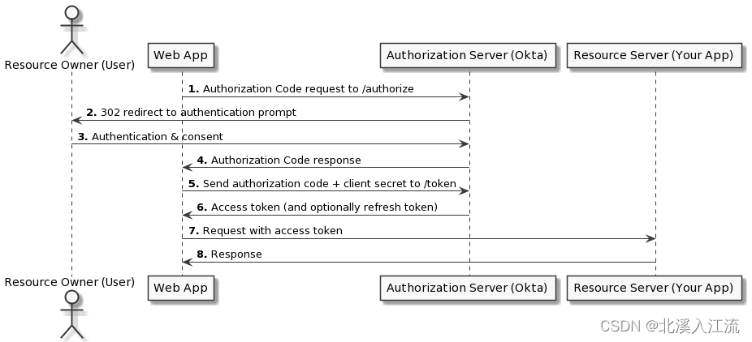

# 什么是SSO（Single Sign On）单点登录
**SSO单点登录**：是指用户的一次性鉴权登录。即用户在身份验证服务器服务器登录一次后，在身份验证服务器的注册服务中即可自动完成登录验证的功能。简单来说，就是在有多个系统时，只需要登录一次，其他服务即可自动感知获取到用户的登录状态。
单点登录的主要核心是身份验证服务器。在身份验证服务器中注册了用户的具体信息和可信应用。在其他服务获取登录状态时，是通过相关协议直接访问身份验证服务器获取用户的登录状态和身份完成登录的授权操作的。

# OIDC（Open ID Connect）
OIDC = (Identity, Authentication) + OAuth2.0
OIDC是一个基于OAuth2.0协议的身份认证标准协议。OIDC使用OAuth2的授权服务器来为可信任客户端提供用户的身份认证，并把对应的身份认证信息传递给客户端，且可以适用于各种类型的客户端，且完全兼容OAuth2。
OIDC基于OAuth2.0，使用access token来授权可信任应用访问保护信息。同时，OIDC提供id token来解决OAuth2无法进行用户身份认证的问题。OIDC将用户身份认证信息以id token的形式传递给可信任应用。可信任应用在验证id token后进一步通过OAtuh2获取access token读取更多信息。

# SSO服务授权流程（OIDC）
应用系统注册：应用在身份验证服务器中进行注册登记。设置应用的回调函数，生成应用ID、secret等信息。

## 授权模式
OIDC根据用户的身份类型和设置的授权模式方法的不同，具有不同的授权流程。根据自己的授权模式执行具体的流程。

### 授权码模式
授权码模式构建构建能够安全存储机密的服务器端（或 Web）应用程序，如带后端的相关程序。

#### 授权码模式授权流程
- 携带有应用服务器生成的`state`(防止CSRF跨域攻击)和在认证服务器注册的信息重定向到认证服务器的`/authorize`授权接口
- 认证服务器重定向登录界面给用户（若用户已登录，则处理器会在短时间内完成重定向和认证服务，前端登录界面未加载显示前已完成相关步骤）
- 用户进行身份认证
- 完成认证后，认证服务器返回一个可过时的授权码`code`到应用程序（`code`数据用来向认证服务器交换`token`信息，`code`数据具有时效性，所以请在其失效之前及时获取具体的`token`信息）
- 应用服务器携带认证的`code`信息和应用信息请求认证服务器的`/token`接口获取用户的`access_token`信息
- 认证服务器将`access_token`返回给应用服务器
- 用户根据`access_token`获取需要认证的相关用户身份信息

#### 请求授权码过程
```shell
https://${AuthorizeUri}?client_id=${ClientId}&response_type=code&scope=openid&redirect_uri=${RedirectUri}&state=${State}
```
- 请求授权码：
	- AuthorizeUri: 认证服务器的授权接口地址
	- ClientId: 应用服务器在认证服务器中注册的客户端ID
	- RedirectUri: 应用服务器在认证服务器中注册的应用服务器回调地址
	- State: 应用服务器生成`state`用来防止CSRF跨域攻击

```shell
curl -v -X POST \
	-H "Content-type:application/x-www-form-urlencoded" \
	"https://${TokenUri}" \
	-d "client_id=${ClientId}&client_secret=${ClientSecret}&grant_type=authorization_code&redirect_uri=${RedirectUri}&code=${Code}"
```
- 通过code获取`access_token`信息：
	- application/x-www-form-urlencoded: 在调用接口获取`access_token`时，其`Content-type`应设置为`application/x-www-form-urlencoded`类型
	- TokenUri: 认证服务器的获取令牌token接口地址
	- ClientSecret: 应用服务器在认证服务器中注册的应用服务器Secret信息
	- Code: 上一步获取到的授权码Code信息，或调用失败，可检测授权码是否过期

## 授权模式对比总结
本文只对前后端授权常见的授权码模式做详细介绍，其他授权模式可自行了解，这里只做简单介绍。

| 授权模式 | 适用情况 | 说明 |
| ---- | ---- | ---- |
| 授权码模式（Authorization Code） | 能够安全存储机密的服务器端（或 Web）应用程序 | 通过授权服务获取授权码`code`，通过`code`换取可用的`access_token`完成授权 |
| 带有PKCE的授权码模式（Authorization Code with PKCE | 适用于构建原生应用程序，如前端SPA服务，桌面、移动端程序等 | 带PKCE的授权码模式授权流程与授权码模式类似，只是在开始和结束时有一个额外的PKCE验证的过程 |
| 客户凭证模式（Client Credentials） | 客户凭证模式适用于没有最终用户的服务器端（“机密”）客户端应用程序，通常是机器对机器通信。如微服务调用等场景。 | 应用程序根据ClientId和ClientSecret获取`access_token`完成授权 |
| 隐含模式（Implicit） | 不推荐使用 | 不安全，隐含模式等token信息在url在携带，容易被窃取或篡改，推荐改为带有PKCE的授权码模式完成授权 |
| 交互代码（Interaction Code） | 交互代码授权通常由本机、前端SPA和Web客户端应用程序使用，这些应用程序希望直接与用户交互并在用户和授权服务器之间进行调解，而不是使用基于浏览器的重定向来传递身份验证。 | 交互代码流程类似于带PKCE的授权码授权流程。所有客户端都需要传递ClientId以及Code交换证明密钥(PKCE)以确保流程安全。Web应用程序等机密客户端还必须在其授权请求中传递客户端密钥。 |
| 直接身份验证-单因素带外数据（out-of-band，OOB）验证 | 当希望应用程序直接对用户进行身份验证时，可以使用直接身份验证。带外因素是一种需要通过单独的通信通道以及初始用户凭据进行二次验证方法的因素。 | 传输层协议使用带外数据来发送一些重要的数据，如果通信一方有重要的数据需要通知对方时，协议能够将这些数据快速地发送到对方 |
| 直接身份验证-单因素动态密码 (one-time passcode，OTP)验证 | 当希望应用程序直接对用户进行身份验证时，可以使用直接身份验证。 | 动态口令也称一次性密码，是指用户的密码按照时间或使用次数不断动态变化,每个密码只使用一次 |
| 直接身份验证-多因素带外数据（multifactor out-of-band，MFA OOB）验证 | 当希望应用程序直接对用户进行身份验证时，可以使用直接身份验证。 | 采用OOB作为次要验证因素进行授权认证 |
| 直接身份验证-多因素动态密码 (one-time passcode，OTP)验证 | 当希望应用程序直接对用户进行身份验证时，可以使用直接身份验证。 | 采用OTP作为次要验证因素进行授权认证 |
| 资源所有者密码（Resource Owner Password） | 不推荐使用 | 适用于没有其他流程的应用程序，因为它要求应用程序代码完全受信任并免受凭据窃取攻击。主要用途是为遗留应用程序提供一致且可预测的集成模式，否则这些应用程序无法更新为更安全的流程。 |
| SAML2.0断言（SAML 2.0 Assertion） | 适用于能够从SMAL认证提供商获取有效、签名的SMAL授权，希望使用现有信任关系而无需在授权服务器上进行直接用户批准步骤的客户端应用程序。 | SMAL2.0断言从SMAL身份提供商获取有效、签名的SMAL授权，然后将其交换为来自OAuth授权服务器的OAuth访问令牌 |
