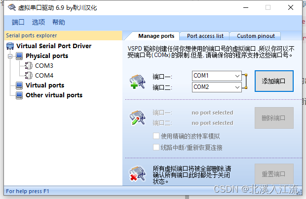
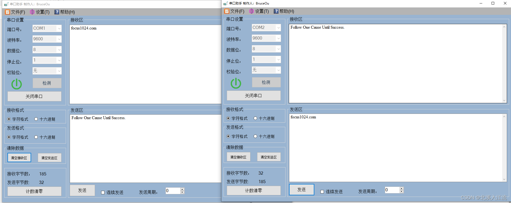
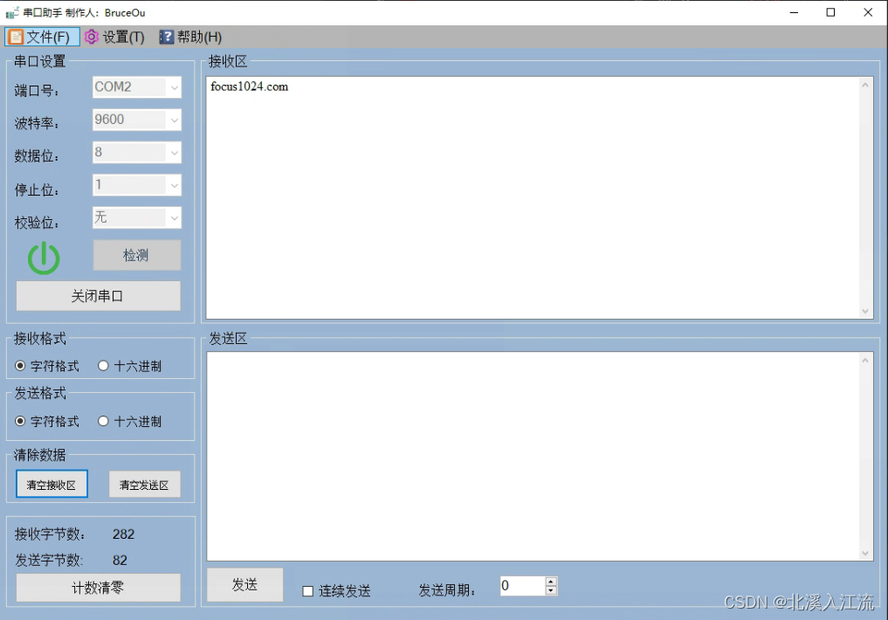
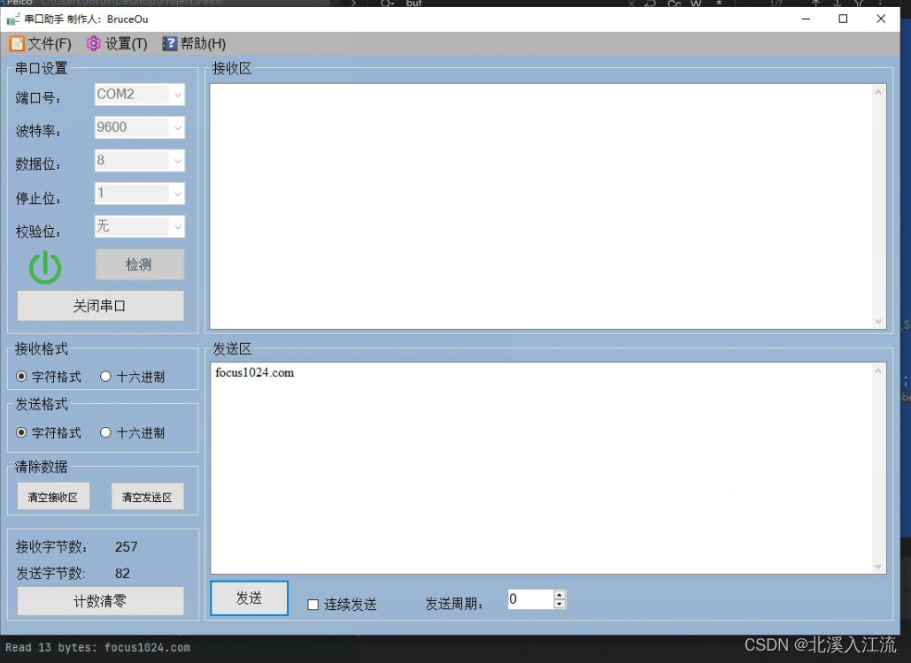

在单片机和嵌入式设备开发过程中，我们有时需要对程序的串口进行调试，但是身边又恰好没有硬件设备，此时，我们可以通过虚拟串口来实现模拟本地端口，方便调试。

# 软件安装
## VSPD虚拟串口工具
- 下载VSPD软件：[百度网盘VSPD分享](https://pan.baidu.com/s/1AuwqAA285LcNcCMJj3CzjA?pwd=1024)
- 解压后，选择`vspd.exe`文件，安装在本地
- 破解：将解压后，将`Cracked`目录下的文件复制到安装路径下，替换原安装路径下的同名文件即可

## 串口调试工具
根据自己的喜好选择合适的串口调试工具即可。

这里推荐BruceOu的串口调试工具：[BruceOu串口调试工具官网](https://www.bruceou.cn/index.php/software/serial_debugging_assistant.html)

# 虚拟串口

- 添加虚拟串口：为了模拟串口之间的通讯，在添加虚拟串口时，会模拟产生两个相连的串口，在这两个串口之间可以进行通讯。

# 串口调试（工具）
由于虚拟串口是模拟的两个串口之间的通讯，打开两个串口调试工具界面。选择一组相连的串口，即可通过调试工具进行测试（若是在串口调试工具中搜索不到相关串口，尝试重启相关串口调试工具重新搜索）。


# C语言程序调试串口（Windows）
在Windows上通过串口发送数据，可以使用Win32 API串口通讯函数。

通过Win32 API打开VSPD虚拟串口工具名如`COM1`、`COM2`的串口时，由于VPSD的驱动符号设置的问题，直接访问`COM1`无法连接到虚拟串口，需要将串口修改为`\\\\.\\COM1`即可正常访问。
## 串口发送数据
```c
#include <windows.h>
#include <stdio.h>

// 修改为对应串口
#define SERIAL_NAME "\\\\.\\COM1"
// 修改为对应波特率
#define BAUD_RATE CBR_9600


/**
 * 初始化串口配置信息
 * @param hSerial
 * @return
 */
int serialInit(HANDLE *hSerial) {
    // 打开串口
    *hSerial = CreateFile(SERIAL_NAME,
                          GENERIC_READ | GENERIC_WRITE,
                          0,
                          0,
                          OPEN_EXISTING,
                          FILE_ATTRIBUTE_NORMAL,
                          0);

    if (*hSerial == INVALID_HANDLE_VALUE) {
        printf("Error opening serial port!\n");
        return 0;
    }

    // 设置串口配置
    DCB dcbSerialParams = {0};
    dcbSerialParams.DCBlength = sizeof(dcbSerialParams);
    GetCommState(*hSerial, &dcbSerialParams);
    dcbSerialParams.BaudRate = BAUD_RATE;
    dcbSerialParams.ByteSize = 8;
    dcbSerialParams.StopBits = ONESTOPBIT;
    dcbSerialParams.Parity = NOPARITY;
    SetCommState(*hSerial, &dcbSerialParams);

    // 清空串口
    PurgeComm(*hSerial, PURGE_RXCLEAR | PURGE_TXCLEAR);

    // 设置超时
    COMMTIMEOUTS timeouts = {0};
    timeouts.ReadIntervalTimeout = 1000;
    timeouts.ReadTotalTimeoutMultiplier = 1000;
    timeouts.ReadTotalTimeoutConstant = 1000;
    timeouts.WriteTotalTimeoutMultiplier = 1000;
    timeouts.WriteTotalTimeoutConstant = 1000;
    SetCommTimeouts(*hSerial, &timeouts);
    return 1;
}

/**
 * 发送数据到串口设置中
 * @param hSerial 
 * @param data 
 * @return 
 */
int sendData2Serial(HANDLE hSerial, const char *data) {
    if (!WriteFile(hSerial, (void *) data, strlen(data), 0, 0)) {
        printf("Error in WriteFile()\n");
        return 0;
    } else {
        return 1;
    }
}

int main() {
    HANDLE hSerial;

    serialInit(&hSerial);

    const char *str = "focus1024.com\0";

    sendData2Serial(hSerial, str);

    // 关闭串口
    CloseHandle(hSerial);

    return 0;
}
```


## 串口读取数据
```c
#include <windows.h>
#include <stdio.h>

// 修改为对应串口
#define SERIAL_NAME "\\\\.\\COM1"
// 修改为对应波特率
#define BAUD_RATE CBR_9600
#define BUF_SIZE 1024


/**
 * 初始化串口配置信息
 * @param hSerial
 * @return
 */
int serialInit(HANDLE *hSerial) {
    // 打开串口
    *hSerial = CreateFile(SERIAL_NAME,
                          GENERIC_READ | GENERIC_WRITE,
                          0,
                          0,
                          OPEN_EXISTING,
                          FILE_ATTRIBUTE_NORMAL | FILE_FLAG_OVERLAPPED,
                          0);

    if (*hSerial == INVALID_HANDLE_VALUE) {
        printf("Error opening serial port!\n");
        return 0;
    }

    // 设置串口配置
    DCB dcbSerialParams = {0};
    dcbSerialParams.DCBlength = sizeof(dcbSerialParams);
    GetCommState(*hSerial, &dcbSerialParams);
    dcbSerialParams.BaudRate = BAUD_RATE;
    dcbSerialParams.ByteSize = 8;
    dcbSerialParams.StopBits = ONESTOPBIT;
    dcbSerialParams.Parity = NOPARITY;
    SetCommState(*hSerial, &dcbSerialParams);

    // 清空串口
    PurgeComm(*hSerial, PURGE_RXCLEAR | PURGE_TXCLEAR);

    // 设置超时
    COMMTIMEOUTS timeouts = {0};
    timeouts.ReadIntervalTimeout = 1000;
    timeouts.ReadTotalTimeoutMultiplier = 1000;
    timeouts.ReadTotalTimeoutConstant = 1000;
    timeouts.WriteTotalTimeoutMultiplier = 1000;
    timeouts.WriteTotalTimeoutConstant = 1000;
    SetCommTimeouts(*hSerial, &timeouts);
    return 1;
}

int main() {
    HANDLE hSerial;

    serialInit(&hSerial);

    char buf[BUF_SIZE];

    OVERLAPPED oRead;
    oRead.Offset = 0;
    oRead.OffsetHigh = 0;
    oRead.hEvent = CreateEvent(0, 1, 0, 0);

    BOOL fRead;
    DWORD dwRead;

    if (hSerial != INVALID_HANDLE_VALUE) {
        fRead = ReadFile(hSerial, buf, BUF_SIZE, &dwRead, &oRead);
        if (!fRead && GetLastError() == ERROR_IO_PENDING) {
            // 等待异步操作完成
            WaitForSingleObject(oRead.hEvent, INFINITE);
            if (GetOverlappedResult(hSerial, &oRead, &dwRead, FALSE)) {
                // 处理读取到的数据
                buf[dwRead] = '\0'; // 确保字符串以null结尾
                printf("Read %lu bytes: %s\n", dwRead, buf);
            }
        }
    }

    // 关闭串口
    CloseHandle(oRead.hEvent);
    CloseHandle(hSerial);

    return 0;
}
```


