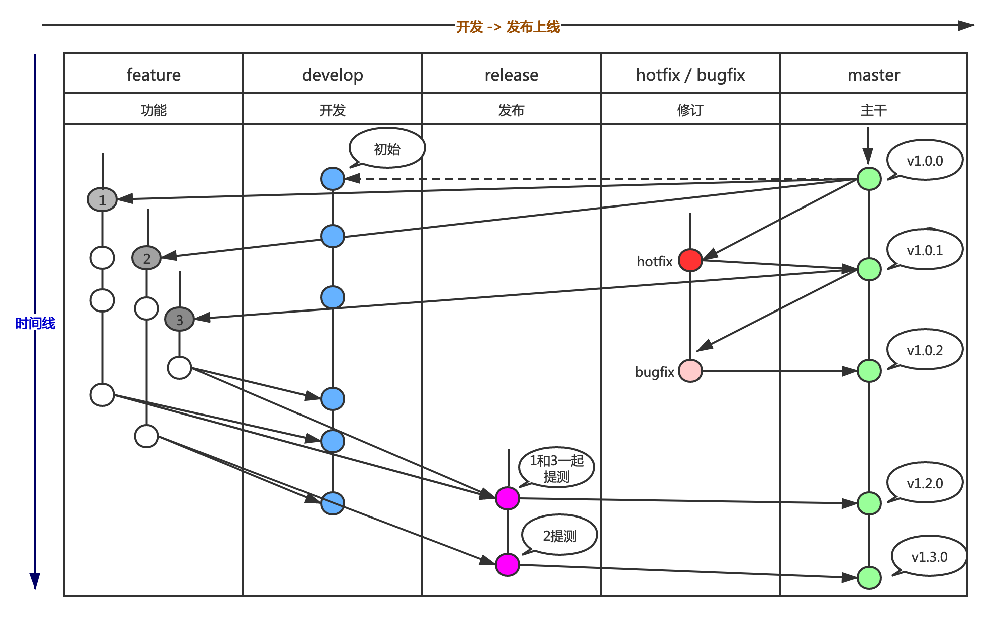

# Git分支管理

Git常用分支包括： **master**，**hotfix**，**bugfix**，**release**，**develop**，**feature**。

- **master**：项目主分支，有且仅有一个，除项目负责人外其他开发人员不得向 master 分支合并内容。
- **hotfix**：紧急线上 bug 修复分支，紧急即需要立刻尽快去处理发布上线（自 master 拉取）, 直接进行测试及上线。
- **bugfix**：非紧急上线的 bug 修复分支, 如非当天上线即使用 bugfix 进行命名（自 master 拉取） , 直接进行测试及上线。
- **release**：作为提测及上线分支，release是发布正式版本之前（即合并到 master 分支之前），需要有一个预发布的版本进行测试。
- **develop**：主开发分支，存有确定性的所有功能（上线和未上线）, 作为开发环境共有的部署分支。
- **feature**：功能开发分支，feature 是为了开发后续版本的功能，从 develop 分支拉取出来的。开发完成稳定后，要再并入 develop 分支。

---

# 分支命名

- **hotfix**：hotfix/{功能}，如 hotfix/providerLose。
- **bugfix**：bugfix/{功能}_年月日，如 bugfix/pubMsg_20210701。
- **release**：release/{功能}_年月日，如 release/pubMsg_20210701。
- **feature**：feature/{功能}_年月日，如 feature/pubMsg_20210701。

---

# 分支管理

- 上线完成之后, 提交申请进行master的合并处理, 打 Tag 维护（审核人员 / Leader）
- 相关分支创建人, 删除对应上线功能 feature / release / bugfix 分支

---

# Git代码提交规约（推荐）

1. 设置用户名为本人姓名，邮箱为公司邮箱或本人邮箱。
2. 代码提交规则：
   1. 提交的说明包含两部分：动作类型:简要说明，以英文的“:”作为区分。
   2. 动作类型使用英文大写。
   3. 理论上一次提交仅包含一个功能修改，如功能过大，需要注明功能的完成进度。若一次提交有多个功能修改，则每个功能提交描述作为单独的一行，每行以英文标识符“,”作为行尾结束符。
      
| 动作     | 说明                                                                            | 示例               |
| ---------- | --------------------------------------------------------------------------------- | -------------------- |
| ADD      | 新加功能，文件                                                                  | ADD:增加文件       |
| DEL      | 删除功能，文件                                                                  | DEL:删除文件       |
| MOD      | 修改功能                                                                        | MOD:修改功能       |
| FIX      | 修复问题                                                                        | FIX:修复问题       |
| PREF     | 优化功能，提升性能，体验                                                        | PREF:优化功能      |
| STYLE    | 修改代码格式（不影响代码运行的变动）                                            | STYLE:修改代码格式 |
| REFACTOR | 重构（既不增加新功能，也不修改bug的代码变动，一般重构需要使用新的独立分支处理） | REFACTOR:重构代码  |
| DOCS     | 文档                                                                            | DOCS:文档          |
      
---

# 代码提交流程

1. 代码修改完成后，需先进行编码规范检查，注释检查，单元测试等操作。
2. 测试通过后提交到本地，检查提交文件是否正确，有无遗漏文件，添加相关说明。
3. 拉取服务器的代码，检查代码合并结果，若有冲突则找相关人员解决冲突。解决冲突后，重新编译测试代码，测试成功后提交本地代码。
4. 推送代码到服务器。

