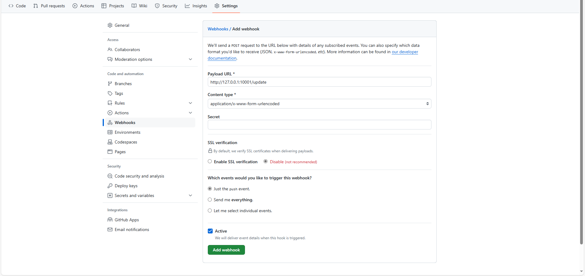

# Nginx部署Hugo
## nginx.conf
```shell
user  nginx;
worker_processes  auto;

error_log  /var/log/nginx/error.log notice;
pid        /var/run/nginx.pid;


events {
    worker_connections  1024;
}


http {
    include       /etc/nginx/mime.types;
    default_type  application/octet-stream;

    log_format  main  '$remote_addr - $remote_user [$time_local] "$request" '
                      '$status $body_bytes_sent "$http_referer" '
                      '"$http_user_agent" "$http_x_forwarded_for"';

    access_log  /var/log/nginx/access.log  main;

    sendfile        on;
    #tcp_nopush     on;

    keepalive_timeout  65;

    #gzip  on;

    include /etc/nginx/conf.d/*.conf;

    # 设置客户端请求服务器最大长度限制
    client_max_body_size 0;
}
```

## hugo.conf
在`/etc/nginx/conf.d`路径下新建`hugo.conf`文件

```shell
server {
    listen 80;
    listen [::]:80;
    
    server_name ${DOMAIN_NAME};
                
    client_max_body_size 1024m;
                  
    index index.html index.html;

    root ${BLOG_PATH}/public;
}
```

根据配置修改域名和博客所在位置，重启Nginx完成部署

# Hugo自动更新
一般情况下，我们在服务器上部署Hugo静态博客。在自己本地撰写博客，若是本次撰写完博客都要手动更新到远程服务器，繁琐且不符合计算机专业的特点，所以我们需要实现本地更新完后主动推送远程进行编译。

这里采用Git进行博客的版本管理，并通过Git的hook机制实现自动更新机制。

## Hugo自动更新流程
在服务端部署实现自动更新，我们需要做到：
1. 本地推送代码时，服务端能够接收到推送信息
    - 利用Git hook机制实现
2. 接收到推送信息时，远程服务器可以拉取Git最新代码
    - 服务器clone仓库，并且具有远程仓库的访问权限（访问远程仓库可以通过用户名密码登录和Token令牌两种访问方式）
        - 用户名密码登录：一般情况下，用户名密码访问Git权限具有时效性，可以通过Git配置设置为不过期
        - Token令牌：根据生成令牌时授予的访问权限，在clone后，该仓库一直具体对应权限信息，不需要登陆，不会过期
            - 令牌登陆时，clone仓库携带令牌信息，可以通过git命令获取到对应令牌，所以请确保服务器信息不会泄露，在生成令牌时，授予最小可用权限即可
3. 远程服务器编译生成静态博客文件
    - 这里也可以直接在本地编译，推送时推送原始内容和编译后的public静态资源文件夹到远程服务器

## 添加访问令牌
- GitHub：Settings -> Developer settings -> Personal access tokens -> Tokens(classic)
- Gitee：设置 -> 安全设置 -> 私人令牌
- Gitea：设置 -> 应用 -> 管理 Access Token

生成令牌后：通过以下命令clone代码
```shell
git clone http(s)://oauth2:${token}@${domain_name}/${repo_name}
```
请根据具体情况替换以上信息

## 添加web hook
web hook是一种基于HTTP的回调请求，当应用触发一定的行为时，会自动调用 hook 设置的API接口

Git通过在对应仓库中添加 Web Hook，当触发对应事件时（如，推送行为）会主动调用设置的api接口。

一般情况下，Git web hook 仅支持POST请求，部分Git网站可能支持GET请求，但是不建议使用GET请求调用 web hook，git web hook目前仅支持JSON（application/json）, x-www-form-urlencoded（application/x-www-form-urlencoded）两种Type类型。

- GitHub：Settings -> Code and automation -> Webhooks -> Tokens(classic)
- Gitee：管理 -> 仓库挂件 -> WebHooks
- Gitea：设置 -> Web 钩子

以GitHub为例：



- Payload URL（目标URL）：设置 web hook 触发时调用的远程 URL 接口
- Content Type：git web hook目前仅支持JSON（application/json）, x-www-form-urlencoded（application/x-www-form-urlencoded）两种Type类型
    - 推荐采用JSON格式，部分git web hook的x-www-form-urlencoded类型已不维护
- Secret：密钥验证内容，若无密钥则为空。不同平台的密钥验证方式不同，请参考对应平台的密钥说明文档
    - GitHub：https://docs.github.com/en/webhooks/using-webhooks/validating-webhook-deliveries
    - Gitee：https://gitee.com/help/articles/4290
    - Gitea：自 Gitea 1.13.0 已弃用（https://docs.gitea.com/zh-cn/usage/webhooks）
- events：推送事件

通过以上内容，新建 web hook 后，当我们本地推送代码后，git 平台会自动调用我们配置的接口，通过在接口中实现更新服务端代码和自动编译操作完成自动更新机制

## rust实现自动更新接口
web hook本质上是一个HTTP请求，所以我们只需要实现对应接口，在接口中调用 `git pull` 和 `hugo`命令即可

**依赖：**
```shell
cargo add actix-web
cargo add serde -F derive
```

**main.rs：**
```rust
use actix_web::{App, HttpServer, HttpResponse, Responder, post};
use serde::{Deserialize, Serialize};

use std::process::Command;

#[derive(Serialize, Deserialize)]
pub struct Response {
    pub code: u16
}

fn hugo_build() {
    let output = Command::new("hugo")
                        .output()
                        .expect("Failed to execute command");
 
    // 输出命令的结果
    println!("hugo build");
    println!("输出: {}", String::from_utf8_lossy(&output.stdout));
    println!("错误: {}", String::from_utf8_lossy(&output.stderr));
    println!();
}

fn git_pull() {
    let output = Command::new("git")
                        .arg("pull") // 添加参数
                        .output()
                        .expect("Failed to execute command");
 
    // 输出命令的结果
    println!("git pull");
    println!("输出: {}", String::from_utf8_lossy(&output.stdout));
    println!("错误: {}", String::from_utf8_lossy(&output.stderr));
    println!();
}

#[post("/update")]
async fn update() -> actix_web::Result<impl Responder> {
    git_pull();
    hugo_build();
    Ok(HttpResponse::Ok().json(Response {code: 200}))
}

#[actix_web::main]
async fn main() -> std::io::Result<()> {
    HttpServer::new(move || {
        App::new()
        .service(update)
    })
    .bind(("0.0.0.0", 10001))?
    .run()
    .await
}
```