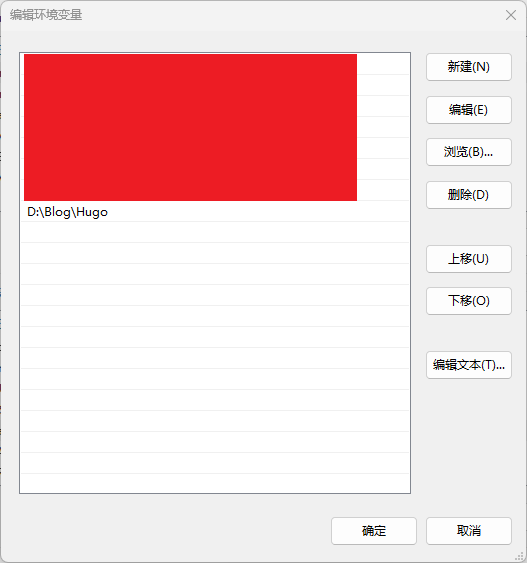

# Hugo博客教程（一）

## 博客

### 静态博客

        静态博客是指利用生成工具（如：Hugo、Hexo）等将博文编译成静态文件的一种博客系统。博主只需要将生成文件部署在静态服务器上即可被互联网访问，在访问时，直接获取静态资源，不需要向数据库中请求博文、图片等信息。

#### 静态博客的优缺点

> 优点

1. 速度快：用户在访问博客时，只需要获取静态资源，不需要向服务器查询博文、图片等信息。

2. 部署方便、成本低：市面上有许多免费开源的托管程序，不需要承担高昂的服务器费用。

3. 维护方便：服务器维护成本低。

4. 迁移方便：无数据库系统，迁移时，不需要专门进行数据库迁移操作，只需保存原始博文即可。

5. 安全：无需担心数据库注入、跨站攻击等网络安全问题。

> 缺点

1. 不支持原生注册登录、原生评论，需要使用第三方评论工具。第三方评论工具的安全性和速度质疑。

2. 入门难度大，不易上手。静态博客的内容管理和操作都有一定的难度，需要一定的编程基础。

#### 常见的静态博客

##### Hexo

        基于Node.js的静态网站生成器，近几年（截止到2023年）的发展不如以前那么好，主题多，教程多，官方文档丰富，可以很快的搭建出漂亮的博客页面。由于其基于Node.js的特点，当博客数量增多时，渲染时间长。

        所以Hexo适用于博客数量少，更新周期长的博主。

##### Hugo

        Hugo是一个基于Go语言开发的静态网站生成器，Hugo的突出特点是简洁、灵活、高效。近几年（截止到2023年）发展迅速，越来越多的网站开始使用Hugo搭建。相比于Hexo，其渲染速度快，配置简单。但是其主题相比于Hexo较少。

        Hugo适合于博客数量多，更新周期短的博主。

### 动态博客

    动态博客是指当服务器收到访问请求时，会结合数据库，调用相应的程序，动态生成需要传回的页面文件。动态博客相比于静态博客最大的区别在于其需要数据库的参与。

#### 动态博客的优缺点

> 优点

1. 网页动态生成，对于不同用户，不同时间的访问展现不同的页面内容。

2. 功能强大：动态博客相比于静态博客的功能更加强大。比如对数据库的支持、注册登录、访问量统计、原生评论的支持。

3. 交互性强：因为其支持原生评论和访问量统计的特点，相比于静态博客具有更好的交互性。

> 缺点

1. 浪费系统资源：因为其与数据库交互的，所以相比于静态博客更消耗系统资源，浏览速度慢。

2. 易遭受攻击：因为动态博客需要支持数据库，还有后端代码，所以更易受到数据库注入和跨站攻击等威胁。

3. 维护迁移困难：相比于静态博客只需要保存静态资源，动态博客的迁移不仅需要重新部署博客，还需要迁移数据库，修改配置等操作，在迁移中容易出现操作失误导致迁移失败重新迁移。

4. 成本高：需要独立的服务器部署博客网站。

#### 常见的动态博客

##### WordPress

        全球最著名的博客网站，并逐步演化为内容管理系统软件。拥有世界上最强大的插件和模板。功能强大、扩展性强。缺点是插件和模板对于国内的支持不好，国内访问速度缓慢。

##### Typecho

        国内开源的一个动态博客平台，相比于WordPress更加轻巧、快速。原生默认采用MarkDown编辑器，相比于WordPress的编辑器更加高效。

### 为什么选择静态博客

        静态博客和动态博客相比各有优劣，但是相比较而言，搭建个人博客，最方便、成本最低、体验最好的就是静态博客。相比于动态博客需要的服务器部署，目前有很多平台支持免费的静态博客部署，成本更低，有需要的只需要买一个域名即可支持每年搭建个人博客所需要的金钱耗费。随着个人博客的发展，静态博客也是目前的趋势所在。

        当然动态博客也有自己的优势，动态博客的功能性、互操性更强，而且动态博客需要部署在服务器上，有自己的一台服务器可以干很多事情，不仅是搭建个人博客，甚至可以搭建自己的云盘、图库、邮件系统、甚至是通过服务器来学习相关的Linux操作系统知识。

        在众多静态博客中，Hugo不是最流行的，但却是未来的静态博客的趋势所在。相比于Hexo的需要安装Node.js，Hugo基于Go打包的二进制文件，只需要把文件下载下来并添加到环境变量中即可使用，且Hugo的渲染速度相比于Hexo更快，更适合有长期写博客人的需求。

## Hugo的安装与配置

- [Hugo中文文档 (gohugo.org)](https://www.gohugo.org/)

- [Hugo官方官网(gohugo.io)](https://gohugo.io/)

- [Hugo安装包下载地址：Releases · gohugoio/hugo (github.com)](https://github.com/gohugoio/hugo/releases)


在下载Hugo安装包时，有Hugo和Hugo-extended两种可运行文件下载，其中Hugo仅支持JS，Hugo-extended是Hugo的扩展版本，在支持JS的基础上还支持TS，所以在下载时建议下载Hugo-extended版本的可执行文件。

### Windows系统的安装与配置

        在[Hugo安装包下载地址：Releases · gohugoio/hugo (github.com)](https://github.com/gohugoio/hugo/releases)下载好Hugo.exe文件后，将Hugo.exe文件放在想要存放的位置即可，比如我这里放在`D:\Blog\Hugo`文件夹下面，此时在该文件夹下面打开cmd命令提示符即可运行Hugo的相关命令，运行命令Hugo命令实际上就是在调用Hugo.exe文件。

#### Windows环境变量配置

        此电脑 -- 属性 -- 高级系统设置 -- 高级 --环境变量 -- Path

        在Windows的系统环境变量配置中，添加存放Hugo.exe文件的文件夹，确定之后即可在其他任意地方运行Hugo命令而不是仅在安装位置运行。

<div style="text-align: center;">
    
</div>


### Linux系统的安装与配置

        Hugo在Linux上的安装与配置和Windows类似。首先wget下载指定的Hugo压缩文件（tar.gz文件一般是Linux系统的压缩文件），以v0.110.0版本为例：

```shell
# 下载指定版本的Hugo文件
wget https://github.com/gohugoio/hugo/releases/download/v0.110.0/hugo_extended_0.110.0_linux-amd64.tar.gz
# 解压tar.gz压缩文件
tar -zxvf hugo_extended_0.110.0_linux-amd64.tar.gz
```

        解压后，使用`mv`命令将可执行文件移动到想要存放的路径。

#### Linux环境变量配置

        Linux修改本用户的环境变量一般需要修改用户目录下的bashrc文件即`~/.bashrc`文件，在文件中加入`export PATH=$PATH:{PATH}`即可，修改后的文件不会立即生效，需要使用`source ~/.bashrc`命令重新加载bashrc文件即可完成环境变量配置。

```shell
# 打开~/.bashrc文件
vim ~/.bashrc
# 在bashrc文件中加入环境变量配置
# 在修改bashrc文件时注意添加注释，避免之后找不到相关配置
# /home/user/blog/Hugo是我存放Hugo文件的目录，在配置时根据自己的情况按需修改
export PATH=$PATH:/home/user/blog/Hugo
# 保存修改，退出后在shell界面重新加载bashrc文件
source ~/.bashrc
```

### 安装检查

        在配置好环境变量后，在cmd或者shell（尽量不要在可执行文件存放的位置中）中运行Hugo命令检查是否安装成功，一般而言使用version查看是否安装成功。

在cmd和shell中执行：

```shell
hugo version
```

成功示例：

```shell
hugo v0.110.0-e32a493b7826d02763c3b79623952e625402b168+extended windows/amd64 BuildDate=2023-01-17T12:16:09Z VendorInfo=gohugoio
```
