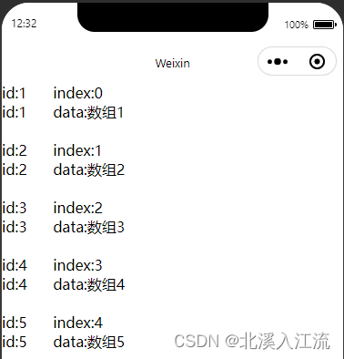

> 微信开发文档：[WXML | 微信开放文档 (qq.com)](https://developers.weixin.qq.com/miniprogram/dev/reference/wxml/)

## 数据绑定
### 简单数据绑定
小程序原生支持数据的双向绑定，在wxml文件里面可以使用 Mustache 语法(双{{ }}方法)绑定js文件中data里面的属性
**示例：**
wxml文件内容：
```html
<view> {{ message }} </view>
```

js文件内容：
```javascript
Page({
  data: {
    message: 'Hello World!'
    // data中属性之间使用","隔开
  }
})
```

实际效果：


## 绑定运算
在{{ }}中绑定的数据可以进行算数运算，逻辑判断，逻辑运算，字符串运算等操作
**算数运算示例：**
wxml文件内容：
```html
<view> {{a}} + {{b}} = {{a + b}} </view>
```

js文件内容：
```javascript
Page({
  data: {
    a: 2,
    b: 3
  }
})
```

实际效果：


### 逻辑绑定
在wxml需要boolean类型的值时，如：
```html
<checkbox checked="{{false}}"> </checkbox>
```
在这里不能写成 `checked="false"` 的形式，其计算结果为字符串，wxml会将其默认转换成 true 值，可能会造成逻辑上的错误。

### 组件绑定函数
使用组件绑定函数后，可通过绑定动作触发相应的函数
js文件内容：
```javascript
Page({
  /**
   * 页面的初始数据
   */
  data: {
	value: 0
  },
  
  /**
   * 自定义的函数
   */
  bindTest: function () {
	//给this指针起别名
	var that = this;
	 
	this.setData({
		value: that.data
	});
	console.log(that.data.value);
    }
 })
```

wxml文件内容：
```html
<button class="mini-btn" type="primary" size="mini" bindtap="bindTest">{{value}}</button>
```

---

## 数据渲染
### 列表渲染

1. 在组件中使用 `wx:for` 绑定一个数组，即可使用数组中的数据重复渲染该组件。
2. 数组当前下标默认为 index，数组当前项的变量名默认为 item
3. 可通过 {{item.key}} 来渲染 value 值
4. 当数组中的项目会发生动态变化的时候，必须加上 `wx:key` 值来指定数组的key，key的属性必须为数组中的唯一标识
5. 即使数组不会发生动态变化，也建议加上 `wx:key` 属性

js文件中内容：
```javascript
data: {
    form: [
      {
        'id': 1,
        'data': '数组1'
      },
      {
        'id': 2,
        'data': '数组2'
      },
      {
        'id': 3,
        'data': '数组3'
      },
      {
        'id': 4,
        'data': '数组4'
      },
      {
        'id': 5,
        'data': '数组5'
      },
    ]
  }
```

wxml文件中内容：
```html
<view wx:for="{{form}}" wx:key="id">
  <text decode="{{true}}" space="{{true}}">id:{{item.id}}&nbsp;&nbsp;&nbsp;&nbsp;&nbsp;&nbsp;index:{{index}}\n</text>
  <text decode="{{true}}" space="{{true}}">id:{{item.id}}&nbsp;&nbsp;&nbsp;&nbsp;&nbsp;&nbsp;data:{{item.data}}\n</text>
  <text>\n</text>
</view>
```

展示效果：




注意事项：

1. 在 wxml 和 html文件中，空格一般是不输出的，如果需要输出空格的话，需要使用`&nbsp;`表示一个空格
2. 微信小程序默认不开启`&nbsp;`的使用，若要使用`&nbsp;`，需要在标签中声明`decode="{{true}}" space="{{true}}`
3. `&nbsp;`在text标签中生效，在view标签中不生效

### 条件渲染
在微信小程序中，使用`wx:if`，`wx:elif`，`wx:else`进行条件渲染。条件的逻辑等同于编程语言中 if 语句的逻辑。
wxml文件中内容
```html
<view wx:if="{{a > 5}}">a大于5</view>
<view wx:elif="{{a < 5}}">a小于5</view>
<view wx:else>a等于5或不是数字</view>
<text>\n</text>

<view wx:if="{{b > 5}}">b大于5</view>
<view wx:elif="{{b < 5}}">b小于5</view>
<view wx:else>b等于5或不是数字</view>

<view wx:if="{{c > 5}}">c大于5</view>
<view wx:elif="{{c < 5}}">c小于5</view>
<view wx:else>c等于5或不是数字</view>
```

js文件中内容：
```javascript
data: {
    a: 7,
    b: 3
}
```

展示效果：


