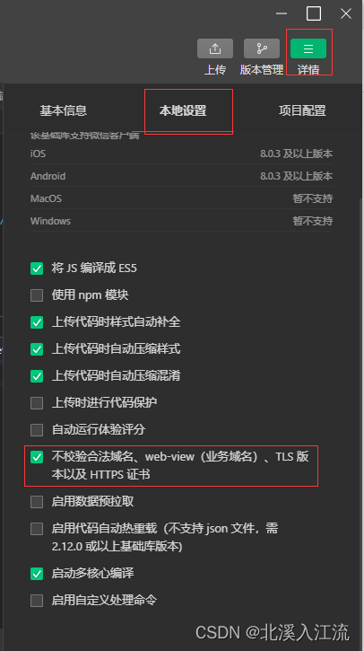

## 路由跳转
1. wx.switchTab

跳转到 tabBar 页面，并关闭其他所有非 tabBar 页面。
```javascript
wx.switchTab({
	url: '/pages/tarbar/index'
})
```

2. wx.reLaunch

关闭所有页面，打开到应用内的某个页面。
```javascript
wx.reLaunch({
	url: '/pages/index/index'
})
```

3. wx.redirectTo

关闭当前页面，跳转到应用内的某个页面。但是不能跳转到 tabbar 页面。
```javascript
wx.redirectTo({
	url: '/pages/index/index'
})
```

4. wx.navigateTo

保留当前页面，跳转到应用内的某个页面。但是不能跳到 tabbar 页面。小程序的页面栈最多只能存储10个页面。
```javascript
wx.navigateTo({
	url: '/pages/index/index'
})
```

5. wx.navigateBack

关闭当前页面，返回上一页面或多级页面。使用delta参数确定返回的页数，默认为1，若delta大于现有页面数，则返回至首页。
```javascript
// 此处是A界面，前往B界面
wx.navigateTo({
	url: '/pages/B/B'
}

// 此处是B界面，前往C界面
wx.navigateTo({
	url: '/pages/C/C'
})

// 此处是C界面，返回到A界面
wx.navigateBack({
	delta: 2
})
```

---

## API调用
微信小程序默认已经封装了相关的请求方法，在使用微信开发工具时，在微信开发工具右上角的详情，本地设置中设置不检验合法域名...即可使用开发工具进行调试调用。
**注：在提交代码至微信小程序平台后，若要调用服务器接口，则需配置https，微信小程序不支持http请求**




微信小程序通过 `wx.request()` 方法调用服务器接口，通过指定 `url` 指定接口，通过 `method` 指定调用方法。

### GET请求
GET请求一般使用头参法传递数据，GET请求相对POST请求速度较快，但是安全性不高，凡是设计用户隐私的数据，都不能使用GET请求。
```javascript
bindTestGet() {
	// 为确保this指向不发生改变，可以固定下this指向
	// 使用this的时候用that代替即可
	var that = this;
	wx.request({
		// 注意，如果小程序开启校验合法域名时必须使用https协议
		// 在测试的情况下可以不开启域名校验
		url: 'http://127.0.0.1:4523/mock/370607/testGet?id=1',

		// 请求的方法
		// 常用方法'GET','POST','PUT','DELETE'
		method: 'GET', 
		// 设置请求头，不能设置 Referer
		header: {
			// 默认值
			'content-type': 'application/json' 
		},
		// 请求成功时的处理
		success: function (res) {
		// 一般在这一打印下看看是否拿到数据
			console.log("testGet");
			console.log(res.data);
			if (res.statusCode == 200) {
				var array = res.data;
				that.setData({
				// 将res.data保存在listDate方便我们去循环遍历
					listDate: res.data
				// 统计所有数据
				});
			};
		},
		// 请求失败时的一些处理
		fail: function () {
			wx.showToast({
				icon: "none",
				mask: true,
				title: "接口调用失败，请稍后再试。",
			});
		}
	});
}
```

### POST请求
POST请求一般使用Body传参法，Body请求速度相对GET请求相对较慢，但是POST请求胜在隐私性高，可传递数据量大。
```javascript
bindTestPost() {
	var that = this;
	wx.request({
      		url: 'http://127.0.0.1:4523/mock/370607/testPost',
      		data: {
        		param: '1',
      		},
	      	method: 'POST', 
      		header: {
    			'content-type': 'application/json'
		},
      		success: function (res) {
        		console.log("testPost");
		        console.log(res.data);
        		if (res.statusCode == 200) {
				var array = res.data;
          			that.setData({
            				listDate: res.data
	          		});
        		}
	      	},
      		fail: function () {
      			wx.showToast({
            			icon: "none",
	            		mask: true,
        	  		title: "接口调用失败，请稍后再试。",
         		});
      		}
   	});
  }
```
其他场景API调用方法如'PUT','DELETE'本质是'POST'请求的延伸，'PUT'请求和'DELETE'请求使用方法同'POST'，只需修改method中的方法即可。

---

## 页面传参

1. 通过微信小程序组件的公有属性`data-[key]="value"`的形式，可以从wxml文件中向js文件中传值；
2. 在同一个标签中，需要向js文件中传递多个值的时候，可以使用多个`data-[key]="value"`的形式传值；
3. 在js文件中，通过`[res].currentTarget.dataset.key`或`[res].currentTarget.dataset[key]`的形式，获取从wxml中传递到js文件的值；
4. 在页面跳转时，使用头参法向要跳转的页面进行传值；
5. 在js的文件的`onLoad`生命周期函数中，通过`[res].[key]`的形式获取从父页面传递的参数。
6. **在使用**`**data-[key]="value"**`**的形式传参时，[key]中不能出现大写字母，不然js文件中识别不到相关的key，这里建议使用下划线命名法进行key的命名**

示例：
wxml文件中：
```html
<view bindtap="goChild" data-id="{{item.id}}" data-key="1">
```

父js文件中获取wxml文件传递的值：
