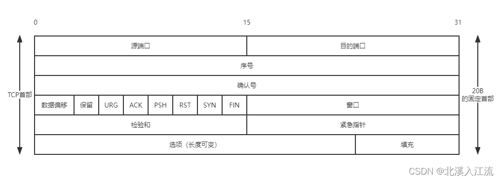

# 传输层提供的服务
## 传输层的功能
传输层向应用层提供通信服务，属于面向通信部分的最高层，是用户功能中的最低层。为运行在不同的主机上的进程之间提供逻辑通信，即使网络层协议不可靠，传输层也可以为用户提供可靠的服务。
传输层的具体功能如下：
- 传输层提供应用程序之间的逻辑通信（即端到端通信）。与网络层的区别是，网络层只提供主机之间的逻辑通信。
- 复用和分用：
	- 复用：发送方不同的应用进程都可使用同一个传输层协议传送数据
	- 分用：接收方的传输层在剥去报文的首部后能把这些数据正确交付到目的应用进程
- 传输层对收到的报文进行差错检验，网络层只检查IP数据报首部，不检验数据部分是否出错
- 传送层提供两种不同的协议，分别是面向连接的TCP和无连接的UDP。网络层无法同时实现两种协议（要么提供面向连接的虚电路服务，要么提供无连接服务）
## 传输层寻址与端口
### 端口的作用
**端口**：能让应用层的各种应用进程将其数据通过端口向下交付给传输层，以及让传输层知道应当将其报文段中的数据向上通过端口交付给应用层相应的进程。端口是传输层服务访问点（TSAP），端口在传输层的作用类似于网络层的IP地址和数据链路层的MAC地址。端口标识的是主机中的应用程序。
数据链路层的SAP是MAC地址，网络层的SAP是IP地址，传输层的SAP是端口。
### 端口号
应用进程通过端口号进行标识，端口号的长度为16bit，能够表示65536（$2^16$）个不同的端口，端口号只标识本计算机中的各个进程。
端口号根据TCP和UDP协议的不同可以分配相同的端口号。比如9527这个端口号可以分配给仅使用TCP协议的一个进程，也可以同时分配给仅使用UDP协议的一个进程。两者的端口号虽然相同，但是使用的协议不同，所以不是同一进程。
#### 端口号分类
- 服务端使用的端口号
	- 熟知端口号（0~1023）：由LANA（互联网地址指派机构）指派给TCP/IP最重要的一些程序
	- 登记端口号（1024~49151）：供没有端口号的应用程序使用，使用这类端口号应在IANA登记，防止重复使用
- 客户端使用的端口号（48152~65535）：仅在客户进程运行时才动态的选择，又称**短暂端口号（临时端口）**。通信结束后，端口号就释放，供其他客户进程使用
##### 常见熟知端口号
| 应用程序 | FTP | TELNET | SMTP | DNS | TFTP | HTTP | HTTPS | SNMP |
| -- | -- | -- | -- | -- | -- | -- | -- | -- |
| 熟知端口号 | 21 | 23 | 25 | 53 | 69 | 80 | 443 | 161 |
### 套接字（Socket）
**套接字**：在网络中通过IP地址区分不同的主机，通过端口号区分主机中不同的应用进程，IP地址和端口号合在一起就构成了套接字Socket。在网络中采用发送方和接收方的套接字来识别端点。套接字的本质就是一个通信端点。**套接字Socket = （IP地址 : 端口号）**
在网络中进行通信时，报文段应含有发送端口和接收端口的套接字。套接字通过发送端口和目的端口区分，所以一个进程可连接的客户进程无理论上的限制。
## 无连接服务与面向连接服务
### 无连接服务
无连接服务是：两个实体之间的通信不需要实现建立好连接，需要通信时，直接发送信息到网络中，让该信息在网络上尽最大努力的传送到目的地。
TCP/IP模型在传输层提供了无连接的用户数据报协议（UDP），提供不可靠的逻辑通信。
UDP是一个无连接的非可靠传输层协议。在网络层之上仅提供两个附加服务：多路复用和对数据的错误检查。
#### 无连接服务UDP的优点
- 比较简单，易于实现
- 执行速度块
- 实时性好
#### UDP应用
- TFTP：小文件传送协议
- DNS：域名系统
- SNMP：指简单网络管理协议，在IP网络中管理网络结点
- RTP：实时传输协议
### 面向连接服务
面向连接服务：通信双方在通信之前，必须先建立连接，在通信过程中，整个连接的情况一直被实时的监控和管理。通信结束后，释放建立的连接。
TCP/IP模型在传输层提供了面向连接的传输控制协议（TCP），采用TCP时，传输层向上提供一台全双工的可靠逻辑信道。
TCP连接和网络层虚电路的区别：TCP报文段是在传输层抽象的逻辑信道中传输，对路由器不可见。虚电路经过的交换结点都必须保存虚电路状态信息。传输层采用TCP不影响网络层提供的无连接服务。
#### 面向连接服务TCP的优点
- TCP的确认机制和重传机制保证其传输的可靠，稳定
- 数据传输中有窗口机制决定传输数据的大小，达到拥塞控制的效果
#### TCP应用
- HTTP协议：超文本传输协议，用于浏览器浏览
- HTTPS协议：安全超文本传输协议，携带SSL的HTTP协议
- FTP协议：文件传输协议，用于文件传输
- POP3协议：邮局协议，收邮件使用
- SMTP协议：简单邮件传输协议，用来发送电子邮件
- Telent协议：远程登陆协议，通过一个终端登陆到网络
- SSH协议：安全外壳协议，用于加密安全登陆，替代安全性差的Telent协议
# UDP协议
用户数据报协议（User Datagram Protocol，UDP）仅在IP的数据报服务上增加了两个最基本的服务：复用和分用以及差错检测。
UDP不保证可靠交付，不意外应用对数据的要求不可靠，所有的维护可靠性工作都在应用层来完成。应用开发者可根据应用的需求灵活设计可靠性机制。
UDP是面向报文的。发送方UDP对应用层提供的报文，添加首部后直接交付给网络层，一次发送一个报文，既不合并也不拆分；接收方UDP对网络层提供的UDP数据报，在去除首部后原封不动地交付给上层应用进程。因此，报文是UDP数据报处理的最小单位。
## UDP的特点
- UDP无须建立连接，不会引入建立连接的时延，速度比TCP要块很多
- 无连接状态，不需要维护连接状态，能支持更多的活动客户机
- 分组首部开销小，TCP首部有20B的开销，而UDP首部仅有8B的开销
- 应用层能更好的控制要发送的数据和发送时间。UDP没有拥塞控制，网络的拥塞不会影响主机的发送速率。某些实时应用要求以稳定的速度传输，能容忍一些数据的丢失，但不允许有较大的时延，UDP很好的满足了这一要求
- UDP支持一对一、一对多、多对一和多对多的交互通信。
## UDP数据报
### UDP的首部格式

    

- 首部（8B）
	- 源端口（2B）：源端口号，在需要对方回信时选用，不需要时全为0
	- 目的端口（2B）：目的端口号，在终点交付报文时必须使用到
	- 长度（2B）：UDP数据报的长度（包括首部和数据），单位是B，最小值为8（仅首部）
	- 校验和（2B）：检测UDP数据报传输时是否出错。有错就丢弃。该字段是可选字段，不需要计算校验和时，该字段全为0

如果接收方UDP发现收到的报文端口不正确，那么就丢弃该报文，并由ICMP发送“端口不可达”差错报文给发送方。
### UDP校验
在计算校验和时，在UDP数据报之前添加12B的伪首部，伪首部只参与计算校验和时，校验和按照这个临时的UDP数据报来计算。UDP校验和即校验首部也校验数据（IP数据报只校验首部）。

    

在计算校验和时，UDP数据报添加伪首部，把全零写入校验和字段。把UDP数据报视为许多16位的子串拼接起来。若UDP的数据部分不是偶数个字节，则在数据部分末尾添加0，使其称为偶数个字节（添加的0是临时的）。然后按照二进制反码计算出这些16位的和，将此和的二进制反码写入校验和字段中，校验完毕。
接收方收到UDP数据报时，加入伪首部和末尾添0（如果不是偶数个字节），按二进制反码求这些16位字的和。当无差错时结果为全1，反之表示出现差错，丢弃这个UDP数据报。
# TCP 协议
传输控制协议（Transmission Control Protocol，TCP）是在不可靠的网络层之上实现的可靠的数据传输协议，主要解决传输的可靠、有序、无丢失和不重复问题。
## TCP协议的主要特点
- TCP是面向连接的传输层协议，TCP连接是一条逻辑连接
- 每条TCP连接只能有两个端点，每条TCP连接只能是端到端的（进程之间）
- TCP提供可靠交付的服务，保证传送的数据无差错、不丢失、不重复且有序
- TCP提供全双工通信，允许通信双方的进程在任何时刻发送数据，因此，TCP连接的两端都设有发送缓存和接收缓存用来存放双向通信的数据
	- 发送缓存：
		- 发送应用程序传送给发送方TCP准备发送的数据
		- TCP已发送但是尚未收到确认的数据
	- 接收缓存：
		- 按序到达但尚未被接收应用程序读取的数据
		- 不按序到达的数据
- TCP是面向字节流的，虽然应用程序和TCP的交互是一次一个数据块，但TCP把应用程序提供的数据仅视为一连串的无结构的字节流
- TCP报文的长度根据接收方给出的窗口值和当前网络的拥塞程度决定
## TCP报文段
TCP传送的数据单元称为报文段。TCP报文段既可以用来传输数据，也可以用来建立连接，释放连接和应答。一个TCP报文段分为首部和数据部分。首部的前20B是固定的，后面4N字节是根据需要而增加的选项，长度为4B的整数倍。首部最短长度为20B。

    

- 源端口和目的端口（各2B）：运输层和应用层的服务接口，运输层的复用和分用功能都要通过端口实现
- 序号（4B）：范围是$0 \sim 2^{32} - 1$。TCP是面向字节流的，所以TCP连接传送的字节流中的每个字节都按顺序变化，序号字段的值指的是本报文段所发送的数据的第一个字节的序号
- 确认号（4B）：期望收到的下一个报文段的第一个数据字节的序号，表面到序号N-1为止的所有数据已经收到
- 数据偏移（首部长度，4bit）：表示TCP报文段的首部长度（TCP首部具有长度可选部分），指出TCP首部的数据起初处距离TCP报文段的起始处有多远。数据偏移的单位是4B，由于4bit表示的最大值为15，所以TCP首部的长度范围是：20B~60B
- 保留（6bit）：保留为今后使用，目前置为0
- 紧急位URG（1bit）：当URG = 1时表示紧急字段有效。告诉系统此报文段有紧急数据，应尽快传送。URG需要和紧急指针联合使用。数据从第一个字节到紧急指针所指的字节接收紧急数据
- 确认位ACK（1bit）：仅当ACK = 1时确认号字段有效。TCP规定，连接建立后所有传送的报文段都必须把ACK置1
- 推送位PSH（Push，1bit）：当接收方TCP收到PSH = 1的报文，就尽快的将报文交付给接收进程，而不是等缓存填满了才向上交付
- 复位位RST（Reset，1bit）：当RST = 1时，表面TCP出现严重错误，必须释放连接，然后再重新建立连接
- 同步位SYN（1bit）：当同步位 = 1时，表示这是一个连接请求或连接接受报文
	- 当SYN = 1，ACK = 0时表示这时一个连接请求报文
	- 若同意连接，则响应报文SYN = 1，ACK = 1
- 终止位FIN（1bit）：用来释放连接，当FIN = 1时表明发送方数据已发送完毕，请求释放运输连接
- 窗口（2B）：范围是$0 \sim 2^{16} - 1$。指现在允许对方发送的数据量，接收方的数据缓存是有限的，因此用窗口作为接收方让发送方设置其发送窗口的依据
- 校验和（2B）：校验和字段校验的范围是首部和数据部分。TCP计算校验和只需要将伪首部的协议字段的17改为6，其他和UDP计算校验和的方式一样
- 紧急指针（2B）：紧急指针只再URG = 1时有效，指出本报文段中紧急事件共有多少字节（从数据部分开头开始计算）
- 选项（长度可变）：TCP最初只规定了一种选项，即最大报文段长度（Maximum Segment Size，MSS），MSS仅是TCP报文段中的数据部分的最大长度
- 填充：使TCP首部长度是4B的整数倍
## TCP连接管理
TCP是面向连接的协议，每个TCP连接都有三个阶段：连接建立、数据传送和连接释放。TCP的连接管理就是使运输连接的建立和释放能正常运行。
### TCP连接建立要解决的问题
- 要使每一方都能够知道对方的存在
- 要允许双方协商一些参数（如最大窗口值、是否使用窗口扩大选项、时间戳选项及服务质量等）
- 能够对运输实体资源（缓存大小、连接表中的项目）进行分配
### TCP连接的建立
TCP连接的建立采用客户/服务器模式（C/S）。主动发送连接建立请求的应用进程称为客户（Client），被动等待接收的应用进程称为服务器（Server）。
TCP连接的建立需要经历3个步骤，俗称三次握手。
连接建立前，服务器处于LISTEN（收听）状态，等待客户的连接请求：
- 第一步：客户机TCP向服务器TCP发送连接请求报文段。这个报文段中，首部的SYN设为1，选择一个初始序号seq = x。TCP规定，SYN报文段不能携带数据，但是需要消耗一个序号。这时TCP客户进入SYN-SENT（Sent，同步已发送）状态
	- 连接请求报文段：同步位SYN = 1，初始序号seq = x
	- 客户进入SYN-SENT（Sent，同步已发送）状态
- 第二步：服务器TCP收到连接请求报文段后，如同意建立连接，则向客户机发回确认，并为该TCP连接分配缓存和变量。再确认报文中，把SYN和ACK置为1，确认号是ack = x + 1，同时为自己选择一个初始序号seq = y。确认报文不能携带数据，也要消耗一个序号。这时TCP服务器进入SYN-RCVD（Received，同步收到）状态
	- 同步确认报文段：同步位SYN = 1，确认位ACK = 1，初始序号seq = y，确认号ack = x + 1
	- TCP服务器分配资源
	- 服务器进入SYN-RCVD（Received，同步收到）状态
- 第三步：客户机收到确认报文段后，向服务器发送确认，并为该TCP连接分配缓存和变量。确认报文段确认位ACK置为1，确认号ack = y + 1，序号seq = x + 1。该报文段可以携带数据，若不携带数据则不消耗序号。这时TCP客户进程进入ESTABLISHED（Established，已建立连接）状态
	- 确认段：确认位ACK = 1，确认号ack = y + 1，序号seq = x + 1
	- TCP客户分配资源
	- 客户进入ESTABLISHED（Established，已建立连接）状态。
### TCP连接的释放
TCP连接的任何一方都可以终止连接请求。TCP连接释放的过程称为四次分手。
- 第一步：主动关闭方向被动关闭方发送连接释放报文段，并停止发送数据。连接释放报文段的终止位FIN置1，序号seq = u（前面已传送的数据最后一个字节的序号加1），FIN报文段即使不携带数据，也消耗一个序号。TCP主动关闭方进入FIN-WAIT-1（终止等待1）状态。因为TCP是全双工，一方关闭数据通路，另一方仍可以继续发送数据
	- 连接释放报文段：FIN = 1，seq = u
	- 主动关闭方进入FIN-WAIT-1（终止等待1）状态
- 第二步：被动关闭方收到连接释放报文段后发送确认，确认号ack = u + 1，序号seq = v。此时被动关闭方进入CLOSE-WAIT（关闭等待）状态，此时主动关闭方到被动关闭方的连接就释放了，TCP连接处于半关闭状态，此时被动关闭方仍能向主动关闭方发送数据
	- 被动确认报文段：ACK = 1，seq = v，ack = u + 1
	- 被动关闭方进入CLOSE-WAIT（关闭等待）状态
- 第三步：若被动关闭方需要释放连接，就通知TCP释放连接。释放连接请求FIN和ACK置为1，ack = u + 1，seq = w（主动关闭方半关闭后，被动关闭方可能还继续发送数据）。这时被动关闭方进入LAST-ACK（最后确认状态）
	- 被动释放报文段：FIN = 1，ACK = 1，seq = w，ack = u + 1
	- 被动关闭方进入LAST-ACK（最后确认状态）
- 主动关闭方收到连接释放报文段后，发送确认。确认报文段ACK置为1，确认号ack = w + 1，seq = u + 1，经过时间等待计时器设置的时间2MSL（最长报文段寿命）后，主动关闭方才进入CLOSED（连接关闭）状态
	- 主动确认报文段：ACK = 1，seq = u + 1，ack = w + 1
	- 等待2MSL（最长报文段寿命）后，主动关闭方进入CLOSED（连接关闭）状态
### TCP建立和释放报文总结
- TCP连接建立：
	- SYN = 1，seq = x
	- SYN = 1，ACK = 1，ack = x + 1，seq = y
	- ACK = 1，ack = y + 1，seq = x + 1
- TCP连接释放：
	- FIN = 1，seq = u
	- ACK = 1，ack = u + 1，seq = v
	- FIN = 1，ACK = 1，ack = u + 1，seq = w
	- ACK = 1，ack = u + 1，seq = w + 1
## TCP 可靠传输
TCP提供的可靠数据传输服务保证接收方进程从缓存中读出的字节流与发送方发出的字节流完全一致。TCP使用校验、序号、确认和重传的机制来实现TCP的可靠传输。TCP的校验机制和UDP的校验机制一样，除了伪首部的协议字段的17改为6
### 序号
TCP首部的序号字段用来保证数据有序的提交给应用层，TCP把数据视为一个无结构但有序的字节流，序号建立再传送的字节流之上，不建立再报文段上。
TCP连接传送的数据流中的每个字节都编上序号。序号字段是本报文段发送的数据的第一个字节的序号。
### 确认
TCP首部的确认号是期望下一个报文段的数据的第一个字节的序号。表示前面的字节流都已成功接收。
TCP默认使用累积确认，即TCP只确认数据流中至第一个丢失字节为止的字节。如TCP已收到序号为1\~3，6\~8的字节，那么TCP仍等待序号为4的字节，确认号设置为4。
### 重传
#### 超时
TCP每发送一个报文段，就对该报文段设置一个计时器。计时器设置到期后仍未收到确认时，就要重传这一报文。
TCP设置了一个自适应算法，记录报文段发出的时间，以及收到的确认时间，这两个时间差称为报文段的往返时间（Round-Trip Time，RTT）。TCP保留了RTT的一个加权平均往返时间$RTT_S$，它会随新策略的RTT的变化而变化。超时计时器设置的超时重传时间（Retransmission Time-Out，RTO）略大于$RTT_S$。
#### 冗余ACK（冗余确认）
超时触发重传存在的一个问题就是周期性往往很长。发送方通常再超时时间发生之前通过主要冗余ACK来较好的检测丢包情况。
冗余ACK就是再次确认某个报文段的ACK，发送方先前已经收到过该报文段的确认。TCP规定每当比期望值大的失序序号报文段到达时，就发送一个冗余ACK，指明下一个报文的序号。TCP规定当发送方收到同一个报文段的3个冗余ACK时，就认为这个被确认报文段之后的报文已经丢失。
## TCP 流量控制与拥塞控制
### TCP流量控制
TCP流量控制用来消除发送方（发送速率太快）使接收方缓存区溢出的可能性。流量控制是一个速度匹配服务（匹配发送方的发送速率和接收方的读取速率）
TCP是基于滑动窗口机制来实现流量控制机制的。在通信过程中：
-	接收方根据根据接收缓存的大小，动态地调制发送方的发送窗口大小，称为**接收窗口rwnd（Receiver Window）**，即通过调制TCP报文段首部的“窗口”字段值。来限制发送方向网络发送报文的速率。
-	发送方根据当前网络的拥塞程度来确认窗口值，称为**拥塞窗口cwnd（Congestion Window）**。拥塞窗口的大小与网络的带宽和时延有关

传输层的数据链路层流量控制的区别是：
- 传输层定义端到端的流量控制；数据链路层定义网络中相邻两个结点之间的流量控制
- 传输层的滑动窗口动态变化；数据链路层的滑动窗口大小不能动态变化
### TCP拥塞控制
拥塞控制是防止过多的数据注入网络，保证网络中的路由器和链路不致于过载。出现拥塞时，端点不知道拥塞发生的细节，对通信连接的端点来说，拥塞往往表现为通信时延的增加。
因特网定义了拥塞控制的4种算法：慢开始、拥塞避免、快重传和快恢复。
拥塞控制和流量控制的区别：
- 拥塞控制是让网络能够承载现有网络的负荷，是一个全局性的过程，涉及所有的主机、路由器，以及降低网络传输性能有关的所有因素
- 流量控制指点到点的通信量的控制，是端到端的问题，所要做的是抑制发送端发送数据的速率，以便接收端来得及接收
- 拥塞控制和流量控制都通过控制发送方发送速率来达到控制效果

因特网发送方在发送报文段时，既要考虑接收方的接受能力，又要全局考虑不要使网络发生拥塞情况。因此，TCP协议要求发送方维护两个窗口：
- 接收窗口rwnd：接收方根据目前接收缓存大小所允诺 的最新窗口值，反映接收方的容量，由接收方根据其放在TCP报文段的首部窗口值通知发送方
- 拥塞窗口cwnd：发送方根据自己估算的网络拥塞程度设置窗口值，反映网络当前的容量。只要网络未出现拥塞，窗口就增大一些，以便把更多的分组发送出去。但网络只要出现拥塞，窗口值就减小一些，减少注入网络的数据

发送窗口的上限值取决于接收窗口rwnd和拥塞窗口cwnd种较小的一个：$发送窗口上限值 = min[rwnd, cwnd]$
#### 慢开始和拥塞避免
##### 慢开始算法
在TCP刚建立好时，先令拥塞窗口cwnd = 1，没收到一个对新报文段的确认后，将cwnd加1，用这样的方法逐步增大发送方的cwnd，可使分组注入网络的速率更加合理。
慢开始的慢指TCP开始发送报文段时将cwnd = 1，使得发送方在开始时只发送一个报文段，然后再逐渐增大 cwnd。
慢开始算法每经过一个传输轮次（往返时延RTT），cwnd就会加倍，即cwnd的值随传输轮次线性增长。这样慢开始一直把cwnd增大到一个规定的慢开始门限ssthresh（阈值），然后改用拥塞避免算法。
##### 拥塞避免算法
拥塞避免算法的思路是让拥塞窗口cwnd缓慢增大，具体做法时，目的经过一个往返时延RTT就把发送方的拥塞窗口cwnd加1，使拥塞窗口cwnd按线性规律缓慢增长，这比慢开始算法的拥塞窗口增长速率要缓慢的多。
注意慢开始算法是每收到一个确认报文后将cwnd加1，而拥塞避免是每经过一个往返时延RTT时拥塞窗口加1，注意两者的区别。
###### 慢开始和拥塞避免的选择
- 当cwnd < ssthresh时，使用慢开始算法
- 当cwnd = ssthresh时，即可使用慢开始算法，也可使用拥塞避免算法
- 当cwnd > ssthresh时，使用拥塞避免算法
##### 网络拥塞的处理
无论是慢开始还是拥塞避免，只要发送方判断网络出现拥塞（未收到确认），就把慢开始门限ssthresh设置为出现拥塞时发送方cwnd值的一半（不能小于2）。然后将拥塞窗口cwnd重新设置为1，执行慢开始算法。目的是迅速减少主机发送到网络中的分组数，使得发生拥塞的路由器有足够时间把队列中积压的分组处理完毕。
慢开始算法和拥塞避免都使用了“乘法减小”和“加法增大”方法：
- 乘法减小：在拥塞避免阶段，只要出现超时，就把慢开始门限值ssthresh设置为当前拥塞窗口的一半
- 加法增大：执行拥塞避免算法后，在收到对所有报文段的确认后，就把拥塞窗口cwnd加1，使拥塞窗口缓慢增大，防止网络过早出现拥塞
###### 拥塞处理示例
- 初始时，拥塞窗口设置为1（cwnd = 1），慢开始门限设置为16（ssthresh = 16，根据题目条件）
- 慢开始阶段，cwnd初始为1，发送方每收到一个确认ACK，cwnd加1，即经过每个传输轮次RTT，cwnd呈指数规律增长。
- 当拥塞窗口cwnd增长到慢开始门限ssthresh时（即cwnd = 16），改用拥塞避免算法，cwnd按线性规律增长
- 假如当cwnd = 24时出现超时，更新ssthresh = 12（超时时cwnd的一半），cwnd重置为1，并执行慢开始算法，当cwnd = 12时，改为执行拥塞避免算法。
#### 快重传和快恢复
##### 快重传
在TCP可靠传输机制中，快重传技术使用冗余ACK检测丢包的情况，冗余ACK同时也可以用于网络拥塞情况的检测（丢包意味着网络出现拥塞）。
当发送方连续收到3个重复的ACK报文时，重传对方尚未收到的报文段，不必等待报文段设置的重传计时器超时
##### 快恢复
快恢复的原理是：当发送方连续收到三个冗余ACK时，执行“乘法减小”算法，把慢开始门限ssthresh设置为此时发送方cwnd的一半，预防网络出现拥塞，但发送方认为网络并未发生严重拥塞（仍可以连续接收多个报文段）。因此快恢复将门限ssthresh设置为cwnd的一半后，将cwnd的值设置为慢开始门限ssthresh的值，然后开始执行拥塞避免算法，使拥塞窗口缓慢的线性增长。
