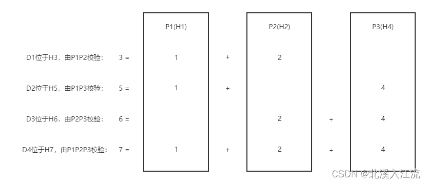
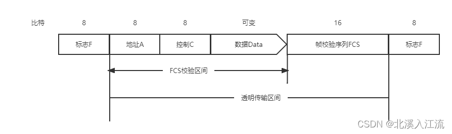
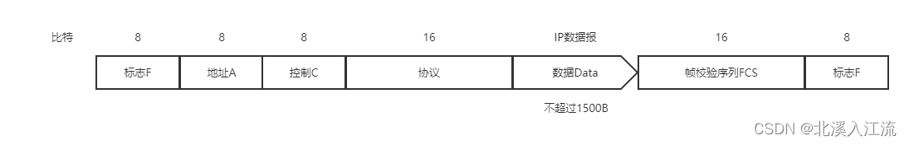
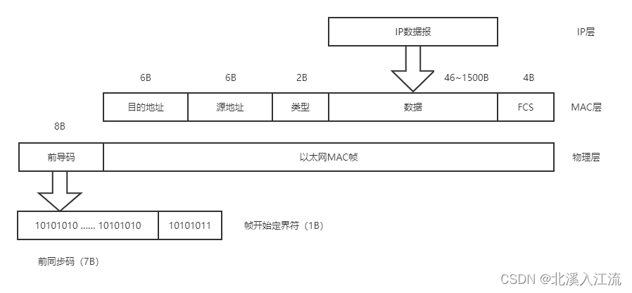
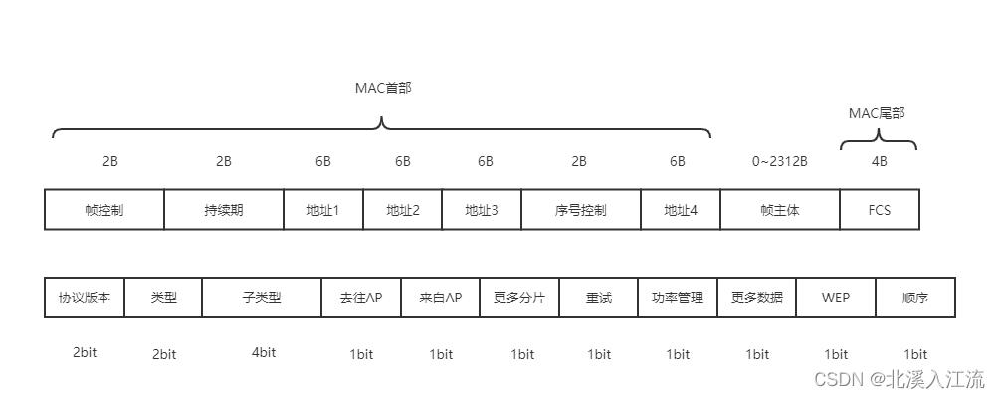
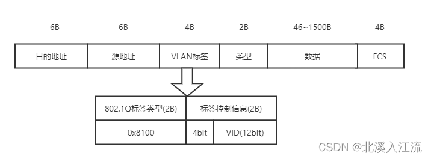

# 数据链路层的功能
数据链路层的主要作用将物理层提供的可能出错的物理连接改造成逻辑上无差错的数据链路，使之对网络层变现为一条无差错的链路。
## 为网络层提供服务
- 无确定的无连接服务：发送数据帧是不需建立链路连接，目的机器收到数据帧是不须发送返回确定。
	- 对丢失帧，由上层处理
	- 适用于实时通信或误码率较低的通信信道，如以太网
- 有确定的无连接服务：发送数据帧是不需建立链路连接，目的机器收到数据帧是必须发送返回确定。
	- 规定时间内，未收到确定信号，就重传丢失帧
	- 适用于误码率较高的通信信道，如无线通信
- 有确定的面向连接服务：目的机器每一帧都要给出确定，源机器收到确定后才能发送下一帧。
	- 帧传输阶段：建立数据链路、帧传输、释放数据链路
	- 适用于通信要求较高的场所
## 链路管理
**链路管理**：数据链路层连接的建立、维持和释放的过程为链路管理，主要面向于有确定的面向连接服务。结点在通信前，需要确定双方都处于就绪状态，并交换必要信息对帧序号初始化才能建立连接。
## 帧定界、帧同步与透明传输
**组帧**：两台主机之间传输信息时，必须将网络层的分组封装成帧，以帧的格式进行传输。将一端数据的前后分别添加首部和尾部就构成了帧。
**帧定界**：在帧的首部和尾部中含有许多控制信息，它们的一个重要作用就是确定帧的界限
**帧同步**：接收方应能从接收到的二进制比特流中区分帧的起始和终止。
**透明传输**：如果数据中出现了与帧定界符相同的比特组合，那么就要采取有效的措施解决这个问题。即不管所传送的数据是什么样的比特组合，都应当能在链路上传送。
**最大传送单元（MTU）**：每种数据链路层协议规定的帧的数据部分的长度上限。为了提高帧传输效率，应尽可能的使数据部分的长度大于首部和尾部的长度。
## 流量控制
在数据传输时，由于发送方和接收方工作速率和存储空间的差异，可能出现发送方的发送能力大于接收方的接收能力的情况，如果不限制发送方的发送速率，将导致帧的丢失和出错。
**流量控制**：限制发送方的发送数据流量，使其发送速率不超过接收方的接收能力。
流量控制的过程需要通过某种反馈机制使发送方知道接收方的接收能力情况。
> - OSI参考模型：数据链路层具有流量控制功能：控制相邻两结点之间数据链路上的流量
> - TPC/IP模型：传输层具有流量控制功能：控制从源端到目的端之间的流量
## 差错控制
- **差错控制**：由于信道噪声等影响，帧在传输中可能会出现错误，使发送方确定接收方是否正确收到由其发送方发送的数据称为差错控制
	- 位错：帧中某些位出现错误
		- 采用循环冗余校验（CRC）发现位错
		- 通过自动重传请求（Automatic Repeat reQuest，ARQ）重传出错的帧
		- 具体做法（ARQ法）：将数据帧和附加的CRC冗余校验码一起发送，接收方根据校验码检查错误，若发现错误则丢弃，发送方超时重传该数据帧。
	- 帧错：帧的丢失、重复或失序等错误
		- 引入定时器和编号机制，保证每一帧正确的交付给目的端。
# 组帧
**组帧**：两台主机之间传输信息时，必须将网络层的分组封装成帧，以帧的格式进行传输。将一端数据的前后分别添加首部和尾部就构成了帧。组帧主要解决的问题：帧定界、帧同步、透明传输等问题。
> 在计算机网络各层传输单位中，唯有数据链路层层是既要添加首部，又要添加尾部。其他层都是只添加首部。
> 数据链路层既要添加首部，又要添加尾部的原因是，在网络中信息以帧位最小单位进行传输，所以接收端要正确接收帧，必须确定该帧在比特流中的起始位置和结束位置。（没有首部和尾部就不能正确的区分帧）。
## 字符计数法
字符计数法指在帧头部使用一个计数字段表示帧内字符。目的结点根据计数值，就可以确定帧结束的位置。
缺点：如果计数字段出错，失去帧定界划分依据，无法正确判断下一帧的起始位，收发双方将失去同步。
## 字符填充的首位定界符法
字符填充法指使用特定字符来定界一帧的开始和结束。
如控制字符SOH在帧最前面表示帧的开始，控制字符EOT在帧最后面表示帧的结束。在数据中出现特殊字符，在前面添加转义字符ESC加以区分。
## 零比特填充的首尾标志法
零比特字符填充法指用一个特定的比特模式如01111110来标志一阵的开始和结束。为了不使数据位中的01111110被误判，在数据位中遇到5个连续的1，则在其后面加一个0，接收方则做其逆过程。
零比特字符填充法容易由硬件来实现，性能优于字符填充法。
## 违规编码法
违规编码法：在物理层进行比特编码时，通常采用与编码法违规的表示方法来表示开始和结束。
如，曼彻斯特编码方法将1编码位“高-低”，0编码位“低-高”。而“高-高”和“低-低”电平在曼彻斯特编码中是违规的，可以借用这些违规编码序列定界帧的起始和终止。
违规编码适用于冗余编码的特殊编码环境。
# 差错控制
**比特差错**：数据在链路通信时，受噪声等因素的影响，比特在传输过程中可能会产生差错，如1可能变成0，0变成1。
通常采用编码技术进行差错控制：
- 检错编码：能发现数据是否出错
	- 采用技术：冗余编码技术
	- 核心思想：在有效数据发送前，按照某种关系附加一定的冗余位，构成一个符合某一规则的码字在发送。接收端根据接收到的码字是否仍符合原规则判断是否出错。
	- 常用编码技术：奇偶校验码和循环冗余码
	- 自动重传请求（ARQ）：接收端检测到差错后，设法通知发送端重发。直到接收到正确的数据为止。
- 纠错编码：能发现并判断数据出错位数，并进行纠正
	- 核心思想：在每个要发送的数据块上附加足够的冗余信息，使接收方能够推导出发送方实际发送的应该是什么样的比特串
	- 常用编码技术：海明码
	- 前向纠错（FEC）：接收端不但能发现差错，而且能确定比特串的错误位置，并加以纠正
## 检错编码
### 奇偶校验码
奇偶校验码是奇校验码和偶校验码的统称，是一种最基本的检错码。
奇偶校验码由$n - 1$位信息位和$1$位校验位组成，如果是奇校验码，那么在附加一个校验位后，码长为$n$的码字中$1$的个数为奇数；如果是偶校验码，那么在附加一个校验位后，码长为$n$的码字中$1$的个数为偶数。
奇偶校验码只能发现出现奇数个错误，不能发现出现偶数个错误，不知道是那个位出错。
### 循环冗余码（多项式码，CRC）
**循环冗余码（多项式码，CRC）**：任何一个二进制数位串组成的代码都可以与一个只含有0和1两个系数的多项式建立一一对应关系。一个$k$位帧可以视为从$X^{k - 1}$到$X^0$的k次多项式的序数序列，这个多项式的阶数为$k - 1$。如：10010101表示的多项式是$X^7 + X^4 + X^2 + X^0$。
给定一个$m$位的帧或报文，发送器生成一个$r$位的序列，称为**帧检验序列（FCS）**，形成一个$m + r$位的帧。发送方和接收方事先商定一个多项式$G(x)$（最高位和最低位必须为1），使这个带检验码的帧刚好能被预先确定的多项式$G(x)$整除。接收方用相同的多项式去除收到的帧，如果无余数，就认为无差错。

假设一个帧有$m$位，对应的多项式位$G(x)$，其阶位$r$，计算冗余码的步骤如下：
- 加0：在帧的低位端加上$r$个0。
- 模2除：利用模2除法，用$G(x)$对应数据串除1中计算出的数据串，得到的余数即为冗余码。
#### 循环冗余码示例
> 在数据传输中，若接收方收到的二进制比特序列位10110011010，双方采用的生成多项式$G(x) = x^4 + x^3 + 1$，则该二进制比特序列在传输中是否出错？若未出错，则发送数据的比特序列和CRC校验码的比特序列分别是什么？

根据题意，生成多项式$G(x)$对应的二进制比特序列位（最高位和最低位都为1），阶数为4。
进行如下二进制模2除法：
$$
\begin{array}{lr} 
& 1101010 \\
11010 \!\!\!\!\!\! & \sqrt{10110011010} \\ 
& \underline{11001}\ \ \ \ \ \ \ \ \ \ \ \ \\ 
& 11110\ \ \ \ \ \ \ \ \ \ \\
& \underline{11001}\ \ \ \ \ \ \ \ \ \ \\
& 11111\ \ \ \ \ \ \\
& \underline{11001}\ \ \ \ \ \ \\ 
& 11001\ \ \\
& \underline{11001}\ \ \\ 
& 00
\end{array}
$$
所得余数为0，因此该二进制位在传输过程中未出现差错。
发送比特序列为1011001，CRC检验码的比特序列是1010（$G(x)$的阶数位4，最低4位为校验位）。
## 纠错编码
### 海明码
海明码实现原理：在有效信息位中加入几个校验位形成海明码，并把海明码每个二进制位分配到几个奇偶校验组中。当某一位出错后，就会引起有关的几个校验位的值发生变化，这样不但可以发现错位，还能指出错位位置，为自动纠错提供依据。
**海明码的编码原理和过程**：
- 确定海明码位数
	- 设$n$为有效位的位数，$k$为校验位的位数，则信息位$n$和校验位$k$应满足：$n + k \le 2^k - 1$
- 确定校验位的分布
	- 规定校验位$P_i$在海明码$2^{i - 1}$的位置上，其余各位为信息位
	- 以4位数据位举例，其对应海明码各位分布如下：
$$
 \begin{matrix} 
H_7 & H_6 & H_5 & H_4 & H_3 & H_2 & H_1 & \\
D_4 & D_3 & D_2 & P_3 & D_1 & P_2 & P_1 & 
 \end{matrix}
$$
- 分组以形成校验关系
	- 每个数据位用多个校验位进行校验。应满足条件：被校验数据位的海明码位号等于校验该数据位的各校验位海明码位号之好。
		- 如：当数据位$D_2$在海明码中为$H_5$时，其校验位应该是$P_1(H_1)$和$P_3(H_4)$
  

    

- 校验位取值
	- 检验位的值为第$i$组（该校验位校验的数据位）所有位异或。
		- 如上图所示：$P_1 = D_1 \oplus D_2 \oplus D_4$，$P_2 = D_1 \oplus D_3 \oplus D_4$，$P_3 = D_2 \oplus D_3 \oplus D_4$
- 海明码的校验原理
	- 每个检验组利用校验位和参与形成该校验位的信息位进行奇偶校验检查：
$$
S_1 = P_1 \oplus D_1 \oplus D_2 \oplus D_4 \\
S_2 = P_2 \oplus D_1 \oplus D_3 \oplus D_4 \\
S_3 = P_3 \oplus D_2 \oplus D_3 \oplus D_4
$$
	- 若$S_3S_2S_1$的值为"000"则无错，反之则为对应错误位的位号。如$S_3S_2S_1 = 001$，则说明第1位即$H_1$出错，该位直接取反就达到了纠错的目的。
# 流量控制与可靠传输机制
## 流量控制、可靠传输与滑动窗口机制
### 流量控制
**流量控制**：通过对链路上帧的发送速率的控制，使接收方有足够的缓冲空间接收每个帧。
流量控制的基本方法是又接收方控制发送方发送数据的速率，常见方式有**停止-等待协议**和**滑动窗口协议**。
### 可靠传输机制
 数据链路层的可靠传输是通过使用**确认**和**超时重传**两种机制来完成的。
 - 确认：一种无数据的控制帧，这种控制帧使得接收方可以让发送方知道那些内容被正确接收。
	 - 捎带确认：有些情况下，为了提高传输效率，将确认捎带在一个回复帧中。
- 超时重传：发送方在发送某个数据帧后就开启一个计时器，在一定时间内没有收到确定帧，就重新发生该数据帧，知道发送成功为止。
#### 自动重传请求（ARQ）
自动重传请求（ARQ）：通过接收方请求发送方重传出错的数据帧来恢复出错的帧。
传统自动重传请求分为三种：停止-等待ARQ、后退$N$帧ARQ和选择重传ARQ。后两种协议与滑动窗口机制结合，当窗口尺寸足够大时，帧在线路上可以连续地流动，因此又称为连续ARQ协议。
### 滑动窗口机制
#### 滑动窗口的基本原理
- 发送窗口：任意时刻，发送方都维持一组连续的允许发送的帧的序号。
	- 发送窗口用来对发送方进行流量控制
	- 发送窗口的大小$W_T$代表还未收到对方确定信息的情况下发送方最多还可以发送多少个数据帧
	- 发送方没收到一个确认帧，发送窗口向后滑动一个帧的位置，当发送方无可发送数据帧时（窗口帧全部已发送但未收到确定帧时）停止发送，直到收到接收方的确认帧后才能继续操作
- 接收窗口：同时接收方也维持一组连续的允许接收帧的序号。
	- 接收窗口控制可以接收哪些数据帧和不可以接收那些数据帧
	- 在接收方，只有收到在接收窗口内的数据帧序号时，才允许将该数据帧接收，否则一律丢弃
	- 接收端收到数据帧时，将窗口向后移动一个位置，并返回确认帧，若收到的数据帧在接收窗口之外，则一律丢弃
#### 滑动窗口的重要特性
- 只有接收窗口向后移动时，发送窗口才有可能向后移动
- 各协议接收窗口和发送窗口的大小差别：
	- 停止-等待协议：发送窗口大小$W_T$ = 1，接收窗口大小$W_R$ = 1
	- 后退$N$帧协议：发送窗口大小$W_T$ > 1，接收窗口大小$W_R$ = 1
	- 选择重传协议：发送窗口大小$W_T$ > 1，接收窗口大小$W_R$ > 1，$W_T = W_R$，$W_{Tmax} = W_{Rmax} = 2^{n - 1}$
- 接收窗口的大小为1时，可保证帧的有序接收
- 数据链路层的滑动窗口协议中，窗口的大小在传输过程是固定的
## 停止-等待协议
发送方每发送一帧，都要等待接收方的应答信号，收到确认信号后才能发送下一帧；接收方没接收一帧，就要反馈一个应答信号。每次只允许发送一帧，传输效率低下。
从滑动窗口机制来看，停止-等待协议就是发送窗口和接收窗口大小都是1的滑动窗口协议。
## 后退$N$帧协议（GBN）
在后退$N$帧协议中，发送方可以连续发送多个帧。当接收方检测出失序的数据帧时，要求发送方重发最后一个正确接收的数据帧之后的所有未被确认的帧；或发送方发送$N$个帧后，若发现$N$个帧的前一个帧在计时器超时后仍未返回确认信息，则发送方重传出错帧和随后的$N$个帧。即发送窗口可以连续发送，接收窗口只允许按序接收帧。
从滑动窗口机制来看，后退$N$帧协议就是发送窗口大小 > 1，接收窗口大小 = 1。
后退$N$帧协议的接收窗口为1，可以保证按序接收数据帧。若采用$n$比特对帧编号，则其发送窗口的尺寸$W_T$应满足$1 \le W_T \le 2^n - 1$。若窗口尺寸$W_T > 2^n - 1$，接收方将无法区分新帧和旧帧。
后退$N$帧协议因为连续发送数据帧提高了信道的利用率，但是在重传时又可能把已传送正确的帧重传，导致传送效率降低。所以当信道的传输质量很差导致误码率较大时，后退$N$帧协议不一定优于停止-等待协议。
## 选择重传协议（SR）
为进一步提高信道利用率，可设法只重传出错的数据帧和计时器超时的数据帧，因此必须加大接收窗口。以便发送序号不连续时仍能接收数据帧。
在选择重传协议中，发送窗口大小$W_T > 1$，接收窗口大小$W_R > 1$，发送窗口大小和接收窗口大小应一致，且最大值都为$n$比特编码的序号的一半，即$W_{Tmax} = W_{Rmax} = 2^{n - 1}$
# 典型数据链路层协议
## HDLC（高级数据链路控制）协议
高级数据链路控制协议（HDLC）是：
- 面向比特的数据链路层协议
- 该协议不依赖于任何一种字符编码集
- 数据报文和透明传输，用于实现透明传输的“0比特填充法”
- 全双工通信，有较高的数据链路传输效率
- 所有帧采用CRC校验，对数据帧进行顺序编号，防止漏发或重发，传输可靠性高
- 传输控制功能与处理功能分离，具有较大的灵活性
高级数据链路控制协议采用“0比特填充法”进行编码。在标志字段用01111110确认帧的起始和终止位置。在发送端遇到5个连续的1时，在其后填入一个0。在接收端遇到5个连续的1时，将其后面紧跟着的0删除，还原为原来的比特流。

    

- HDLC帧格式由标志、地址、控制、数据和FCS等字段构成
- 标志字段F（8位）：01111110（0x7E，0比特填充）
- 地址字段A（8位）：根据不同的传送方式，表示从站或应答站的地址
- 控制字段C（8位）：HDLC的许多功能依赖控制字段来实现
- 帧校验序列FCS（16位）：采用RCR校验
## PPP（点对点）协议
PPP（Point-to-Point Protocol）协议是：
- 使用串行线路通信的面向字节的协议
- 该协议应用在直接连接两个结点的链路上
- 设计的目的：通过拨号或专线方式建立点对点连接发送数据，使其成为各种主机、网桥和路由器之间简单连接的一种共同的解决方案
- 数据报文和透明传输，用于实现透明传输的“0比特填充法”
- 所有帧采用CRC校验

    

PPP协议有三个组成部分：
- 链路控制协议（LCP）：用于建立、配置、测试和管理数据链路
- 网络控制协议（NCP）：PPP协议允许同时采用多种网络层协议，每个不同的网络层协议用一个相应的NCP来配置，为网络层协议建立和配置逻辑连接
- 将IP数据报封装到串行链路的方法：IP数据报在PPP协议中就是其数据部分，这个数据部分的长度受最大传送单元（MTU）限制

PPP协议的数据帧格式：
- PPP帧格式由标志、地址、控制、协议、数据和FCS等字段构成
- 标志字段F（8位）：01111110（0x7E，0比特填充）
- 地址字段A（8位）：11111111（0xFF，默认规定）
- 控制字段C（8位）：0000011（0x03，默认规定）
- 协议字段（16位）：说明数据中运载的是什么种类的分组
- 数据部分：0~1500B，是点对点形，没有最短帧，数据部分出现标志字段一样的比特组合时，采用0比特填充法实现透明传输
- 帧校验序列FCS（16位）
### HDLC协议和PPP协议区别
HDLC帧和PPP帧在格式是很相似，但两者有以下不同：
- HDLC协议是面向比特的，PPP协议是面向字节的
- PPP协议比HDLC协议多一个2字节的协议字段。当协议字段值位0x0021时，表示数据部分为IP数据报
- HDLC协议的数据帧使用编号和确认机制，提供可靠传输；PPP协议不使用序号和确认机制，只保证无差错接收（CRC校验），端到端差错检测由高层协议负责
# 介质访问控制
介质访问控制的主要任务是：为使用介质的每个结点隔离来自同一信道上其他结点所传送的信号，协调结点的传输。
**介质访问控制子层（Medium Access Control，MAC）**：用来决定信道分配的协议的数据链路层的子层。
## 信道划分介质访问控制（静态划分信道）
**信道划分介质访问控制**：将使用介质的每个设备与来自同一通信信道上的其他设备的通信隔离，把时域和频域资源合理地分配给网络上的设备。
### 多路复用
**多路复用**：当传输介质的带宽超过传输单个信号所需的带宽时，通过在一条介质上同时携带多个传输信号的方法来提高传输系统的利用率。多路复用技术就是把多个信号组合在一条物理信道上进行传输，使多个计算机或终端设备共享信道资源，提高信道利用率。
#### 频分多路复用（FDM）
**频分多路复用**：按频谱划分信道，多路基带信号被调制在不同的频谱上。因此它们在频谱上不会重叠，即在频率上正交，但在时间上是重叠的，可以同时在一个信道内传输。频分通信也叫载波通信，是模拟通信的主要手段。

频分多路复用的优点在于：
- 充分利用了传输介质的带宽，系统效率较高
- 技术成熟，实现容易
#### 时分多路复用（TDM）
**时分多路复用**：将一条物理信道按时间分成若干个时间片轮流地分配给多个信号使用。每一时间片由复用的一个信号占有信道。是数字信号通信的常用手段。
**统计时分多路复用（STDM，又称异步时分多路复用）**：TDM的改进，采用STDM帧，STDM帧并不固定分配时隙，而是按需动态地分配时隙，当终端有数据需要传送时，才会分配到时间片，提高线路的利用率。
#### 波分多路复用（WDM）
**波分多路复用**：波分多路复用即光的频分多路复用，在一根光纤冲传输多种不同波长的光信号，由于波长不同，各种光信号互不干扰，最后再用波长分解复用器将各路波长分解出来。
#### 码分多路复用（CDM）
**码分多路复用**：用户传输信息所用的信号不是靠频率或时隙的不同来区分，而是用各自不同的编码序列来区分，或者说，靠信号的不同波形来区分。码分多路复用即共享信道的频率，也共享信道的时间，
##### 码分多址（CDMA）
**码分多址**：每个比特时间划分为$m$个短的时间槽，称为码片（Chip），每个站点被指派一个唯一的$m$位码片序列。当发送1时，站点发送它的码片序列；当发送0时，站点发送该码片序列的反码。当两个或多个站点同时发送时，各路数据在信道中线性相加。为从信道中分离出各路信号，要求各个站点的序列相互正交。
## 随机访问介质访问控制（动态划分信道）
**随机访问介质访问控制（争用性介质访问控制）**：胜利者通过争用活动信道，从而获得信道的发送权。因此，随机访问控制协议又称争用性协议。
在随机访问协议中，不采用集中控制方式解决发送信息的次序问题，所有用户都根据自己的意愿随机地发送信息，占用信道全部速率。
### ALOHA协议
#### 纯ALOHA协议
**纯ALOHA协议**：当网络中的任何一个站点需要发送数据时，可以不进行任何检测就发送数据。如果在一段时间内未收到确认，该站点就认为传输过程中发生冲突。发送站点等待一段时间后再发送数据，直至发送成功。
#### 时隙ALOHA协议
**时隙ALOHA协议**：把所有站点在时间上同步起来，并把时间划分为一段段等长的时隙（Slot），规定只能在每个时隙开始时发送一个帧。避免了用户发送数据的随意性，减少了数据产生冲突的可能性，提高了信道利用率。
### 载波侦听多路访问协议（CSMA）
**载波侦听多路访问协议（CSMA）**：在发送前先侦听以下共有信道，发现信道空闲后再发送，则会大大降低冲突的可能，提高信道的利用率。CSMA协议是在ALOHA协议基础上提出的一种改进协议，与ALOHA协议的主要区别是多路一个载波侦听装置。
#### 1-坚持CSMA
**1-坚持CSMA**：当一个结点要发送数据时，首先侦听信道；如果信道空闲，立即发送数据；如果信道忙，等待，同时继续侦听直至信道空闲；如果发生冲突，随机等待一段时间后，再重新开始侦听信道。
#### 非坚持CSMA
**非坚持CSMA**：一个结点要发送数据时，首先侦听信道，如果信道空闲，立即发送数据；如果信道忙，那么放弃侦听，等待一个随机的时间后再重复上述过程。
#### $p$-坚持CSMA
**$p$-坚持CSMA**：一个结点要发送数据时，首先侦听信道，如果信道忙，就继续侦听；如果信道空闲，就以概率$p$发送数据，以概率$1 - p$推迟到下一个时隙，重复上述过程。
$p$-坚持CSMA用于时分信道。
#### 三种不同类型的CSMA协议比较
| 信道状态 | 1-坚持 | 非坚持 | $p$-坚持 |
| -- | -- | -- | -- |
| 空闲 | 立即发送数据 | 立即发送数据 | 以概率$p$发送数据，以概率$1 - p$推迟到下一个时隙 |
| 忙 | 继续坚持侦听 | 放弃侦听，等待一个随机的时间后侦听 | 继续坚持侦听，直到信道空闲 |
### 载波侦听多路访问/碰撞检测（CSMA/CD）
**碰撞检测**：就是边听边发，即适配器边发送数据边检测信道上信号电压的变化情况，以便判断自己在发送数据时其他站点是否也在发送数据。
载波侦听多路访问/碰撞检测（CSMA/CD）是CSMA协议的改进方案，适用于总线形网络和半双工网络。

CSMA/CD的工作流程可以概况为：“先听后发，边听边发，冲突停发，随机重发”：
- 适配器从网络层获得一个分组，封装成以太网帧，放入适配器的缓存，准备发送
- 如果适配器侦听到信道空闲，那么它就开始发送该帧。如果适配器侦听到信道忙，那么它持续侦听直至信道空闲，然后开始发送该帧
- 在发送过程中，适配器持续检测信道。若一直未检测到碰撞，则顺利的将该帧发送完毕；若检测到碰撞，则中止数据发送，并发送一个拥塞信号，让所有用户都知道
- 中止发送后，适配器执行指数退避算法，等待一段随机时间后返回步骤2

为了确保发送数据的同时还能检测到可能出现的碰撞，需要在发送完帧之前就能收到自己发送出去的数据，即帧的传输时延至少要两倍于信号在总线中的传播时延，所以CSMA/CD总线网中的所有数据帧都必须岛屿一个最小帧长。
$$
最小帧长 = 总线传播时延 \times 数据传输速率 \times 2
$$
载波侦听多路访问/碰撞检测（CSMA/CD）只能用于有线连接的局域网和半双工通信中，不能用于无线局域网中：
- 接收信号的强度往往会远小于发送信号的强度，且无线介质上信号强度的动态变化范围很大，因此若要实现碰撞检测，则硬件上的花费会很大
- 无线通信中，并非所有的站点都能听见对方，存在“隐蔽站”问题
### 载波侦听多路访问/碰撞避免（CSMA/CA）
**碰撞避免**：协议的设计要尽量降低碰撞发生的概率。所有站完成发送后，必须等待一段很短的时间才能发送下一帧。这段时间称为**帧间间隔（InterFrame SPace，IFS）**。帧间间隔的长短取决于该站要发送的帧的类型：
- SIFS（短IFS）：最短的IFS，用来分隔属于一次对话的各帧，使用SIFS的帧类型有ACK帧、CTS帧、分片后的数据帧，以及所有回答AP探询的帧等。
- PIFS（点协调IFS）：中等长度的IFS，在PCF操作中使用。
- DIFS（分布式协调IFS）：最长的IFS，用于异步帧竞争访问的时延。

CSMA/CA协议主要用于无线局域网中。
CSMA/CA的工作流程为：
- 若站点最初有数据要发送（不是发送不成功再进行重传），且检测到信道空闲，在等待时间DIFS后，就发送整个数据帧。
- 否则，站点执行CSMA/CA退避算法，选取一个随机回退值。一旦检测到信道忙，退避计时器就保持不变。只要信道空闲，退避计时器就进行倒计时。
- 当退避计时器减到0时（这时信道只可能是空闲的），站点就发送整个帧并等待确认。
- 发送站若收到确认，就知道已发送的帧被目的站正确接收。这时如果要发送第二帧，就从步骤2开始
- 若发送在规定时间内未收到确认帧ACK，就必须重传该帧，再次使用CSMA/CA协议争用该信道，直到收到确认帧。若经过若干次重传失败后就放弃发送。
#### 处理隐蔽站问题：RTS和CTS
**RTS（请求发送控制帧）**：源站在发送数据之前必须广播一个很短的RTS帧，它包括源地址、目的地址和这次通信所需的持续时间。
**CTS（允许发送控制帧）**：在收到RTS帧后，若信道空闲，则AP（Access Point，无线接入点）广播一个CTS帧，它包括这次通信所需的持续时间（从RTS帧复制）。其他站在收到CTS帧后在指明的时间内将抑制发送。CTS由两个目的：给源站明确的发送许可；指示其他站点在预约期内不要发送。
#### CSMA/CD和CSMA/CA的比较
- CSMA/CD可以检测冲突，但无法避免；CSMA/CA发送数据时不能检测信道上有无冲突，在发送数据是只能尽量避免冲突
- CSMA/CD用于总线形以太网；CSMA/CA用于无线局域网
- CSMA/CD通过电缆中的电压变化检测信道状态；CSMA/CA采用能量检测、载波检测和能量载波混合检测三种方式检测信道状态
- CSMA/CD：发送前侦听，边发送边侦听，一旦出现碰撞马上停止发送
- CSMA/CA：发送数据时广播告知其他站点，让其他站点在某段时间内不要发送数据，避免出现碰撞
# 局域网
## 局域网的基本概念与体系结构
**局域网（Local Area Network，LAN）**：指一个较小的地理范围内，将各种计算机、外部设备和数据库系统通过连接介质互相连接起来，组成资源和信息共享的计算机互连网络。
IEEE 802标准将数据链路层拆分为两个子层：逻辑链路控制子层（LLC）和介质访问控制子层（MAC）。
- 逻辑链路控制子层（LLC）：LLC子层与传输媒介无关，它向网络层提供4种不同的连接服务类型：
	- 无确认无连接
	- 面向连接
	- 带确认无连接
	- 高速传输
- 介质访问控制子层（MAC）：与接入传输媒介有关的内容都放在MAC子层中，它向上层屏蔽了对物理层的各种差异，提供对物理层的统一访问控制接口，主要功能包括：
	- 组帧和拆帧
	- 比特传输差错检测
	- 透明传输
### 局域网的主要特点：
- 为一个单位所拥有，且地理范围和站点数目均有限
- 所有站点共享较高的总带宽（即较高的数据传输速率）
- 较低的时延和较低的误码率
- 各站为平等关系而非主从关系
- 能进行广播和组播
### 局域网的特性三要素
- 拓扑结构：
	- 星形结构
	- 环形结构
	- 总线形结构
	- 星形和总线形结合的复合形结构
- 传输介质：
	- 双绞线（主流）
	- 铜缆
	- 光纤
- 介质访问控制方式：最重要的特性，决定局域网的技术特性：
	- CSMA/CD（局域网）
	- 令牌总线
	- 令牌环
## 以太网与 IEEE 802.3
IEEE 802.3标准是一种基带总线形的局域网标准，描述了物理层和数据链路层的MAC子层的实现方式。

以太网采用两项措施简化通信：
- 采用无连接的工作方式，不对发送的数据帧编号，不要求接收方发送确认，即以太网尽最大努力交付数据，提供不可靠服务，对于差错纠正由高层完成。
- 发送的数据都使用曼彻斯特编码，每个码元的中间出现一次电压转换，接收端利用电压转换把位同步信号提前出来。
### 以太网传输介质与网卡
| 参数 | 10BASE5 | 10BASE2 | 10BASE-T | 10BASE-FL |
| -- | -- | -- | -- | -- |
| 传输媒介 | 基带同轴电缆（粗缆） | 基带同轴电缆（细缆） | 非屏蔽双绞线 | 光线对（850nm） |
| 编码 | 曼彻斯特编码 | 曼彻斯特编码 | 曼彻斯特编码 | 曼彻斯特编码 |
| 拓扑结构 | 总线形 | 总线形 | 星形 | 点对点 |
| 最大段长 | 500m | 185m | 100m | 2000m |
| 最多结点数目 | 100 | 30 | 2 | 2 |

计算机与外界局域网通信是通过网路接口板[又称网络适配器（Adapter）或网络接口卡（Network Interface Card，NIC]实现的。网卡和计算机通信是通过计算机主板上的I/O总线以并行方式进行的。网卡的主要功能是进行数据的串并转换。网卡的具体概念有：实现局域网传输介质之间的物理连接和电信号匹配，帧的发送与接收，帧的封装与拆封，介质访问控制，数据的编码与解码及数据缓存功能等。网卡主要工作在物理层和数据链路层，只关注比特，不关注任何地址信息和高层协议信息。
### 以太网的MAC帧
**介质访问控制（MAC）地址**：每块网卡在出厂时都有一个唯一的代码，称为介质访问控制（MAC）地址，也称物理地址；MAC地址长6字节，一般由连字符（或冒号）分割的12个十六进制数表示，如10-54-C8-37-C8-CD，高24位位厂商代码，低24位为网卡序列号。
由于总线是广播通信，因此网卡没收到一个MAC帧，首先检查MAC帧的MAC地址。如果是发往本站的帧，就接收，反之则丢弃。

    

- 前导码（8B）：使接收端和发送端时钟同步
	- 前同步码（7B）：快速实现MAC帧的比特同步
	- 帧开始定界符（1B）：表示后面的信息就是MAC帧
- 地址（6B）：通常使用6字节表示MAC地址
- 类型（2B）：指出数据域中携带的数据应交给那个协议实体处理
- 数据（46~1500B）：包含高层协议信息。CSMA/CD算法的以太网帧最短帧长64B，MAC帧的首部和尾部的长度为18B，所以数据字段最短为64 - 18 = 46B
- FCS校验码（4B）：校验范围为目的地址到数据段末尾，算法采用32位循环冗余码，不校验前导码。
### 高速以太网
**高速以太网**：速度达到或超过100Mb/s的以太网
#### 100BASE-T以太网
- 在双绞线上传送100Mb/s基带信号的星形拓扑结构以太网
- 支持半双工模式，使用CSMA/CD协议
- 支持全双工模式，全双工模式下不使用CSMA/CD协议
#### 吉比特以太网（千兆以太网）
- 允许在1Gb/s速率下用全双工和半双工两种工作方式
- 支持半双工模式，使用CSMA/CD协议
- 支持全双工模式，全双工模式下不使用CSMA/CD协议
- 与10BASE-T和100BASE-T向后兼容
#### 10吉比特以太网
- 不再使用铜线而使用光纤作为传输媒介
- 只工作在全双工方式，没有争用问题，不使用CSMA/CD协议
## 无线局域网 IEEE 802.11
### 无线局域网的组成
#### 有固定基础设施无线局域网
**固定基础设施**：预先建立的，能覆盖一定地理范围的固定基站。
- 对于有固定基础设施无线局域网，IEEE制定了无线局域网的802.11系列协议（又称Wi-Fi）标准，包括802.11a/b/g/n等。
	- 802.11采用星形拓扑
	- 中心称为接入点（Access Point，AP）
	- 在MAC层使用CSMA/CA协议
- 基本服务集BBS（Basic Service Set，BBS）：802.11标准规定无线局域网的最小构件
	- 一个基本服务集BBS包括一个接入点（AP）和若干移动站
	- 各站在本基本服务集BBS中通信或与外部站通信，都必须通过基本服务集BBS的接入点AP
	- **扩展服务集（Extended Service Set，ESS**）：一个基本服务集BBS可以是孤立的，也可以通过接入点AP连接到一个分配系统，再连接到另一个基本服务集BBS，这样就构成了扩展服务集ESS
		- 扩展服务集ESS可以通过称为门户（Portal）的设备位无线用户提供到有线连接的以太网的接入
	- 一个基本服务集BSS的地理范围称为一个基本服务区（Basic Service Area，BSA）
		- 无线局域网的基本服务区的范围直径一般不超过100m
- 接入点AP：就是基本服务集BSS中的基站
	- 安装AP时，必须为该AP分配一个不超过32字节的服务集标识符（Service Set IDentifier，SSID）和信道
	- SSID是指该AP的无线局域网名字
#### 无固定基础设施移动自组织网络
**自组织网络（ad hoc network）**：一种无固定基础设施的无线局域网。自组织网络没有基本服务集BSS中的AP，而是由一些平等状态的移动站相互通信组成的临时网络。各结点之间地位平等，中间结点都为转发结点
自组织网络的构成：可移动设备在发现它们附近其他的可移动设备，并且要求和其他移动设备进行通信。自组网络中的每个移动站都要参与网络中其他移动站的路由的发现和维护，自组织网络由移动站构成的网络拓扑结构可能随时间变化的很快。
### 802.11局域网的MAC帧
802.11局域网帧有三种类型：数据帧、控制帧和管理帧。数据帧主要由MAC首部、帧主体（数据部分）、MAC尾部（FCS帧校验）组成

    

802.11局域网MAC帧格式：
- MAC首部（30B）
- 帧主体（0~2312B）：帧的数据部分
- MAC尾部（4B）：FCS帧校验序列

MAC首部的地址字段的具体含义由帧控制中的去往AP和来自AP确定
| 去往AP | 来自AP | 地址1 | 地址2 | 地址3 | 地址4 |
| -- | -- | -- | -- | -- | -- |
| 0 | 1 | 接收地址 = 目的地址 | 发送地址 = AP地址 | 源地址 | -- |
| 1 | 0 | 接收地址 = AP地址 | 发送地址 = 源地址| 目的地址| -- |
## 虚拟局域网 VLAN
一个以太网是一个广播域，当一个以太网包含的计算机过多时，会导致：
- 以太网出现大量的广播帧，特别是经常使用的ARP和DHCP协议
- 一个单位的不同部门共享一个局域网，对信息保密和安全不利

**虚拟局域网（Virtual LAN）**：提供VLAN可以把一个较大的局域网分割成一些较小的与地理位置无关的逻辑上的VLAN，每个VLAN是一个较小的广播域。
802.3ac标准定义了支持VLAN的以太网帧格式的扩展。在以太网帧中插入一个4字节的标识符（称为VLAN标签），用来指明发送该帧的计算机属于那个虚拟局域网。插入VLAN标签的帧称为802.1Q帧

    

- 802.1Q标签类型（2B）：规定为0x8100，表示是一个802.1Q帧
- 标签控制信息（2B）：
	- 前4bit：预留无用
	- VID：VLAN标识符，唯一标识该802.1Q帧属于那个VLAN。12位的VID可识别4096个不同的VLAN
- 802.1Q帧因为添加了一个4B的VLAN标签，所以相比以太网的最大帧长1518B，其最大帧长为1522B
# 广域网
## 广域网的基本概念
**广域网**：指覆盖范围广的长距离网络。是因特网的核心部分，其任务是长距离运送主机所发送的数据。连接广域网各结点交换机的链路都是高速链路。广域网首要考虑的问题是通信容量必须足够大，以便支持日益增长的通信量。
广域网由一些结点交换机及连接交换机的链路组成。结点交换机的功能是分组存储并转发。结点之间是点到点连接，为了提高网络的可靠性，通常一个结点交换机往往与多个节点交换机相连。
广域网使用的协议主要在网络层
### 广域网和局域网的区别与联系
<table border="1">
	<tr>
		<th></th>
		<th>广域网</th>
		<th>局域网</th>
	</tr>
	<tr>
		<td>覆盖范围</td>
		<td>广，通常是跨区域</td>
		<td>通常在一个区域内</td>
	</tr>
	<tr>
		<td>连接方式</td>
		<td> 结点之间都是点到点连接，为了提高网络的可靠性，一个结点交换机通常与多个结点交换机相连</td>
		<td>通常采用多点接入技术</td>
	</tr>
	<tr>
		<td>OSI参考模型层次</td>
		<td>三层：网络层、数据链路层、物理层</td>
		<td>两层：数据链路层、物理层</td>
	</tr>
	<tr>
		<td>联系与相似点</td>
		<td colspan="2">
			<ol>
				<li>广域网和局域网都是互联网的重要组成部分，从互联网的角度看，二者是平等关系</li>
				<li>连接到一个广域网或一个局域网上的主机在该网内通信时，只需要使用其网络的物理地址</li>
			</ol>
		</td>
	</tr>
	<tr>
		<td>着重点</td>
		<td>强调资源共享</td>
		<td>强度数据传输</td>
	</tr>
</table>

## 帧中继
**帧中继（Frame Relay）**：是一种用于连接计算机系统的面向分组的通信方法。它主要用在公共或专用网上的局域网互联以及广域网连接。大多数公共电信局都提供帧中继服务，把它作为建立高性能的虚拟广域连接的一种途径。帧中继是进入带宽范围从56Kbps到1．544Mbps的广域分组交换网的用户接口。
### 帧中继的特点
- 使用光纤作为传输介质，因此误码率极低，能实现近似无差错传输，减少了进行差错校验的开销，提高了网络的吞吐量，它的数据传输速率和传输时延比X.25网络要分别高或低至少一个数量级。
- 采用基于变长帧的异步多路复用技术，帧中继主要用于数据传输，而不适合语音、视频或其他对时延时间敏感的信息传输。
- 仅提供面向连接的虚电路服务。
- 仅能检测到传输错误，而不试图纠正错误，而只是简单地将错误帧丢弃。
- 帧长度可变，允许最大帧长度在1600B以上。
- 帧中继是一种宽带分组交换，使用复用技术时，其传输速率可高达44.6Mbps。
## 异步传输模式（ATM）
**异步传输模式(Asynchronous Transfer Mode，ATM)**：又称信息元中继：是一种信元交换和多路复用技术。是每一个字符独立形成一个帧进行传输，一个连续的字符串同样被封装成连续的独立帧进行传输，各个字符间的间隔可以是任意的，所以这种传输方式称为异步传输。
ATM采用信元（Cell）作为传输单位，信元具有固定长度，总共53字节，前5字节是信头，其余48字节是数据段。信头中有信元去向的逻辑地址、优先级、信头差错控制、流量控制等信息。ATM常被应用在光通信中。
ATM是一种面向连接的技术，采用虚连接技术，是一种为支持宽带综合业务网而专门开发的新技术，它与现在的电路交换无任何衔接。当发送端想要和接收端通信时、它通过UNI发送一个要求建立连接的控制信号。接收端通过网络收到该控制信号并同意建立连接后，一个虚拟线路就会被建立。
### 异步传输模式特点：
- ATM的基本单位是信元。  
- ATM的信元的长度为53个字节。
- ATM常被应用在光通信中。
- ATM是面向连接的技术，采用虚连接技术。
## 同步光纤网络 SONET/SDH
**SONET/SDH**：定义了一组在光纤上传输光信号的速率和格式，通常统称为光同步数字传输网，是宽带综合数字网的基础之一。SONET/SDH采用TDM（时分复用）技术，是同步系统，由主时钟控制。
# 数据链路层设备
## 网桥（Bridge）的概念和基本原理
**网桥**：早期的两端口二层网络设备。网桥的两个端口分别有一条独立的交换信道，不是共享一条背板总线，可隔离冲突域。
- 两个或多个以太网通过网桥连接后，可以组成范围更大的以太网
- 网桥工作在数据链路层的MAC子层
- 网桥可以使各网段成为隔离的冲突域
- 网桥各网段相对独立，一个网段的故障不会影响到另一个网段的运行
- 网桥必须具有路径选择的功能
## 局域网交换机及其工作原理
**局域网交换机（又称以太网交换机）**：本质上，以太网交换机是一个多端口的网桥。工作在数据链路层。交换机能将网络划分成更小的冲突域，为每个冲突域提高更高的带宽。
### 交换机的原理和特点
#### 局域网交换机的原理
交换机检测出从以太网端口来的数据帧的源和目的的MAC地址，从系统内部动态查找表进行比较，若数据帧源MAC地址不在查找表中，将改地址加入查找表，并将数据帧发送给对应目的端口
#### 局域网交换机的特点
- 交换机的每个端口都直接与单台主机相连（网桥的端口往往连接到一个网段），并且一般都工作在全双工方式
- 交换机能同时连通多个端口，使每对相互通信的主机都能像独占通信媒介那样，无碰撞传输数据
- 交换机是一种即插即用设备，内部的帧的转发表是通过自学习算法自动建立起来的
- 交换机使用专用的交换结构芯片，交换速率高
- 交换机独占传输媒介的带宽
#### 交换机交换模式
- 直通式交换机：只检查帧的目的地址，使得帧在接收后能马上被转发出去
	- 优点：
		- 速度快
	- 缺点：
		- 缺乏智能性和安全性
		- 无法支持具有不同速率的端口的交换
- 存储转发式交换机：先将接收到的帧缓存到高速缓存器中，检查数据是否正确，确认无误后通过查找表将该帧发出；如果帧出错，则将其丢弃
	- 优点：
		- 可靠性高
		- 能支持不同速率端口间的转换
	- 缺点：
		- 延迟较大
### 交换机的自学习功能
**过滤**：决定一个帧是应该转发到某个接口还是应该将其丢弃称为过滤。
**转发**：决定一个帧应该被移动到哪个接口称为转发。
交换机的过滤和转发借助于交换表完成。
#### 交换表（Switch Table）项
一个交换表表项至少包含：
- 一个MAC地址
- 连通该MAC地址的交换机接口
#### 交换机的自学习原理
交换机是即插即用性设备，当设备A和设备B插入交换机后。设备A向设备B发送数据，交换机从接口1获得设备A的发送数据帧。交换机A收到帧后，查找交换表，若在交换表中找不到设备A对应的MAC地址，则将（A，1）写入交换表中，查找交换表，找不到目的设备B对应的MAC地址，从除接口1外的所有接口广播该帧；若找到目的设备B对应的MAC地址，从对应接口转发出去。这样就完成了设备A的自学习功能，交换表写入（A，1）后，以后从任何接口收到目的地址为A的帧，都从接口1转发出去。
交换机所连主机会随时变化，所以需要更新交换表中的表项，因此交换表中的每个表项都设有一定的有效时间，过期表项会自动删除。保证交换机中的数据符合网络的实际情况。
