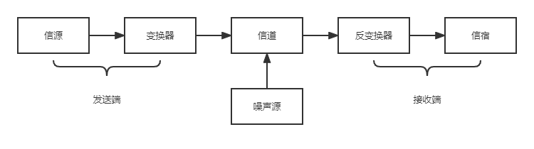

# 通信基础
## 信道、信号、宽带、码元、波特、速率、信道容量等基本概念
### 数据、信号与码元
**数据**：数据是指传送信息的实体。
**信号**：数据的电气或电磁表现，是数据在传输过程中的存在形式。
**码元**：用一个固定时长的信号波形（数字脉冲）表示一位 **$k$进制数字**，代表不同离散数值的基本波形。例如：在使用二进制编码时，存在两种码元，一种代表0状态，一种代表1状态。
#### 数据和信号的类型
- 数字数据（信号）：*离散变化*的数据（或信号）
- 模拟数据（信号）：*连续变化*的数据（或信号）
#### 数据传输方式
- 串行传输：比特流按照时间顺序在一条信道上传输。
- 并行传输：若干比特通过多条通信信道同时传输。
### 信源、信道与信宿（通信系统模型）
一个通信系统主要划分为信源、信道和信宿三个部分。**信源**是产生和发送数据的源头；**信宿**是接收数据的终点，它们都是计算机或其他数字终端装置。**信道**是信号的传输媒介。
发送端信源发送信息需要经过变换器转换成适合于信道上传输的信号，通过信道传送到接收端，经过反变换器转换成原始信息，发送给信宿。

    

#### 信道分类
##### 传输信号形式
- 数字信道：传输数字信号
- 模拟信道：传输模型信号
##### 传输介质
- 有线信道
- 无线信道
##### 传输信号
- 基带传输：将数字信号之间用两种不同的电压表示，送到数字信道上传输
- 宽带传输：将基带信号进行调制后形成频分复用模拟信号，送到模拟信道上传输
##### 通信交互方式
- 单向通信：只有一个方向的信道没有反方向的交互
	- 仅需一条信道
	- 示例：无线广播、电视广播
- 半双工通信：通信双方都可以发送和接收信息，但是同一时间只允许一方进行发送数据操作
	- 需要两条信道
	- 示例：对讲机
- 全双工通信：通信双方可以同时发送和接收信息
	- 需要两条信道
### 速率、波特与带宽
**速率（数据率）**：数据传输速率，表示单位时间内传输的数据量。可以用码元传输速率和信息传输速率表示。
**波特（Baud）**：表示数字通信系统每秒传输一个码元。码元速率和进制数无关。
**带宽**：原指信号具有的频带宽度，单位是赫兹（Hz）。由于带宽数据率存在数值上的互换关系，因此在网络的通信线路中表示传输数据的能力。带宽表示单位时间内网络从某一点到另一点所能通过的“最高数据率”，单位是b/s。
#### 码元传输速率与信息传输速率
- 码元传输速率（波特率）：表示单位时间内数字通信系统所传输的码元个数（脉冲个数或信号变化的次数），单位是波特（Baud）。
- 信息传输速率（信息速率、比特率）：单位时间内数字通信系统传输的二进制码元个数（即比特数），单位是比特/秒（b/s）。
	- 若一个码元携带$n$比特的信息量，则$M$波特率的码元传输速率所对应的信息传输速率为$Mn$比特/秒。
## 奈奎斯特定理与香农定理
### 奈奎斯特定理（奈式准则，无噪声信道传输能力）
**码间串扰**：信道所通过的频率范围是有限的。信号中许多高频分量往往不能通过信道，否则会在传输中衰减，导致接收端收到的信号波形失去码元之间的清晰界限。
**奈奎斯特定理**：规定在理想低通（没有噪声、带宽有限）的信道中，为了避免码间串扰，极限码元传输速率为$2W$波特，其中$W$是理想低通信道的带宽。
若用$W$表示带宽，$V$表示每个码元离散电平的数目（如16种不同的码元，需要4个二进制位），则奈奎斯特定理可表示为：
$$
理想低通信道极限码元传输速率 = 2W \qquad (单位为Baud) \\
理想低通信道极限信息传输速率 = 2Wlog_2V \qquad (单位为b/s)
$$
#### 奈奎斯特定理结论
- 在任何信道种，码元传输速率存在上限。若传输速率超过此上限，会出现码间串扰问题，使接收端不能正确识别码元。
- 信道的带宽越大，通过的信号高频分量越多，可用更高的速率进行码元的有效传输。
- 奈奎斯特定理给出了码元传输速率的限制，但并未对信息传输速率做出限制，即未对一个码元对应多少个二进制位给出限制。
### 香农定理（带噪声信道传输能力）
**香农定理**：给出了带宽受限且有噪声干扰的信道的极限传输速率。香农定理定义为：
$$
带噪声信道的极限数据传输速率 = Wlog_2(1 + \frac{S}{N}) \qquad (单位为b/s)
$$
其中，$W$为信道的带宽，$S$为信道所传输信号的平均功率，$N$为信道内部的噪声功率。$\frac{S}{N}$为信噪比，即信号的平均功率与噪声的平均功率之比。
$$
信噪比 = 10log_{10}(\frac{S}{N}) \qquad (单位为dB)
$$
例如，当$\frac{S}{N}) = 10$时，信噪比为$10dB$；当$\frac{S}{N}) = 1000$时，信噪比为$30dB$
#### 香农定理结论
- 信道的带宽或信道的信噪比越大，信息的极限传输速率越高。即噪声越小，信道的极限传输速率就越高。
- 对一定的传输带宽和一定的信噪比，信息传输速率上限是确定的。
- 只要信息传输速率低于信道的极限传输速率，就能找到某种方法实现无差错传输。
## 编码与调制、多路复用与扩频
### 编码与调制
无论是数字信号还是模拟信号，为了在信道上传输都必须转换为对应信号。
**编码**：把数据变换为数字信号的过程称为编码。
**调制**：把数据变换为模拟信号的过程称为调制。
- 数字数据：
	- 通过数字发送器转换为数字信号传输
	- 通过调制器转换为模拟信号传输
- 模拟信号：
	- 通过PCM编码器转换为数字信号传输
	- 通过放大器调制器转换为模型信号传输
#### 数字数据编码为数字信号（数字发送器）
数字数据通过数字发送器编码为数字信号，用于基带传输，在基本不改变数字数据信号频率的情况下，直接传输数字信号。
##### 归零编码（RZ）
- **归零编码（RZ）**：用高电平表示1，低电平表示0，每个时钟周期中间均跳变到低电平（归零）。
	- 接收方根据跳变调整本方的时钟基准
	- 为传输双方提供了自同步机制（归零）
	- 归零需要占用一部分带宽，传输速率受到一定的影响
##### 非归零编码（NRZ）
- **非归零编码（NRZ）**：用高电平表示1，低电平表示0。
	- 与RZ编码的区别是不用归零，一个周期全部用来传输数据
	- 无法传递时钟信号，难以同步
##### 反向非归零编码（NRZI）
- **反向非归零编码（NRZI）**：信号保持不变代表1，信号翻转代表0。
	- 翻转信号本身可以作为通知机制
	- 既能传输时钟信号，又能尽量不损失系统带宽
##### 曼彻斯特编码
- **曼彻斯特编码**：将一个码元分为两个相等的间隔，前一个间隔为高电平而后一个间隔为低电平代表1，前一个间隔为低电平而后一个间隔为高电平代表0.
	- 码元中间出现电平信号，即作为时钟信号（用于同步），也作为数据信号
##### 差分曼彻斯特编码
- **差分曼彻斯特编码**：将一个码元分为两个相等的间隔，前半个码元的电平与上一个码元后半个码元的电平相同表示1，前半个码元的电平与上一个码元后半个码元的电平相反表示0.
	- 每个码元中间都有依次电平跳转，可以实现自同步，抗干扰性较好
#### 数字数据调制为模型信号（调制器）
数字数据调制技术在发送端将数字信号转换为模拟信号，而在接收端将模拟信号还原为数字信号。
##### 幅移键控（ASK，振幅）
幅移键控：通过改变载波信号的振幅来表示数字1和0，抗干扰能力差。
##### 频移键控（FSK，频率）
频移键控：通过改变载波信号的频率来表示数字1和0，抗干扰能力强，应用广泛。
##### 相移键控（PSK，相位）
相移键控：通过改变载波信号的相位来表示数字1和0。
##### 正交振幅调制（QAM，叠加振幅与相位）
正交振幅调制：通过叠加改变载波信号的振幅和相位来表示数字1和0。
设码元传输速率为$B$，采用$m$个相位，每个相位有$n$种振幅，则该QAM技术的信息传输速率$R$为：
$$
R = Blog_2(mn) \qquad (单位为b/s)
$$
#### 模拟信号编码为数字信号（PCM编码器）
将模拟信号转换为数字信号主要包括三个步骤：采样、量化和编码。
- 采样：对模型信号进行周期性扫描，把时间上连续的信号变成时间上离散的信号。
- 量化：把采样取得的电平幅值按照一定的分级标度转化为对应的数字值并采取整数，这样就把连续的电平幅值转换为离散的数字量。
- 编码：把量化的结果转换为与之对应的二进制编码。
##### 采样定理
假设原始信号中的最大频率为$f_{max}$，那么采样频率$f_{采样}$必须大于等于最大频率$f_{max}$的两倍，才能保证采样后的数字信号保留原始模拟信号的信息。
- $f_{采样} \ge 2f_{max}$
- 采样定理又称奈奎斯特定理

#### 模拟信号调制为模拟信号（放大器调制器）
为了实现传输的有效性，可能需要较高的频率。这种调制方式就是改变模拟信号的频率，以充分利用带宽资源。
### 多路复用
**多路复用**：指两个及其以上用户共享公用信道的一种机制。通过多路复用技术，多个终端能共享一条高速信道，从而达到节省信道资源的目的。
#### 频分多路复用（FDM）
频分多路复用：按频谱划分信道，多路基带信号被调制在不同的频谱上。因此它们在频谱上不会重叠，即在频率上正交，但在时间上是重叠的，可以同时在一个信道内传输。频分通信也叫载波通信，是模拟通信的主要手段。
#### 时分多路复用（TDM）
时分多路复用：将一条物理信道按时间分成若干个时间片轮流地分配给多个信号使用。每一时间片由复用的一个信号占有信道。是数字信号通信的常用手段。
#### 码分多路复用（CDM）
码分多路复用：用户传输信息所用的信号不是靠频率或时隙的不同来区分，而是用各自不同的编码序列来区分，或者说，靠信号的不同波形来区分。
## 电路交换、报文交换与分组交换
### 电路交换
**电路交换**：在进行数据传输前，两个结点之间必须先建立一条专用的物理通信路径，该路径可能经过许多中间结点。这一路径在整个数据传输期间一直被独占，在通信结束后才被释放。因此，电路交换分为三个阶段：连接建立、数据传输金额连接释放。
- 优点：
	- 通信时延小：由于通信线路为通信双方用户专用，数据直达，因此传输数据的时延非常小。
	- 有序传输：双方通信时按发送顺序传送数据，不存在失序问题。
	- 没有冲突：不同通信的双方拥有不同的信道，不会出现争用物理信道的问题。
	- 适用范围广：电路交换即适用于传输模拟信号，又适用于传输数字信号。
	- 实时性强：通信双方之间的物理通路一旦建立，双方就可以随时通信。
	- 控制简单：电路交换的交换设备（交换机）控制简单。
- 缺点： 
	- 建立连接时间长
	- 线路独占：使用效率低，即使通信线路空闲，也不能供其他用户使用。
	- 灵活性差：只要双方建立的通路中的任何一点出了故障，就必须重新拨号建立新的连接。
	- 难以规格化：电路交换时，数据直达，不同类型、不同规格、不同速率的终端很难相互进行通信，也难以在通信过程中进行差错控制。
### 报文交换
**报文交换**：数据交换的单位是报文，报文携带又目的地址、源地址等信息。报文交换在交换结点采样的存储转发的传输方式。
- 优点：
	- 无须建立连接：报文交换不需要预先建立一条专用的通信线路，不存在建立连接时延，可随时发送报文。
	- 动态分配线路：当发送方把报文交给交换设备时，交换设备先存储整个报文，然后选择一条合适的空闲线路，将报文发送出去。
	- 提高线路可靠性：某条传输路径发送故障，可重新选择另一条路径传输数据。
	- 提高线路利用率：通信双方不是固定占有一条通信线路，因而大大提高了通信线路的利用率。
	- 提高多目的服务：一个报文可以同时发送给多目的地址。
- 缺点：
	- 由于数据进入交换结点后要经历存储转发这一过程，因而会引起转发时延。
	- 报文交换对报文的大小没有限制，这就要求网络结点需要较大的缓存空间。
### 分组交换
**分组交换**：将数据分为较短的固定长度的数据块，在每个数据块上加上目的地址、源地址等辅助信息组成分组（包），以存储-转发方式传输。同报文交换一样，分组交换也采用存储转发方式，但解决了报文交换中大报文传输的问题。
- 优点：
	- 无建立时延：不需要为通信双方先建立一条专用的通信线路，不存在连接建立时延，用户可随时发送分组。
	- 线路利用率高：通信双方不是固定占用一条通信线路，而是在不同的时间部分占用这条物理通路，因而大大提高了通信线路的利用率。
	- 简化了存储管理：分组的长度固定，相应的缓冲区大小也固定。
	- 加速传输：分组逐个传输，可以多个分组同时并行传输，流水线方式减少了报文的传输时间。
	- 减少了出错概率和重发数据量：因为分组较短，出错概率也相应减小。即使减小，每次重发的数据量也就大大减少了。
- 缺点：
	- 存在传输时延：仍然存在存储转发时延，其结点交换机必须具有更强的处理能力。
	- 需要传输额外的信息量：每个分组都要加上源地址、目的地址和分组编号等信息，因此使得传送的信息量增大了5%~10%，降低了通信效率，增加了处理时间，使控制复杂，时延增加。
	- 当分组交换采用数据报服务时，可能会出现失序、丢失或重复分组：分组到达目的结点时，需要对分组按编号进行排序等工作；若采用虚电路服务，虽无失序问题，担忧呼叫建立、数据传输和虚电路释放三个过程。
## 数据报与虚电路
分组交换根据其通信子网向端点系统提供的服务，还可分为无连接的数据报方式和面向连接的虚电路，这两种服务方式都由网络层提供。
### 数据报
用户发送一个报文时，在端系统中实现的高层协议先把报文拆分若干带有序号的数据单元，并在网络层加上地址等控制信息后形成数据报分组。不同分组可以找不同的路径，也可以按照不同的顺序到达目的地点。
#### 数据报的特点
- 发送分组不需要建立连接。发送方可随时发送分组。
- 网络尽最大努力交付，传输不保证可靠性，所以可能丢失：每个分组独立选择路由，转发的路径可能不同，分组不一定按序到达目的地点。
- 发送的分组中要包括发送端和接收端的完整地址，以便可以独立传输。
- 分组在交换结点存储转发时，需要排队等候处理，这会带来一定的时延。通过交换结点的通信量较大或网络发送拥塞时，这种时延会大大增加，交换结点还可根据情况丢弃部分分组。
- 网络具有冗余路径，当某个结点或一条链路出现故障时，可相应地更新转发表，寻找另一条路径转发分组，对故障的适应能力强。
- 存储转发的延时一般较小，提高了网络的吞吐量。
- 收发双方不独占某条链路，资源利用率高。
### 虚电路
虚电路方式将数据报方式与电路交换方式结合起来，以达到最佳的数据交换效果。在分组发送之前，要求发送方和接收方建立一条逻辑上相连的虚电路，并且连接一旦建立，就固定了虚电路所对应的物理路径。与电路交换类似，整个通信过程分为三个阶段：虚电路建立、数据传输和虚电路释放。
虚电路中，端系统每次建立虚电路时，选择一个未用过的虚电路号分配给该虚电路。在传送数据时，每个数据分组不仅要有分组号、校验和等信息，还需要有其虚电路号，以区别其他虚电路上的分组。
#### 虚电路的特点
- 虚电路通信链路的建立和拆除需要时间开销。
- 虚电路的路由选择体现在连接建立阶段，连接建立后，就确定了传输路径。
- 虚电路提供了可靠的通信功能，保证每个分组正确有序的到达，此外虚电路还提供了两个数据端点的流量控制。
- 虚电路有一个致命的弱点。
- 分组首部不包含目的地址，包含虚电路标识符，相对于数据报方式，其开销小。
### 数据报和虚电路的比较
| | 数据报服务 | 虚电路服务|
| --- | --- | --- |
| 连接的建立 | 不需要 | 必须要有 |
| 目的地址 | 每个分组都有完整的目的地址 | 建在连接阶段使用，之后每个分组使用虚电路号 |
| 路由选择 | 每个分组独立地进行路由选择和转发 | 同一条虚电路分组按照同一路由转发 | 
| 分组顺序 | 不保证有序到达 | 保证分组有序到达 |
| 可靠性 | 不保证可靠传输，可靠传输由用户主机来保证 | 可靠性由网络保证 |
| 对网络故障的适应性 | 出故障结点丢失分组，其他分组正常传输 | 所有经过故障结点的电路均不能正常工作 |
| 差错处理和流量控制 | 由用户主机进行流量控制 | 可由分组交换网复杂，也可由用户主机负责 |
# 传输介质
## 双绞线、同轴电缆、光纤与无线传输介质
**传输介质（传输媒体）**：是数据传输系统中发送设备和接收设置之间的物理通路
- 导向传输介质：电磁波沿着导向固体媒介（铜线、光纤）传播
- 非导向传输介质：电磁波传播方向不固定或发散传播，传输介质可以是空气、真空或海水等。
### 双绞线
- 双绞线：由采用一定规则并排绞合的、相互绝缘的铜导线组成。
	- 绞合：减少相邻导线的电磁干扰，提高抗电磁干扰能力
	- 分类：
		- 屏蔽双绞线（STP）：在双绞线外面加一层由金属丝编织的屏蔽层。
		- 非屏蔽双绞线（UTP）：双绞线外无屏蔽层的双绞线。
	- 特点：
		- 价格便宜
		- 在局域网和传统电话网中普遍使用
		- 带宽取决于铜线的粗细和传输距离
		- 模拟信号和数据信号都可以使用双绞线
		- 通信距离一般在几千米到数十千米
		- 距离太远时，模拟信号要用放大器放大衰减的信号
		- 距离太远时，数字传输要用中继器将失真的信号整形
### 同轴电缆
- 同轴电缆：由内导体、绝缘层、网状编织屏蔽层和塑料外层构成。
	- 分类：
		- 基带同轴电缆：$50 \Omega$同轴电缆，主要用于传输基带数字信号。在局域网中应用广泛
		- 宽带同轴电缆：$75 \Omega$同轴电缆，主要用于传输宽带信号。主要用于有线电视系统。
	- 特点：
		- 具有良好的抗干扰性（外导体屏蔽层作用）
		- 广泛用于较高速率的数据传输，传输距离更远
		- 价格比双绞线贵
### 光纤
- 光纤：主要利用光导纤维传递光脉冲来进行通信。
	- 有光脉冲表示1，无关脉冲表示0，可见光频率约为$10^8MHz$，带宽范围大
	- 构成：光纤主要由纤芯和包层构成。
		- 纤芯：纤芯很细，其直径只有$8$至$10 \mu m$，光波通过纤芯传导
		- 包层：包层有较低的折射率，当光波通过包层时就会折射回纤芯，这个过程不断重复，光就沿着光纤传输下去。
	- 分类：
		- 多模光纤：利用光的全反射特性，可以将不同角度入射的多条光线在一条光纤中传输
			- 光源：发光二极管
			- 只适合于近距离传输，光波在多模光纤中传输会逐渐失真
		- 单模光纤：光纤的直径减小到只有一个光的波长时，可使光线一直向前传输，不会产生多次反射
			- 光源：定向性很好的半导体激光器
			- 纤芯很细，只有几微米，成本高
			- 光纤衰减小，适合远距离传输
	- 特点：
		- 传输损耗小，远距离传输特别经济。
		- 抗雷电和电磁干扰性能好。
		- 无串音干扰，保密性好，不易被窃听或截取数据。
		- 体积小，重量轻。
### 无线传输介质
#### 无线电波
- 无线电波：
	- 穿透能力强，传输距离长
	- 广泛应用于通信领域，如手机通信、无线局域网等
	- 信号向所有方向散播，简化了通信连接
#### 微波、红外线和激光（视线介质）
高带宽的无线通信主要使用三种技术：微波、红外线和激光。它们需要发送方和接收方之间存在一条视线通路，有很强的方向性，沿直线传播，统称为视线介质。
微波通信频率高、频段范围宽，载波频率通常为2~40GHz，通信容量大。
微波通信沿直线传播，在地面的传播距离有限，超过一定距离需要中继站接力。
#### 卫星通信
- 卫星通信：通过利用地球同步卫星作为中继来转发微波信号，克服了地面微波通信距离限制。
	- 优点：通信容量大，距离远，覆盖广
	- 缺点：保密性差、端到端传播时延长
## 物理层接口的特性
**物理层的主要任务**可以描述为确定与传输媒体的接口有关的一些特性：
- 机械特性：指明接口所用接线器的形状和尺寸、引脚数目和排列、固定和锁定装置
- 电气特性：指明接口电缆各条线上出现的电压范围
- 功能特性：指明某条线上某一电平的电压表示何意义
- 过程特性（规程特性）：指明对于不同功能的各种可能事件的出现顺序
# 物理层设备
## 中继器
**中继器**：主要功能是将信号整形并放大再转发出去，以消除信号在传输中产生的失真和衰减，使信号的波形和强度达到要求，扩大网络的传输距离。
## 集线器（Hub，多端口中继器）
**集线器（Hub）**：主要功能是对接收到的信号进行再生整形放大，以扩大网络的传输距离，同时把所有节点集中在以它为中心的节点上。其实质是一个多端口的中继器。
集线器在处理完信号后，将其转发给除输入端的所有其他段，因此其不具备定向传输能力。同一时间只能有一个端口输入，如果同时有多个端口输入，那么输出时会产生冲突。
