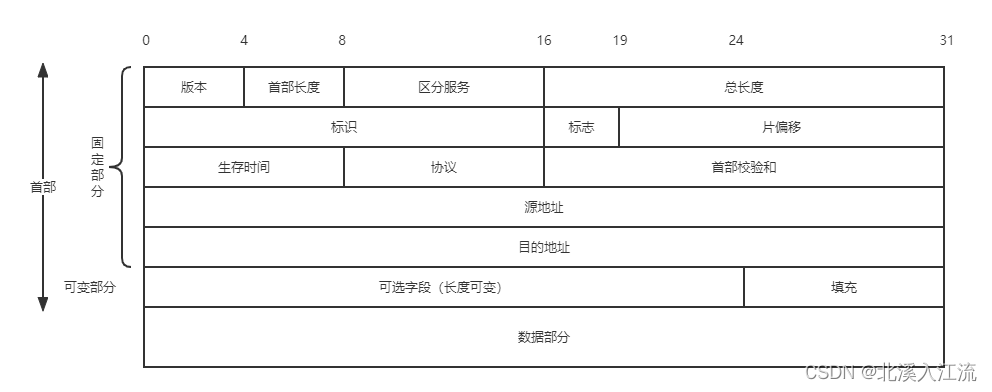
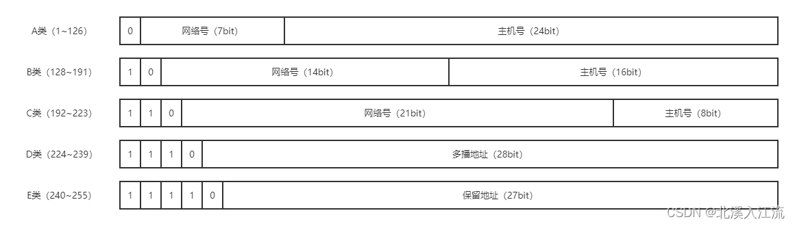

# 网络层的功能
网络层的设计思路：向上提供简单灵活的、无连接的、尽最大努力交付的数据报服务。即所传送的分组可能出错、丢失、重复、失序或超时。
这种设计思路的好处是：网络造价大大降低，运行方式灵活，能够适应各种应用。
## 异构网络互联
**异构网络**：是由不同制造商生产的计算机，网络设备和系统组成的，大部分情况下运行在不同的协议上支持不同的功能或应用。
**网络互联**：指两个以上计算机网络，通过一定的方法，用中间设备（又称中继系统）相连连接起来，构成更大的网络系统。
在物理层或数据链路层的中继系统只是把一个网络扩大了，但仍是同一个网络，所以并不称为网络互联。网络互连指用路由器进行网络互连和路由选择。
路由器是一台专用计算机，用于在互联网中进行路由选择。
### 中继系统层次
根据所在的层次，中继系统分为：
- 物理层：转发器、集线器
- 数据链路层：网桥或交换机
- 网络层：路由器
- 网络层以上：网关
## 路由与转发
路由器的主要功能：
- 路由选择（选择哪一条路径）：按照复杂的分布式算法，根据从各相邻路由器所得到的关于整个网络拓扑的变化情况，动态的改变所选择的路由。
	- 根据特定的路由协议构造路由表
	- 经常或定期的和相邻路由器交换路由信息不断更新和维护路由表
	- 路由表根据路由选择算法得出
	- 路由的结构应使网络拓扑结构的变化最优化
- 分组转发：路由器根据转发表将用户的IP数据报从合适的端口转发出去。
	- 处理通过路由器的数据流
	- 主要操作是转发表查询、转发和相关的队列管理和任务调度
	- 转发表由路由表得出
	- 转发表的结构应使查找过程最优化
## 拥塞控制
**拥塞**：在通信子网中，因出现过量的分组而引起网络性能下降的现象称为拥塞。
### 判断拥塞
通过观察网络的吞吐量和网络负载的关系来判断网络是否进入拥塞状态：
- 轻度拥塞：随着网络负载的增加，网络的吞吐量明显小于正常的吞吐量
- 拥塞状态：随着网络负载的增加，网络的吞吐量下降
- 死锁状态：随着网络负载的增加，网络的吞吐量下降到零
### 流量控制和拥塞控制的区别
- 流量控制：
	- 流量控制指在发送端和接收端之间的点对点通信量的控制
	- 流量控制是抑制发送端发送数据的速率，以便接收端来得及接收
- 拥塞i控制：
	- 拥塞控制必须确保通信子网能够传送待传送的数据
	- 拥塞控制是一个全局性问题，涉及网络中所有的主机、路由器及导致网络传输能力下降的所有因素
### 拥塞控制方法
- 开环控制（静态的预防方法）：设计网络时将有关发生拥塞的因素考虑周到，力求在工作时不发生拥塞。
	- 一旦系统启动并运行，中途不再需要修改
	- 开环控制手段包括确定何时接收新流量、何时丢弃分组、丢弃哪些分组，确定何种调控策略
	- 做决定时不考虑当前网络的状态
- 闭环控制（动态的反馈方法）：事先不考虑有关发生拥塞的各种因素，采用监测网络系统去监视，及时检测哪里发生了拥塞，将拥塞信息传到合适的地方，以便调整网络系统的运行，解决问题
	- 基于反馈环路的概念
# 路由算法
路由器转发分组是通过路由表转发的，路由表是通过各种算法得到的。
## 静态路由与动态路由
根据是否随网络的通信量或拓扑结构自适应地进行调制变化来划分，路由算法可以分为：
- 静态路由算法（非自适应路由算法）：由网络管理员手工配置路由信息。
	- 当网络的拓扑结构或链路状态发生变化时，网络管理员需要手工修改路由表中的相关的静态路由信息。
	- 不能及时适应网络状态的变化。
	- 适用于简单的小型网络
	- 简便和开销较小
	- 在拓扑结构变化不大的网络中运行效果良好
- 动态路由算法（自适应路由算法）：路由器上的路由表项通过相互连接的路由器彼此交换信息，按照一定的算法优化出路由信息，这些路由信息会在一定时间间隙不断更新，以适应不断变化的网络，随时获得最优的寻路效果
	- 能改善网络的性能并有助于流量控制
	- 算法复杂，会增加网络负担
	- 对路由的动态变化反应太快会引起网络振荡，反应太慢会影响网络路由的一致性
## 距离-向量路由算法
**距离-向量路由算法**：所有结点定期地将它们的整个路由选择表传送给所有与之直接相邻的结点。
### 路由选择表
这种路由选择表包括：
- 每条路径的目的地（另一结点）
- 路径的代价（也称距离）
### 路由选择表的更新
在距离-向量路由算法中，所有结点都必须参与距离向量交换，保证路由的有效性和一致性，结点在以下情况下更新它们的路由选择表
- 在相邻结点发送过来的信息中，包含一条新的路由，该路由在本结点的路由表中不存在，将该路由添加到路由表中
- 在相邻结点发送过来的信息中有一条到达某个目的地的路由，该路由与当前使用的路由相比，距离（或代价）更小。用经过发送路由信息的结点的新路由替换路由表中到达那个目的地的现有路由

由于距离-向量路由算法交换路由信息报文的大小与通信子网的结点个数成正比，所有结点都需要参与路由信息交换，所以可能导致通信子网上传送的路由选择信息的数量很容易变得很大，
最常见的距离-向量路由算法是RIP算法，采用“跳数”作为距离的单位。
## 链路状态路由算法
**链路状态路由算法**：每个参与该算法的结点都具有完全的网络拓扑信息，它们执行下述任务：
- 主动测试所有邻接结点的状态
- 定期地将链路状态传播给所有其他结点

链路状态路由算法的典型算法是：OSPF算法
链路状态路由算法一个结点检查其所有直接连接链路的状态，并将状态信息发送给网上所有其他结点。当链路状态到达时，路径==结点根据状态信息更新直接的网络拓扑结构和状态，一旦链路状态发生变化，结点利用更新的网络图利用迪杰斯特拉最短路径算法重新计算路由
### 链路状态路由算法的特点
- 通过洪泛法向本系统的所有路由器发送信息：即路由器通过所有端口向所有相邻的路由器发送信息。每个相邻路由器又将此信息发送给其所有相邻的路由器（不再发送给刚发来信息的路由器）
- 发送的信息是与路由器相邻的所有路由器的链路状态，只是路由器所知道的部分信息
- 当链路状态发生变化时，路由器才向所有路由器发送此信息
### 链路状态路由算法的优点
- 每个路由结点使用相同的原始状态数据独立地计算路径，不依赖中间结点的计算
- 链路状态报文不加改变地传播，易查找故障
- 当一个结点从其他所有结点接收到报文时，可以在本地立即计算正确的通路，保证一步汇聚
- 由于链路状态报文仅传输单个结点关于直接链路的信息，其大小与网络中的路由结点数目无关，因此比距离-向量路由算法具有更好的规模可扩展性
###  链路状态路由算法和距离-向量路由算法的比较
- 距离-向量路由算法：
	- 每个结点仅与其直接相邻结点交谈
	- 为它的相邻结点提供从自己到网络中所有其他结点的最低距离（代价）估计
- 链路状态路由算法：
	- 每个结点通过广播的方式与所有其他结点交谈
	- 仅告诉其他结点与其直接相连的链路的状态
## 层次路由
当网络规模扩大时，路由器的路由表将成比例的增大，会浪费更多的网络系统资源，因此路由选择必须按照层次的方式进行划分。
因特网将整个互联网划分为许多较小的自治系统（一个自治系统包含多个局域网），每个自治系统自主地决定本系统内采用何种路由选择协议，两个自治的系统如果需要通信，需要在两个自治系统之间的协议屏蔽这些差异
- 内部网关协议（IGP，也称域内路由选择）：一个自治系统内部所使用的路由选择协议，包括RIP（距离-向量路由算法）和OSPF（链路状态路由算法）
- 外部网关协议（EGP，也称域间路由选择）：用在不同自治系统的路由器之间交换路由信息，并负责为分组在不同自治系统之间选择最优的路径，包括BGP
# IPv4
**网际互连协议（IP协议）**：定义数据传送的基本单元为IP分组及其确切的数据格式。IP协议根据端到端的设计原则。为主机提供一种无连接、不可靠的、尽力而为的数据包传输服务。IP地址和MAC地址相比，IP地址是互联网的逻辑地址，是根据机构分配的可变化的；MAC地址是网卡的物理地址，是厂商出厂时就设置好了的。
**IPv4**：IP协议第4版。
## IPv4 分组
### IPv4分组的格式

    

- 版本（4bit）：IP协议的版本，目前广泛使用的版本号为4。
- 首部长度（4bit）：表示IP数据报首部的长度，表示的最大十进制数为15，以32（4B）为单位，最大值为60B（$15 \times 4$B）。
- 总长度（16bit）：首部和数据之和（IP数据报）的长度，单位为字节，因此数据报的最大长度为$2^{16} - 1 = 65535$B。以太网帧的最大传送单元（MTU）为1500B，因此当一个IP数据报成帧时，数据报的总长度不能超过下面的数据链路层的MTU值。
- 标识（16bit）：是一个计数器，每产生一个数据报就加1，并赋值给标识字段。当一个数据报长度超过网络的MTU时，必须分片，此时每个数据报片都会复制一次标识号，以便能正确的重装成原来的数据报
- 标志（3bit）：标志字段的最低位为MF，MF = 1时表示后面还有分片，MF = 0表示是最后一个分片。标志字段的中间位位DF，只有当DF = 0 时才允许分片
- 片偏移（13bit）：指出分组在分片后，某片在原分组中的相对位置。片偏移以8B为单位，除最后一个分片外，每个分片的长度一定是8B的整数倍
- 生存时间（TTL，8bit）：数据报在网络中可通过路由数的最大值，标识分组在网络中的寿命，确保分组不会永远在网络中循环。路由器在转发分组时，会将TTL减1，当TTL为0时，丢弃分组。
- 协议（8bit）：指出分组携带的数据使用何种协议。其中值为6表示TCP、值为17表示UDP。
- 首部校验和（16bit）：只校验首部，不校验数据部分
- 源地址（4B）：标识发送方IP地址
- 目的地址（4B）：标识接收方IP地址
### IP数据报分片
**分片**：一个数据链路层帧能承载的最大数据量称为最大传送单元（MTU）。当一个数据报长度超过网络的MTU时，就需要将IP数据报的分组分装在较小的IP数据报中，这些较小的数据报称为分片。

源主机创建一个数据报并为其加上标识号（每创建一个数据报，标识号加1），当路由器需要将一个数据报分组时，根据IP数据报的标识号，标志等信息将数据报分为较小的分组：若标志的中间位DF（Don't Fragment） = 0，则可以对数据报进行分组，将原数据报分为较小的分组，每个IP数据报具有相同的标识号，设置各个分组的片偏移（片偏移以8B为单元，除最后一个分组外，其余分组的长度一定是8B的整数倍），其中标志的最低位MF（More Fragment） = 1，表示该分组还有分组，标志最低位MF = 0，表示为原分组的最后一片。
在所有分片到达目的主机后，目的主机根据标识号，标志和片偏移将分片组装成原数据报。
## IPv4 地址与 NAT
### IPv4地址
IP地址分为网络号和主机号：
- 网络号：标识主机或路由器所连接的网络，一个网络号在互联网中是唯一的
- 主机号：标识主机或路由器的逻辑地址，一台主机号在其所在的网络范围里是唯一的
#### IPv4地址的分类

    

- A：(1.0.0.0-126.0.0.0)（默认子网掩码：255.0.0.0）
	- 该类IP地址的最前面为“0”
	- 网络号取值为1~126
	- 大型网络
- B：(128.0.0.0-191.255.0.0)（默认子网掩码：255.255.0.0 ）
	- 该类IP地址的最前面为“10”
	- 网络号取值为128.0~191.255
	- 中等规模
- C：(192.0.0.0-223.255.255.0)（子网掩码：255.255.255.0
	- 该类IP地址的最前面为“110”
	- 网络号取值为192.0.0~223.255.255
	- 小型网络。
- D：多播地址
	- 该类IP地址的最前面为“1110”
	- 用于多路广播用户
- E：保留地址
	- 该类IP地址的最前面为“11110”

常用三种类比IP地址的使用范围：
| 网络类别 | 最大可用网络数 | 第一个可用网络号 | 最后一个可用的网络号 | 每个网络中的最大主机数 |
| -- | -- | -- | -- | -- |
| A | $2^7 - 2$ | 1 | 126 | $2^{24} - 2$ |
| B | $2^{14}$ | 128.0 | 191.255 | $2^{16} - 2$ |
| C | $2^{21}$ | 192.0.0 | 223.255.255 | $2^{8} - 2$ |
#### 特殊IP地址
在各类IP地址中，有些IP地址具有特殊用途，不用做主机的IP地址：
- 主机号全为0：表示本网络本身
- 主机号全为1：表示本网络的广播地址，又称直接广播地址
- 127.x.x.x：表示为环回自检地址，又称本地回环地址，不属于任何一个有类别地址类。它代表设备的本地虚拟接口，所以默认被看作是永远不会宕掉的接口
- 0.0.0.0：表示本网络上的本主机
- 255.255.255.255：表示整个TCP/IP网络的广播地址，又称受限广播地址。实际使用时，由于路由器对广播域的隔离，255.255.255.255等效为本网络的广播地址
#### IP地址的重要特点
- 因为每个IP地址都由网络号和主机号组成，所以IP地址是一种分等级的地址结构
	- IP地址管理机构分配IP地址时只分配网络号，主机号由网络单位自行分配，方便IP的管理
	- 路由器仅根据目的主机所连接的网络号来转发分组，减小了路由表所占用的存储空间
- IP地址是表示一台主机（或路由器）和一条链路的接口。当一台主机同时连接到两个网络时，该主机就必须分配两个相应的IP地址，每个IP地址的网络号必须与所在网络的网络号相同，因此IP网络上一个路由器必然至少有两个IP地址（和其他网络相连构成更大的网络）
- 用转发器或桥接器（网桥）连接的若干LAN仍然是同一网络，因此该LAN中所有主机的IP地址必须相同
- 在IP地址中，所有分配到网络号的网络都是平等的
- 在同一个局域网上的主机或路由器的IP地址的网络号必须是一样的，路由器总是具有两个或两个以上的IP地址，路由器的每个端口都有一个不同网络号的IP地址
### 网络地址转换（NAT）
**网络地址转换**：指通过将专用网络地址转换为共用地址从而对外隐藏内部管理的IP地址。使得整个专用网只需要一个全球IP地址就可以和因特网连通，由于专用网本地IP地址可重用，所以NAT节省了IP地址的消耗。隐藏了内部网络结构，从而降低了内部网络受到攻击的风险。
#### 私有IP地址
未来网络安全，将部分IP地址划分为私有IP地址（可重用IP地址），私有IP地址只用于LAN，不用于WAN，并且允许私有IP地址被LAN重复使用，有效解决了IP地址不足的问题。
- A类：1个私有网段：**10**.0.0.0~**10**.255.255.255
- B类：16个私有网段：**172.16**.00~**172.31**.255.255
- C类：256个私有网段：**192.168.0**.0~**192.168.255**.255

采用私有IP地址的互联网称为专用互联网或本地互联网。在因特网中，对于目的地址是私有地址的数据报一律不转发。
使用NAT时需要在专用网连接到因特网的路由器上安装NAT软件，NAT路由器至少有一个有效的外部全球IP地址，使用本地地址的主机和外界通信时，NAT路由器使用NAT转换表进行本地IP地址和全球IP地址的转换。NAT转换表中存放着 **{本地IP地址：端口}** 到 **{全球IP地址：端口}** 的映射。通过这种映射的方式，可让多个私有IP地址映射到一个全球IP地址上。
## 子网划分与子网掩码、CIDR
### 子网划分
两级IP地址的缺点：
- IP地址空间的利用率有时很低
- 给每个物理网络分配一个网络号会使路由表变得太大而使网络性能变坏
- 两级IP地址不够灵活

**子网划分**：为了解决两级IP地址的缺点，在IP地址中增加一个”子网号字段“，使两级IP地址变成三级IP地址，这种做法称为子网划分。
#### 子网划分的基本思路
- 子网划分是一个单位内部的事情，单位对外仍然表现为没有划分子网的网络
- 从主机号借用若干比特作为子网号，三级IP地址结构如下：**IP地址 = {<网络号>, <子网号>, <主机号>}**
- 凡是从其他网络发给本单位某台主机的IP数据报，仍通过IP数据报的网络号，先发到本单位网络上的路由器，路由器在收到IP数据报后，根据目的网络号和子网号找到目的子网，把IP数据报直接交付给目的主机
#### 子网掩码
为了告诉主机或路由器对网络进行的子网划分，使用子网掩码表示对原网络主机号的借位。
子网掩码是一个与IP地址相对应的、长32bit的二进制串，其中”1“对应于IP地址中的网络号及子网号，而”0“对应主机号，计算机只需要将IP地址和其对应的子网掩码地址逐位”与“运算，就可以得到相应子网的网络地址
在使用子网掩码的情况下：
- 一台主机在设置IP地址信息的同时，必须设置子网掩码
- 同属于一个子网的所有主机及路由器的相应端口，必须设置相同的子网掩码
- 路由器的路由表中，包含的主要内容有目的网络地址、子网掩码、下一跳地址
### 无分类编码CIDR
**无分类域间路由选择CIDR**：在变长子网掩码的基础上提出的一种消除传统A、B、C类网络划分，并且可以在软件的支持下实现超网构造的一种IP地址的划分方法。
> 如一个单位需要2000个地址，那么就给它分配2048地址的块，即8个连续的C类网络，而不是一个完全的B类地址，这样就可以大幅度提高IP地址的利用率，减小路由器的路由表大小，提高路由转发能力

CIDR消除了传统A、B、C类地址和子网划分的概念，因此可以更有效的分配IP地址，CIDR使用”网络前缀“的概念代替子网络的概念，网络前缀的位数不固定，可以任意选取，CIDR的记法为：**IP = {<网络前缀>, <主机号>}**
CIDR还使用”斜线记法“（或称CIDR记法）：IP地址/网络前缀所占比特数
CIDR地址块中的地址数一定是2的整数次幂，实际可指派的地址数是：$2^N - 2$，$N$表示主机号的位数，主机号全0表示网络号，全1表示广播地址。网络前缀越短，地址库所含地址数越多
**最长前缀匹配（最佳匹配）**：使用CIDR时，路由表中的每个项目由”网络前缀”和“下一跳地址”组成。查找路由表时会得到不止一个匹配结果，应当从匹配结果中选择最长的网络前缀的路由，因为网络前缀越长，地址块越小，路由就越具体。
CIDR查找路由方法：为了更有效的查找最长前缀匹配，通常将CIDR路由表放在一种层次的数据结构中，自上而下的按层次查找，通常采用的数据结构是二叉线索树。
### 网络层转发分组的过程
分组转发都是基于目的主机所在的网络。当分组到达路由器后，路由器根据目的IP地址的网络前缀来查找转发表，确认下一跳应当到那个路由器。因此，在转发表中，每条路由必须有下面的信息：（目的地址， 下一跳地址）
#### 特殊路由
此外，转发表还可以增加两种特殊的路由：
- 主机路由：对特定目的主机的IP地址专门指明一个路由，以方便网络管理员控制和测试网络。
- 默认路由：用特殊前缀0.0.0.0/0表示默认路由，任何目的地址进行按位与运算结果必然全是0，目的网络是其他网络（不在转发表中），就一律使用默认路由。
#### 路由器执行的分组转发算法
- 从收到的IP分组的首部提取目的主机的IP地址（目的地址）
- 若查找到特点主机路由，就按照这条路由的下一跳转发分组；否则从转发表按前缀长度的顺序开始检查
- 将查找的数据的子网掩码与目的地址进行按位与运算，若运算结果与本行的前缀匹配，则查找结束，将接收的分组通过指定接口交付到下一跳主机上；否则，对转发表下一行数据进行检查，重新执行本步骤，若无下一行，执行下一步
- 若转发表有一个默认路由，把分组传送到默认路由；否则，报告转发分组错误
## ARP 协议、DHCP 协议与 ICMP 协议
### IP地址和硬件地址（MAC地址）
**IP地址**：网络层使用的地址，具有分层结构。是主机的逻辑地址。
**硬件地址（MAC地址）**：数据链路层使用的地址，是平面式的地址。是主机的真实地址。

IP数据报封装成帧后，在数据链路层是看不到IP地址的。因此，在网络中，使用IP地址来完成寻址。寻址时，每个路由器依据其路由表选择目标网络。IP分组到达目标网络后，改为在目标网络中通过数据链路层的MAC地址以广播的方式寻址，这样可以提高路由选择的利用率。
- IP层抽象的互联网上只能看到IP数据报
- IP数据报首部有源IP地址，但是路由器只根据目的IP地址进行转发
- 在局域网的数据链路层，只能看到MAC地址，IP数据报被封装在MAC帧中，通过路由器转发IP分组时，IP分组在每个路由器都会被解封装和重新封装，所以其MAC帧首部的源地址和目的地址会不断发生变化，所以MAC地址无法跨网络通信
- 尽管互联在一起的网络的硬件地址体系各不相同，但IP曾抽象的互联网缺屏蔽了下层的复杂的细节，这样我们在网络层讨论问题，就得到了统一。
### 地址解析协议（ARP）
无论网络层使用什么协议，在数据链路层上传送数据帧时，都需要使用硬件地址，所以需要一种方法完成IP地址和MAC地址的映射。
**地址解析协议（Address Resolution Protocol，ARP）**：完成IP地址和MAC地址的映射。每台主机都存在一个ARP高速缓存，用来存放本局域网各主机和路由器的IP地址到MAC地址的映射，称为ARP表，通过ARP来动态维护ARP表。
#### ARP工作原理
ARP工作在网络层，其工作原理为：主机如果欲向本局域网上的某台主机B发送IP数据报，先在其ARP高速缓存中查看有无主机B：
- 有主机B：查看其对应的MAC地址，将MAC地址写入MAC帧，通过局域网将该MAC帧发往对应的主机
- 无主机B：通过使用目的MAC地址为FF-FF-FF-FF-FF-FF的帧来封装并广播ARP请求分组，使同一个局域网的所有主机都收到此ARP请求。主机B收到该ARP请求后，单独向主机A发送ARP响应分组，分组中包含主机B的IP与MAC地址的映射关系，主机A收到响应分组后将其写入ARP缓存，然后按查询到的MAC地址发送MAC帧

ARP由于“看到了”IP地址，所以其工作在网络层
#### ARP工作的四种情况
- 发送方是**主机**，把IP数据报发送到**本网络**上的另一台主机：这时主机在本网络通过ARP找到目的主机的硬件地址
- 发送方是**主机**，把IP数据报发送到**另一个网络**上的另一台主机：主机在本网络通过ARP找到与本网络连接的路由器的硬件地址，剩下的工作由路由器完成
- 发送方是**路由器**，把IP数据报发送到**与路由器直接连通的网络**上的一台主机：路由器在目标网络通过ARP找到目标主机的硬件地址
- 发送方是**路由器**，把IP数据报发送到**不与路由器直接连通的网络**上的一台主机：路由器通过ARP找到间接连通的路由器的硬件地址，剩下的工作由间接路由器完成
### 动态主机配置协议（DHCP）
**动态主机配置协议（Dynamic Host Configuration Protocol，DHCP）**：常用于给主机动态地分配IP地址，提供了即插即用的联网机制，这种机制允许一台计算机加入新的网络和获取IP地址而不需要手工配置。DHCP是基于UDP的应用层协议。
#### DHCP的工作原理
DHCP使用客户/服务器（C/S）模式。需要IP地址的主机在启动时向DHCP服务器广播发送发现报文，这时主机就成为DHCP服务器的客户，DHCP服务器先在其数据库查找该计算机的配置信息，若找到，返回找到的信息；若找不到，从服务器的IP地址池中区一个地址分配给该计算机。DHCP服务器的回答报文称为提供报文。
DHCP允许网络配置多台服务器，当DHCP客户机发出“DHCP发现”报文时，可能会收到多个应答，这时，DHCP客户机以最先到达的为准。
DHCP服务器分配给DHCP客户的IP地址是临时的，因此DHCP客户只有在一段有限的时间内才能使用这个分配的IP地址。DHCP称这段时间为租用期，租用期的值由DHCP服务器自己决定，DHCP客户可可以在自己发送的报文中提出对租用期的要求。
### 网际控制报文协议（ICMP）
**网际控制报文协议（Internet Control Message Protocol，ICMP）**：为了提供IP数据报交付成功的机会，在网络层使用网际控制报文协议让主机或路由器报告差错和异常情况。ICMP是IP层协议，ICMP作为IP层数据报的数据，加上数据报的首部，组成IP数据报发送出去。
ICMP报文分为ICMP差错报文和ICMP询问报文
#### ICMP差错报文
**ICMP差错报文**：用于目标主机或到目标主机路径上的路由器向源主机报告差错和异常情况。
##### ICMP差错情况
- 终点不可达：路由器或主机不能交付数据报时，向源点发送终点不可达报文
- 源点抑制：当路由器或主机由于拥塞丢弃数据报时，向源点发送源点抑制报文，使源点把发送数据报速率放慢
- 时间超过：
	- 当路由器收到生存时间（TTL）为零的数据报时，丢弃数据报并向源点发送时间超过报文。
	- 当终点在预定时间不能收到一个数据报的全部数据报片时，把已收到的数据报片都丢弃，并向源点发送时间超过报文
- 参数问题：当路由器或目的主机收到的数据报的首部有字段的值不正确时，丢弃该数据报，并向源点发送参数问题报文
- 改变路由（重定向）：路由器把改变路由报文发送给主机，让主机知道下次应将数据报发给另外的路由器
##### 不应发送ICMP差错报文的情况
- 对ICMP差错报告报文不在发送ICMP差错报告报文
- 对第一个分片的数据报片的所有后续数据报片都不发送ICMP差错报告报文
- 对具有组播地址的数据报都不发送ICMP差错报告报文
- 对具有特殊地址的数据报不发生ICMP差错报告报文
#### ICMP询问报文
ICMP常见的询问报文：
- 回送请求和回答报文
- 时间戳请求和回答报文
- 地址掩码请求和回答报文
- 路由器询问和通告报文
#### ICMP的常见应用
- 分组网间探测Ping（测试两条主机之间的连通性）：使用ICMP回送请求和回答报文
- 路由跟踪（跟踪分组经过的路由）：使用ICMP时间超过报文
# IPv6
随着互联网和物联网的发展，IPv4面临地址耗尽问题。
解决“IP地址耗尽”问题的措施：
- 使用无类别编制CIDR，使IP地址的分配更加合理
- 采用网络地址转换（NAT）以节省全球IP地址
- 采用具有更大地址空间的新版本IPv6

其中，前两种都是在延长Ipv4地址分配完毕的时间，只有第三种方法才能从根源上解决IP地址耗尽的问题。
## IPv6 的主要特点
- 更大的地址空间。IPv6将地址从IPv4的32位（4B）增大到128位（16B）
- 扩展的地址层次结构
- 灵活的首部格式
- 改进的选项
- 允许协议继续扩充
- 支持即插即用（即自动配置）
- 支持资源的预分配
- IPv6只有在包的源结点才能分片，是端到端的，传输路径中的路由器不能分片。
- IPv6的首部长度必须是8B的整数倍，而IPv4首部是4B的整数倍
- 增大了安全性。身份验证和保密功能是IPv6的关键特性

IPv6和IPv4是不兼容的，但与其他的因特网协议兼容，只是在少数地方做必要修改（为了处理长的地址）
### IPv6满足预定目标体现在
- IPv6有比IPv4更长的地址。IPv6的地址用16个字节表示，地址空间是IPv4的$2^{128 - 21} = 2^{96}$倍
- IPv6简化了IP分组头，包含8个域（IPv4包含12个域）。使路由器可以更快地处理分组，改善吞吐量。
- 更好地支持选项，之前的一些必要段现在变成了可选段，加快分组的处理速度
## IPv6 地址
### IPv6的目的地址类型
IPv6的目的地址可以是下面三种基本类型地址之一：
- 单播：传统的点对点通信
- 多播：一对多点通信，分组被交付给一个分组的每台计算机
- 任播：IPv6新增类型。任播的目的站是一组计算机，但数据报在交付时只交给一台计算机，通常是距离或跳数最近的一台计算机
### IPv6的表示
若是IPv6仍使用IPv4的点分十进制表示法，那么地址写起来将会特别长。IPv6标准中指定了一种比较紧凑的表示法：把地址中的每4位用一个十六进制数表示，并用冒号分割每16位。如：ABCD:AA12:0216:0010:BBAE:0394:BADA:9527
通常IPv6还可以进一步缩写，每16位域的开头有一些0时，可以省略多余的0，但是每个域内至少有一个数字。如：4BF5:0000:0000:0000:ABCE:0527:000B:9527可以缩写为：4BF5:0:0:0:ABCE:527:B:9527
当IPv6中出现连续的0值域时，可以进一步缩写，这些域可以使用双冒号（::）缩写。双冒号在一个地址中只能出现一次。如：4BF5:0:0:0:ABCE:527:B:9527可以进一步缩写为：4BF5::ABCE:527:B:9527
### IPv6的分级结构
IPv6扩展了IPv4的分级结构，IPv6使用3个等级：
- 顶级：全球都知道的公告拓扑
- 场点级：指明单个场点
- 第三级：指明单个网络接口
### IPv4向IPv6的过渡
IPv4向IPv6的过渡使用逐步演进的办法，使新安装的IPv6系统能够向后兼容。IPv6系统必须能够接收和转发IPv4分组，能够为IPv4分组进行分组路由选择。
IPv4向IPv6的过渡可以使用双协议栈和隧道技术两种策略
- 双协议栈：一台设备同时装有IPv4和IPv6协议栈
	- 路由器：不同接口分别配置IPv4地址和IPv6地址
	- 计算机：同时拥有IPv4和IPv6地址
- 隧道技术：将整个IPv6数据报封装到IPv4数据报的数据部分，使得IPv6数据报可以在IPv4网络的隧道中传输
# 路由协议
## 自治系统（AS）
**自治系统（Autonomous System，AS）**：单一技术管理下的一组路由器，这些路由器使用一种AS内部的路由选择协议和共同的度量来确定分组在该AS内的路由，同时使用一种AS之间的路由选择协议来确定分组在AS之间的路由。
一个自治系统的所有网络都由一个行政单位管辖，一个自治系统的所有路由器在本自治系统内都必须是连通的。
## 域内路由与域间路由
自治系统内部的路由选择称为域内路由选择，自治系统之间的路由选择称为域间路由选择。
### 内部网关协议（IGP）
**内部网关协议（Interior Gateway Protocol，IGP）**：内部网关协议是在一个自治系统内部使用的路由选择协议，它与互联网中其他自治系统选用什么路由选择协议无关。主要有RIP、OSPF协议等
### 外部网关协议（EGP）
**外部网关协议（External Gateway Protocol，EGP）**：源站和目的站处于不同的自治系统中，当数据报传到一个自治系统的边界时（两个自治系统可能使用不同的IGP），就需要使用一种协议将路由选择信息传递到另一个自治系统中。这样的协议技术外部网关协议（EGP）。主要由BGP协议等
## 路由信息协议（RIP $\in$ IGP）
**路由信息协议（Routing Information Protocol，RIP）**：内部网关协议中最先得到广泛应用的协议。RIP是一种分布式的基于**距离向量的路由选择协议**，最大的优点是简单。
- 优点：
	- 实现简单
	- 开销小
	- 收敛速度块
- 缺点：
	- RIP限制了网络的规模，能使用的最大距离为15跳
	- 路由器之间交换的是路由器的完整路由表，当网络规模越大，开销越大
	- 网络出现故障时，会出现慢收敛现象（需要较长时间才能将此信息传送到所有路由器），即“坏消息传得慢”，使更新过程的收敛时间长
### RIP规定
- 网络中的每个路由器都要维护从它自身到其他每个目的网络的距离记录
- 距离也称跳数，规定从一个路由器到之间连接的网络的距离为1，每经过一个路由器，距离加1
- RIP认为好的路由就是它通过的路由器的数目少，即优先选择跳数少的路径
- RIP允许一条路径最多包含15个路由器（即最多允许15跳）。因此距离大于15时表示网络不可达。因此RIP只适用于小型互联网。限制跳数是为了防止数据报不断在环路上循环，减少网络拥塞的可能性
- RIP默认在任意两个使用RIP的路由器之间每30秒广播一次RIP路由更新信息，以便自动建立并维护路由表
- 在RIP中不支持子网掩码的RIP广播，所以RIP的每个网络的子网掩码必须相同。在RIP2中支持变长子网掩码和CIDR
### RIP的特点
- 仅和相邻的路由器交换信息
- 路由器交换的信息是当前路由器所知道的全部信息，即自己的路由表
- 按固定的时间间隔交换路由信息
### 距离向量算法
RIP基于距离向量路由选择算法。每个路由表项目都由三个关键数据：**<目的网络N， 距离d， 下一跳路由器地址X>**，对于每一个相邻路由器发送的RIP报文，执行以下步骤：
- 对地址为X的相邻路由发来的RIP报文，先修改此报文的所有项目：把“下一跳”字段中的地址都改为X，并把所有“字段”的值加1
- 对修改后的RIP报文的每个项目，执行如下步骤：
	- 当原来的路由表中没有目的网络N时，把该项目添加到路由表中
	- 当原来的路由表中有目的网络N时，且下一跳路由器的地址是X时，用收到的项目替换原路由表中的项目
	- 当原来的路由表中有目的网络N时，且下一跳路由器的地址不是X时，如果收到的项目中的距离d小于路由表中的距离，那么就用收到的项目替换原路由表中的项目。
- 如果180秒（RIP默认超时时间为180秒）还没有收到相邻路由器的更新路由表，那么将此相邻路由器记为不可达路由器，距离设置为16
## 开放最短路径优先协议（OSPF $\in$ IGP）
**开放最短路径优先协议（OSPF）**：是使用分布式链路状态路由算法的典型代表，是内部网关协议的一种。
### OSPF和RIP的主要区别
- OSPF向本自治系统中的所有路由器使用洪泛法发送信息，RIP只向直接相邻的路由器发送信息
- OSPF发送与本路由器相邻的所有路由器的链路状态，RIP发送整个路由表
- OSPF只有当链路状态发生变化时，才会发生信息，并且更新收敛快，RIP不管网络拓扑是否发生变化，都会定期交换路由表信息
- OSPF是网络层协议，不使用UDP或TCP，直接用IP数据报传送（IP数据报首部的协议字段为89），RIP是应用层协议，在传输时使用UDP
### OSPF的特点
- OSPF对不同的链路可根据IP分组的不同服务类型（TOS）设置成不同的代价。因此，OSPF对不同类型的业务可计算出不同类型的路由，十分灵活
- **多路径间的负载均衡**：如果同一目的网络有多条相同代价的路径，那么可以将通信量分配给这几条路径
- 所有在OSPF路由器之间交换的分组都具有可鉴别的功能，因而保证了仅在可信赖的路由器之间交换链路状态信息
- 支持可变长度的子网划分和无分类编址CIDR
- 每个链路状态都带有一个32位的序号，序号越大，状态就越新
### OSPF的基本工作原理
所有路由器最终都建立了一个链路状态数据库，这个数据库实际上是全网的拓扑结构图，它在全网范围是一致的（称为链路状态数据库的同步）。每个路由器根据这个全网的拓扑结构图使用迪杰斯特拉最短路径算法计算从自己到各目的网络的最优路径，构造路由表。
为使OSPF算法适用于规模很大的网络，OSPF算法将一个自治系统划分为若干更小的范围，称为区域。
划分区域的好处是，为利用洪泛法交换链路状态信息的范围局限于每个区域而非整个自治系统，减少网络上的通信量。在一个区域内部的路由器只知道本区域的完整网络拓扑，不知道其他区域的网络拓扑情况。区域也有层次之分，处于上层的区域称为主干区域，负责连通下层的区域和连接其他自治域
### OSPF的五种分组类型
- 问候分组：用来发现和维持邻站的可达性
	- 通常每10秒，每两个相邻的路由器就要交换一次问候分组，以便知道那些站可达
- 数据库描述分组：向邻站给出之间的链路状态数据库中的所有摘要信息
- 链路状态请求分组：向对方请求发送某些链路状态项目的详细信息
- 链路状态更新分组：用洪泛法对全网更新链路状态
- 链路状态确认分组：对链路更新分组的确认

OSPF为了确保链路状态数据库与全网的状态保持一致，规定每隔一段时间（如30分钟）都会刷新一次数据库中的链路状态
## 边界网关协议（BGP $\in$ EGP）
**边界网关协议（Border Gateway Protocol，BGP）**：是不同自治系统的路由器之间交换路由信息的协议，是一种外部网关协议。
内部网关协议主要使AS中尽可能有效地从源站到达目的站，不需要考虑其他方面的策略。但是在外部网关协议中环境有很大的不同，主要原因：
- 因特网的规模太大，使得自治系统之间路由选择非常困难
- 对于自治系统之间的路由选择，要寻找最佳路由是很不现实的
- 自治系统之间的路由选择必须考虑有关策略
### BGP的原理
边界网关协议力求寻找一种能够到达目的网络且比较好的路由，而并非寻找一条最佳路由。BGP采用距离-向量路由选择协议。BGP是应用层协议，基于TCP。
BGP的工作原理：每个自治系统的管理员选择至少一个路由作为该自治系统的”BGP发言人“。一个BGP发言人与其他自治系统中的BGP发言人交换路由信息，需要先建立TCP连接（BGP报文是TCP报文的数据部分），然后在此连接上交换BGP报文以建立BGP会话，再利用BGP会话交换路由信息。当所有BGP发言人都相互交换网络可达性信息后，各BGP发言人就可找出到达各个自治系统的较好路由。
### BGP的特点
- BGP交换路由信息的结点数量级是自治系统的数量级，要比这些自治系统中的网络数少很多
- 每个自治系统的BGP发言人的数目是很少的，这样就使得自治系统之间的路由选择不致于过分复杂
- BGP支持CIDR，因此BGP的路由表应当包括目的网络前缀，下一跳路由器，以及到达该目的网络所要经过的各个自治系统序列
- 再BGP刚运行时，BGP的邻站交换整个BGP路由表，但以后只需要在发生变化时更新有变化的部分。这样做对节省网络带宽和减少路由器的处理开销都有好处
### BGP-4报文
- 打开报文：用来与相邻的另一个BGP发言人建立联系
- 更新报文：用来发送某一路由的消息，以及列出要撤销的多条路由
- 保活报文：用来确认打开报文并周期性地证实邻站关系
- 通知报文：用来发送检测到的错误
## RIP、OSPF、BGP的比较
<table border="1">
	<tr>
		<th>协议</th>
		<th>RIP</th>
		<th>OSPF</th>
		<th colspan="2">BGP</th>
	</tr>
	<tr>
		<td>类型</td>
		<td>内部（IGP）</td>
		<td>内部（IGP）</td>
		<td colspan="2">外部（EGP）</td>
	</tr>
	<tr>
		<td>路由算法</td>
		<td>距离-向量</td>
		<td>链路状态</td>
		<td colspan="2">距离-向量</td>
	</tr>
	<tr>
		<td>传递协议</td>
		<td>UDP</td>
		<td>IP</td>
		<td colspan="2">TCP</td>
	</tr>
	<tr>
		<td>路径选择</td>
		<td>跳数最少</td>
		<td>代价最低</td>
		<td colspan="2">较好，非最佳</td>
	</tr>
	<tr>
		<td>交换结点</td>
		<td>和本结点相邻的路由器</td>
		<td>网络中的所有路由器</td>
		<td colspan="2">和本结点相邻的路由器</td>
	</tr>
	<tr>
		<td rowspan="2">交换内容</td>
		<td rowspan="2">当前路由器知道的全部信息，即自己的路由表</td>
		<td rowspan="2">与本路由器相邻的所有路由器的链路状态</td>
		<td>首次</td>
		<td>整个路由表</td>
	</tr>
	<tr>
		<td>非首次</td>
		<td>有变化的部分</td>
	</tr>
</table>

# IP 组播
## 组播的概念
**组播**组播机制是让源站发送的单个分组可以抵达一个组地址标识的若干目标主机，并被它们正确接收。组播仅应用于UDP。
使用组播的原因：优点应用程序要把一个分组发送给多个目的地主机。不是让源主机给每个目的主机都发送单独的分组，而是让源主机把单个分组发送给一个组播地址，该组播地址标识一组地址。网络把这个分组的副本投递给该组中的每台主机，主机可以选择加入或离开一个组，因此一台主机可以同时属于多个组。
主机使用因特网组管理协议（IGMP）加入组播组。它们使用该协议通知本地网络上的路由器关于要接收发送给某个组播组的分组的愿望。通过扩展路由器的路由选择和转发功能，可以在许多路由器互联的支持硬件组播网络上面实现因特网组播。
主机组播时只发生一份数据，只有在数据传送路径出现分岔时才将分组复制后继续转发。对于发送者而言，数据只需要发送一次就可以发送到所有接收者，减轻了网络的负载和发送者的负担。组播需要路由器的支持，所以运行组播协议的路由器称为组播路由器。
## IP 组播地址
IP组播使用D类地址格式，D类地址的前四位是1110，D类地址的范围是224.0.0.0~239.255.255.255，每个D类IP地址标志一个组播组。
### IP组播地址的特点
组播使用D类IP地址作为目的地址，IP数据报首部的协议字段值为2，使用IGMP。
- 组播数据报“尽最大努力交付“，不提供可靠交付
- 组播地址只能用于目的地址，不能用于源地址
- 对组播数据报不产生ICMP差错报文。因此，若在PING命令后键入组播地址，永远不会得到响应
- 并非所有的D类地址都可以作为组播地址
### IP组播地址的分类
IP组播可以分为两种：
- 只在本局域网上进行硬件组播
- 在因特网的范围内进行组播：因特网组播的最后阶段还是需要在局域网上用硬件组播交付给组播的所有成员
## IGMP与组播路由算法
**因特网组管理协议（Internet Group Management Protocol，IGMP）**：要使路由器知道组播组成员的信息，需要利用IGMP协议，IGMP协议让连接到本地局域网上的组播路由器知道本局域网上是否有主机参加或退出某个组播组。
连接到局域网上的组播路由器还需要和因特网上的其他组播路由器协同工作，所以需要组播路由选择协议。
### IGMP的工作阶段
IGMP是网际协议IP的一个部分：
- 第一阶段：当某台主机加入新的组播组时，该主机向组播组的组播地址发送一个IGMP报文，声明自己要成为组播组的成员。本地的组播路由器在收到IGMP报文后，将组成员关系转发给因特网上的其他组播路由器。
- 第二阶段：因为组成员关系是动态的，本地组播路由器周期性地探询本局域网上的主机，以便知道这些主机是否仍是组的成员，只要对某个组有一台主机响应，那么组播路由器就认为这个组是活跃的。但一个组在经过多次的探询后仍然没有一台主机响应，那不再将该组的成员关系转发给其他的组播路由器

组播路由选择实际上接收找出以源主机位根结点的组播转发树，其中每个分组在每条链路上只传送一次。
### 组播路由算法分类
- 基于距离-向量的路由选择
- 基于链路状态的路由选择
- 协议无关的组播（PIM）：可以建立在任何路由器协议之上
# 移动 IP 
## 移动 IP 的概念
**移动IP**：支持移动性的因特网系统结构与协议成为移动IP。为了满足移动结点在移动中保持其连接性而设计的。移动IP技术指移动结点以固定的网络IP地址实现跨越不同网段的漫游功能，并保证基于网络IP的网络权限在漫游过程中不发生任何改变。
移动IP的目标是把分组自动地投递给移动结点。一个移动结点是把其连接点从一个网络或子网改变到另一个网络或子网的主机。在使用移动IP时，一个移动结点可以在不改变其IP地址的情况下改变其驻留地址。
### 移动IP功能实体
基于IPv4的移动IP定义了三种功能实体：
- 移动结点：具有永久IP地址的移动结点
- 移动代理：归属代理和外部代理的总称
	- 归属代理（本地代理）：在一个网络环境中，移动结点的永久”居所“被称为归属网络，在归属网络中代表移动结点执行移动管理功能的实体称为归属代理（本地代理），它根据移动用户的转交地址，采用隧道技术转交移动结点的数据包
	- 外部代理：在外部网络中帮助移动结点完成移动管理功能的实体
## 移动IP的通信过程
在移动IP中，每个移动结点都有唯一的本地地址，当移动结点移动时，本地地址是不变的，在本地网络链路上每个移动结点还必须有一个本地代理来维护当前的位置信息。还需要引入转交地址，当移动结点连接到外地网络链路上时，转交地址就用来标识移动结点现在所在的位置，以便进行路由选择。移动结点的本地地址与当前转交地址的联合称为移动绑定。当移动结点得到一个新的转交地址时，通过绑定向本地代理进行注册，以便让本地代理即时了解移动结点的当前位置。
### 移动IP技术的基本通信流程
- 移动结点在本地网时，按传统的TCP/IP方式进行通信
- 移动结点漫游到一个外地网络时，仍使用固定的IP地址进行通信，为了能够收到通信对端发送给它的IP分组，移动结点需要向本地代理注册当前的位置地址，这个位置地址就是转交地址
- 本地代理收到来自转交地址的注册后，会构建一条通往转交地址的隧道，将截获的发给移动结点的IP分组通过隧道送到转交地址处
- 在转交地址处解除隧道封装，恢复原始IP分组，最后送到移动结点，这样移动结点在外网也就能收到这些发送给它的IP分组
- 移动结点在外网通过外网的路由器或外部代理向通信对端发送IP数据包
- 移动结点来到另一个外网时，只需向本地代理更新注册的转交地址，就可以继续通信
- 移动结点回到本地网时，移动结点向本地代理注销转交地址，这时移动结点又将使用传统的TCP/IP通信

移动IP为主机设置了两个IP地址，即主地址和辅地址（转交地址）。移动IP在本地网时使用主地址，在外网时，使用临时的辅地址。
# 网络层设备 
## 冲突域和广播域
**域**：冲突或广播时在其中发生并传播的区域。
### 冲突域
**冲突域**：连接到同一物理介质上的所有结点的集合，这些结点之间存在介质争用的现象。
在OSI参考模型中，冲突域被认为是第1层概念，第一层（集线器、中继器）所连接的结点都属于同一个冲突域。
### 广播域
**广播域**：接收同样广播信息的结点集合。该集合中的任何一个结点发送一个广播帧，其他能收到这个帧的结点都被认为是该广播域的一部分。
在OSI参考模型中，广播域被认为是第2层概念，第一层（集线器等）、第二层（交换机）所连接的结点都属于同一个广播域。
## 路由器的组成和功能
路由器是一个具有多个输入/输出端口的专用计算机，其任务是连接不同的网络并完成路由转发。在多个逻辑网络互联时必须使用路由器。
当源主机向目的主机发送数据报时，路由器先检测源主机与目的主机是否连接在同一个网络上。如果源主机和目的主机在同一个网络，那么直接交付无须经过路由器；如果源主机和目的主机不在同一个网络，那么路由器按照路由转发表支持路由将数据报转发给下一个路由器，称为间接交付。因此，在同一个网络中传递数据无须路由器的参与，跨网络通信需要通过路由器进行转发。
### 路由器的组成
- 从结构上看，路由器是由路由选择和分组转发两部分构成。
	- 路由选择部分也称控制部分，核心构件是路由选择处理机。路由选择处理机的任务是根据所选定的路由选择协议构造出路由表，同时经常或定期地和相邻路由器交换路由信息而不断更新和维护路由表
	- 分组转发部分由三部分组成：交换结构，一组输入端，一组输出端
		- 输入端口：从物理层接收到的比特流中提取出数据链路层的帧，进而从帧中提取出网络层数据报
		- 输出端口：把数据报封装成帧，然后转化为比特流输出
		- 交换结构：路由器的关键部件，根据转发表对分组进行处理，对某个输入端口进入的分组从一个合适的输出端口转发出去
			- 通过存储器进行交换
			- 通过总线进行交换
			- 通过互联网络进行交换
- 从模型上看，路由器是网络层设备，实现了网络模型的下三层：物理层、数据链路层、网络层。
### 路由器的功能
- 分组转发：处理通过路由器的数据率，关键操作是转发表查询、转发及相关的队列管理和任务调度
- 路由计算：通过和其他路由器进行基于路由协议的交互，完成路由表的计算
## 路由表与路由转发
路由表是根据路由选择算法得出的，主要用途是路由选择。
标准的路由表有：**目的网络IP地址、子网掩码、下一跳IP地址、接口**
转发表是根据路由表得出的，其表项与路由表项有直接的对应关系。转发表的格式和路由表的格式不同，其结构应使查找过程最优化（路由表需对网络拓扑结构变化的计算最优化）。转发表中含有一个分组将要发往的目的地址，以及分组的下一跳。为了减少转发表的重复项目，可以使用默认路由代替所有具有相同下一跳的项目。
路由表总是由软件来实现；转发表既可以用软件实现，也可由硬件实现。
转发：是路由器根据转发表把收到的IP数据报从合适的端口转发出去，仅涉及一个路由器；路由选择是许多路由器协同工作的结果，这些路由器按照复杂的的路由算法，根据各相邻的路由器得到网络图片的变化情况，动态的改变所选择的路由，构造整个路由表，涉及许多路由器。
