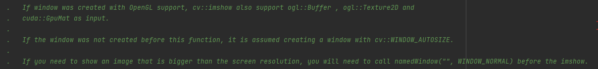

**问题：** 在使用`cv2.imshow()`显示图片时，只能显示图片的部分内容，无法完全显示图片内容。

**原因：** 查看`cv2.imshow()`函数说明可知，opencv在使用`cv2.imshow()`显示图片时，是在指定窗口中显示图片，若在调用`cv2.imshow()`函数之前，没有调用创建窗口的函数，则默认使用`cv2.WINDOW_AUTOSIZE`标记创建默认窗口，如果需要显示大于屏幕分辨率的图像，则需要在使用`cv2.imshow()`之前调用`cv2.namedWindow("", cv2.WINDOW_NORMAL)`

<div style="text-align: center;">
    
</div>

> If the window was not created before this function, it is assumed creating a window with cv::WINDOW_AUTOSIZE.
> 如果该窗口不是在此函数之前创建的，则假定使用cv:：WINDOW_AUTOSIZE创建窗口。

If you need to show an image that is bigger than the screen resolution, you will need to call namedWindow("", WINDOW_NORMAL) before the imshow.
如果需要显示大于屏幕分辨率的图像，则需要在imshow之前调用namedWindow("", WINDOW_NORMAL)。

**解决方法：** 在使用`cv2.imshow()`之前，调用`cv2.namedWindow()`函数，设置显示窗口属性。若调用`cv2.namedWindow()`函数图片仍显示不全，可调用`cv2.resize()`函数使图片的分辨率在显示屏的分辨率也可使图片完全显示。

---

**示例：**
**直接调用imshow()显示图片：**

```python
import cv2
import numpy as np

if __name__ == '__main__':
    img = cv2.imdecode(np.fromfile(r'C:\Users\focus\Pictures\背景图片\希望之鲸.jpg', dtype=np.uint8), cv2.IMREAD_COLOR)
    cv2.imshow('img', img)
    cv2.waitKey(0)
```
<div style="text-align: center;">
    
</div>

**设置namedWindow()：**

```python
import cv2
import numpy as np

if __name__ == '__main__':
    img = cv2.imdecode(np.fromfile(r'C:\Users\focus\Pictures\背景图片\希望之鲸.jpg', dtype=np.uint8), cv2.IMREAD_COLOR)
    cv2.namedWindow('img', cv2.WINDOW_NORMAL)
    cv2.imshow('img', img)
    cv2.waitKey(0)
```

<div style="text-align: center;">
    
</div>
