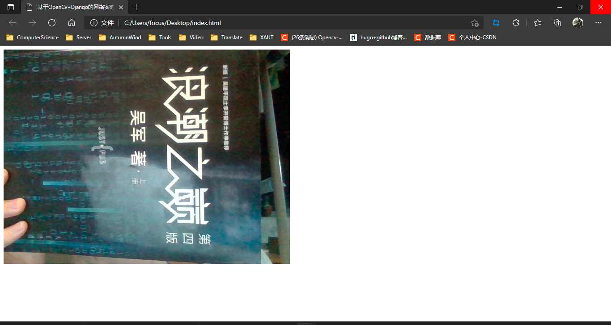
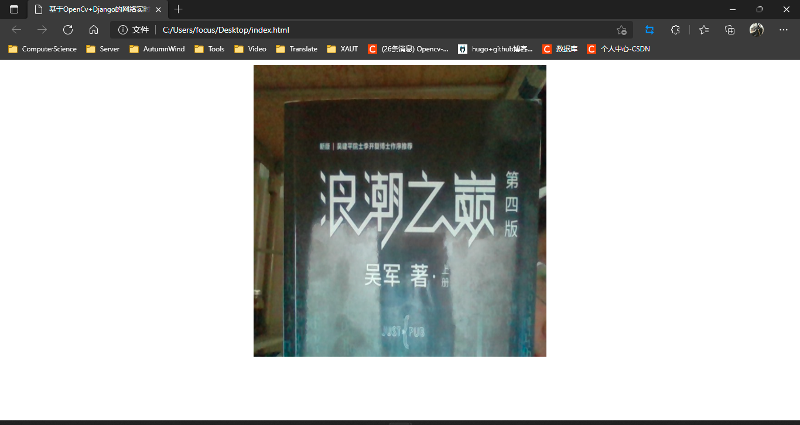

使用OpenCv捕获摄像机画面后，我们有时候需要将画面显示在界面上。本博客基于Django的前后端分离模式，将视频流从后端读取，传送给前端显示。

# Django流传输实例：StreamingHttpResponse

在使用Django进行视频流传输时，无法使用HttpResponse，JsonResponse等对象对内容直接传输，需要使用StreamingHttpResponse流式传输一个响应给浏览器。StreamingHttpResponse不是HttpResponse的子类，因此他们之间的API略有不同。StreamingHttpResponse与HttpResponse之间有以下显著区别：

* 应该给StreamingHttpResponse一个迭代器，产生字节字符串作为内容。
* 不应该直接访问StreamingHttpResponse的内容，除非通过迭代器响应对象本身。
* StreamingHttpResponse没有content属性。相反，他有一个streaming_content属性。
* 无法使用类文件对象的tell()何write()方法。这样会引起一个异常。

# Django传输视频流

因为使用Django的StreamingHttpResponse类进行流传输，所以我们首先需要生成一个视频流的迭代器，在迭代器中，需要将从opencv中获取到的numpy.ndarray三维数组转换为字节类型的，然后传输到前端。

**传输视频流：**

1. 读取图片
2. 图片压缩（针对分辨率较高的界面）
3. 对图片进行解码
4. 转换为byte类型
5. 传输视频流

```python
import cv2
from django.http import StreamingHttpResponse


def gen_display(camera):
    """
    视频流生成器功能。
    """
    while True:
        # 读取图片
        ret, frame = camera.read()
        if ret:
            # 将图片进行解码
            ret, frame = cv2.imencode('.jpeg', frame)
            if ret:
                # 转换为byte类型的，存储在迭代器中
                yield (b'--frame\r\n'
                       b'Content-Type: image/jpeg\r\n\r\n' + frame.tobytes() + b'\r\n')


def video(request):
    """
    视频流路由。将其放入img标记的src属性中。
    例如：
    """
    # 视频流相机对象
    camera = cv2.VideoCapture(0)
    # 使用流传输传输视频流
    return StreamingHttpResponse(gen_display(camera), content_type='multipart/x-mixed-replace; boundary=frame')
```

在使用海康威视等分辨率较高的相机时，直接解码，延迟过高，所以需要先对图片进行压缩，然后解码。

> 经测试，海康相机使用0.25的压缩倍率显示压缩效率较好，当大于0.25时，延迟较高，小于0.25时，界面显示较差

**迭代器优化：**

```python
def gen_display(camera):
    """
    视频流生成器功能。
    """
    while True:
        # 读取图片
        ret, frame = camera.read()
        if ret:
            frame = cv2.resize(frame, (0, 0), fx=0.25, fy=0.25)
            # 将图片进行解码
            ret, frame = cv2.imencode('.jpeg', frame)
            if ret:
                # 转换为byte类型的，存储在迭代器中
                yield (b'--frame\r\n'
                       b'Content-Type: image/jpeg\r\n\r\n' + frame.tobytes() + b'\r\n')
```

# 前端显示视频流

在Django中配置路由后，在浏览器端直接访问视频url即可看到视频显示画面。
在前端HTML5中，将视频路由写入img标签的src属性中，即可访问视频流界面。例如：
<html lang="en">
<head>
    <meta charset="UTF-8">
    <meta http-equiv="X-UA-Compatible" content="IE=edge">
    <meta name="viewport" content="width=device-width, initial-scale=1.0">
    <title>基于OpenCv+Django的网络实时视频流传输（前后端分离）</title>
</head>
<body>
    <!-- 显示视频流 -->
    
</body>
</html>
```

**显示结果：**

<div style="text-align: center;">
    
</div>

在前端显示视频流中，可以通过调整img标签的属性来调整界面显示位置，显示大小。所以在进行视频流前后端传输中，在保证视频显示清晰度的情况下，建议使用前端来调整界面大小。

**调整界面前端显示视频样式：**

```html
<!DOCTYPE html>
<html lang="en">
<head>
    <meta charset="UTF-8">
    <meta http-equiv="X-UA-Compatible" content="IE=edge">
    <meta name="viewport" content="width=device-width, initial-scale=1.0">
    <title>基于OpenCv+Django的网络实时视频流传输（前后端分离）</title>
    <style>
        #video {
            width: 500px;
            height: 500px;
        }
    </style>
</head>
<body>
    <!-- 显示视频流 -->
    <div align="center"></div>
</body>
</html>
```

**显示结果：**

<div style="text-align: center;">
    
</div>

# 视频流传输优化

在项目中，我们可能经常需要对多个相机进行处理，而不是对一个相机进行操作，所以我们可以使用相机工厂来获取相机。在实例化相机后，需要开启一个线程，及时更新缓存队列，确保OpenCv不会因为缓存过多而造成缓存区堵塞，界面延迟。

* 使用线程实时读取OpenCv的内容到队列中
* 使用相机工厂来获取相机

> 在示例代码中，camera_model为自定义model，其中代码需要用到的数据有数据表记录的唯一标识id，相机的访问api：camera_api

**相机类：**

```python
import queue
import threading

import cv2

from apps.device.models import Camera


class CameraException(Exception):
    message = None

    # 初始化异常
    def __init__(self, message: str):
        # 初始化异常，定位异常信息描述
        self.message = message

    def __str__(self):
        return self.message


class BaseCamera:
    # 相机操作对象
    cam = None
    # 保存每一帧从rtsp流中读取到的画面，使用opencv读取，为BGR图片
    queue_image = queue.Queue(maxsize=10)
    # 后台取帧线程
    thread = None
    # 相机Model
    camera_model = None

    # 相机基类
    def __init__(self, camera_model: Camera):
        """
        使用rtsp流初始化相机参数
        rtsp格式：rtsp://[username]:[password]@[ip]:[port]/[codec]/[channel]/[subtype]/av_stream
        username: 用户名。例如admin。
        password: 密码。例如12345。
        ip: 为设备IP。例如 192.0.0.64。
        port: 端口号默认为554，若为默认可不填写。
        codec：有h264、MPEG-4、mpeg4这几种。
        channel: 通道号，起始为1。例如通道1，则为ch1。
        subtype: 码流类型，主码流为main，辅码流为sub。
        """
        self.cam = cv2.VideoCapture(camera_model.camera_api)
        if self.cam.isOpened():
            # 相机打开成功,启动线程读取数据
            self.thread = threading.Thread(target=self._thread, daemon=True)
            self.thread.start()
        else:
            # 打开失败，相机流错误
            raise CameraException("视频流接口访问失败")

    def _thread(self):
        """
        相机后台进程，持续读取相机
        opencv读取时会将信息存储到缓存区里，处理速度小于缓存区速度，会导致资源积累
        """
        # 线程一直读取视频流，将最新的视频流存在队列中
        while self.cam.isOpened():
            ret, img = self.cam.read()
            if not ret or img is None:
                # 读取相机失败
                pass
            else:
                # 读取内容成功，将数据存放在缓存区
                if self.queue_image.full():
                    # 队列满，队头出队
                    self.queue_image.get()
                    # 队尾添加数据
                    self.queue_image.put(img)
                else:
                    # 队尾添加数据
                    self.queue_image.put(img)

    # 直接读取图片
    def read(self):
        """
        直接读取从rtsp流中获取到的图片，不进行额外加工
        可能为空，需做判空处理
        """
        return self.queue_image.get()

    # 读取视频帧
    def get_frame(self):
        """
        获取加工后的图片，可以直接返回给前端显示
        """
        img = self.queue_image.get()
        if img is None:
            return None
        else:
            # 压缩图片，否则图片过大，编码效率慢，视频延迟过高
            img = cv2.resize(img, (0, 0), fx=0.25, fy=0.25)
            # 对图片进行编码
            ret, jpeg = cv2.imencode('.jpeg', img)
            return jpeg.tobytes()


class CameraFactory:
    """
    相机工厂
    """
    # 存储实例化的所有相机
    cameras = {}

    @classmethod
    def get_camera(cls, camera_id: int):
        # 通过相机id获取相机
        camera = cls.cameras.get(camera_id)
        if camera is None:
            # 查看是否存在相机，存在访问
            try:
                camera_model = Camera.objects.get(id=camera_id)
                base_camera = BaseCamera(camera_model=camera_model)
                if base_camera is not None:
                    cls.cameras.setdefault(camera_id, base_camera)
                    return cls.cameras.get(camera_id)
                else:
                    return None
            except Camera.DoesNotExist:
                # 相机不存在
                return None
            except CameraException:
                # 相机实例失败
                return None
        else:
            # 存在相机，直接返回
            return camera
```

**Django views.py：**

```python
from django.http import StreamingHttpResponse

from apps.device.Camera import CameraFactory, BaseCamera


def gen_display(camera: BaseCamera):
    """
    视频流生成器功能。
    """
    while True:
        # 读取图片
        frame = camera.get_frame()
        if frame is not None:
            yield (b'--frame\r\n'
                   b'Content-Type: image/jpeg\r\n\r\n' + frame + b'\r\n')


def video(request):
    """
    视频流路由。将其放入img标记的src属性中。
    例如：
    """
    # 视频流相机对象
    camera_id = request.GET.get('camera_id')
    camera: BaseCamera = CameraFactory.get_camera(camera_id)
    # 使用流传输传输视频流
    return StreamingHttpResponse(gen_display(camera), content_type='multipart/x-mixed-replace; boundary=frame')
```
