# 一：实验内容
1. 掌握python进行图像处理、了解opencv-python库的使用
2. 基于robert、prewitt、sobel算子完成图像边缘提取
3. 了解SUSAN、Harris、SIFT算子的特征检测
# 二：实验过程
## （一）边缘提取
### （1）卷积算子
#### a：robert交叉算子

<div style="text-align: center;">
    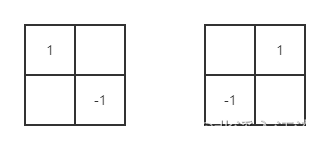
</div>

#### b：prewitt算子

<div style="text-align: center;">
    
</div>

#### c：sobel算子

<div style="text-align: center;">
    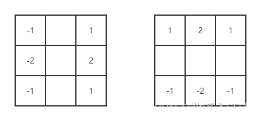
</div>

#### d：laplacian算子

<div style="text-align: center;">
    
</div>

### （2）实验代码
```python
import cv2
import numpy as np


def _edge_extraction(img: np.ndarray, kernel_method='robert'):
    """
    边缘提取
    :param img: 需要进行边缘提取的图，COLOR：BGR
    :param kernel_method: 边缘提取算子名称，全小写
    :return: x方向（0.5x）和y方向（0.5y）边缘提取的加权和
    """
    # 转换为灰度图
    gray = cv2.cvtColor(img, cv2.COLOR_BGR2GRAY)
    # 边缘提取算子
    if 'robert' == kernel_method:
        kernel_x = np.array([[-1, 0], [0, 1]], dtype=int)
        kernel_y = np.array([[0, -1], [1, 0]], dtype=int)
    elif 'prewitt' == kernel_method:
        kernel_x = np.array([[-1, 0, 1], [-1, 0, 1], [-1, 0, 1]], dtype=int)
        kernel_y = np.array([[1, 1, 1], [0, 0, 0], [1, 1, 1]], dtype=int)
    elif 'sobel' == kernel_method:
        kernel_x = np.array([[-1, 0, 1], [-2, 0, -2], [-1, 0, 1]], dtype=int)
        kernel_y = np.array([[1, 2, 1], [0, 0, 0], [-1, -2, -1]], dtype=int)
    elif 'laplacian' == kernel_method:
        kernel_x = np.array([[0, -1, 0], [-1, 4, -1], [0, -1, 0]], dtype=int)
        kernel_y = np.array([[-1, -1, -1], [-1, 8, -1], [-1, -1, -1]], dtype=int)
    else:
        kernel_x = np.array([[-1, 0], [0, 1]], dtype=int)
        kernel_y = np.array([[0, -1], [1, 0]], dtype=int)
    # 进行边缘提取
    filter_x = cv2.filter2D(gray, ddepth=-1, kernel=kernel_x)
    filter_y = cv2.filter2D(gray, ddepth=-1, kernel=kernel_y)
    # x方向和y方向加权
    img_add_weight = cv2.addWeighted(filter_x, 0.5, filter_y, 0.5, 0)
    return img_add_weight


def image_show(img: np.ndarray, title='img'):
    """
    显示图片
    :param img:
    :param title:
    :return:
    """
    cv2.namedWindow(title)
    cv2.imshow(title, img)
    cv2.waitKey(0)


def edge_extraction(path: str, kernel_method='robert'):
    # 读取图片
    img = cv2.imdecode(np.fromfile(path, dtype=np.uint8), cv2.IMREAD_COLOR)
    # 边缘提取
    img_extraction = _edge_extraction(img, kernel_method=kernel_method)
    # 显示图片
    image_show(img_extraction, kernel_method)
```
## （二）特征点检测
### （1）实验代码
```python
import cv2
import numpy as np


def feature_point_detection_susan(img: np.ndarray):
    """
    susan特征点检测
    :param img:
    :return:
    """
    # susan算子
    susan_operator = np.ones((7, 7))
    susan_operator[0, 0] = 0
    susan_operator[0, 1] = 0
    susan_operator[0, 5] = 0
    susan_operator[0, 6] = 0

    susan_operator[1, 0] = 0
    susan_operator[1, 6] = 0

    susan_operator[5, 0] = 0
    susan_operator[5, 6] = 0

    susan_operator[6, 0] = 0
    susan_operator[6, 1] = 0
    susan_operator[6, 5] = 0
    susan_operator[6, 6] = 0

    dst = img.astype(np.float64)
    # 检测阈值
    threshold = 37 / 2
    # 像素偏差阈值
    t = 10

    for i in range(3, dst.shape[0] - 3):
        for j in range(3, dst.shape[1] - 3):
            # ir：中心位置像素，ir0周边位置像素
            # 获取矩形区域
            ir = np.array(dst[i - 3:i + 4, j - 3:j + 4])
            # 使用susan算子截取圆形区域
            ir = ir[1 == susan_operator]
            ir0 = dst[i, j]
            # 平滑曲线相似变换：c = e的[-((ir - ir0)/6))的6次方]的次方，表示相似还是不相似
            similarity = np.sum(np.exp(-((ir - ir0) / t) ** 6))
            # 小于阈值，提取特征点
            if similarity < threshold:
                img[i, j, 2] = 255
    return img


def feature_point_detection_harris(img: np.ndarray):
    """
    harris特征点检测
    :param img:
    :return:
    """
    # 转换为灰度图
    gray = cv2.cvtColor(img, cv2.COLOR_BGR2GRAY)
    # Harris特征点检测
    # 检测窗口大小
    block_size = 2
    # Sobel的卷积核
    k_size = 3
    # 权重系数
    k = 0.04
    dst = cv2.cornerHarris(gray, block_size, k_size, k)
    # 在原图上绘制关键点
    img[dst > 0.01 * dst.max()] = [0, 0, 255]
    return img


def feature_point_detection_sift(img: np.ndarray):
    """
    sift特征点检测
    :param img:
    :return:
    """
    # 转换为灰度图
    gray = cv2.cvtColor(img, cv2.COLOR_BGR2GRAY)
    # 创建SIFT对象
    sift = cv2.SIFT_create()
    # SIFT关键点检测
    kernel_point = sift.detect(gray, None)
    # 在原图绘制关键点
    cv2.drawKeypoints(gray, kernel_point, img)
    return img


def image_show(img: np.ndarray, title='img'):
    """
    显示图片
    :param img:
    :param title:
    :return:
    """
    cv2.namedWindow(title)
    cv2.imshow(title, img)
    cv2.waitKey(0)


def feature_point(path: str, kernel_method='susan'):
    # 读取图片
    img = cv2.imdecode(np.fromfile(path, dtype=np.uint8), cv2.IMREAD_COLOR)
    # 特征检测
    if 'susan' == kernel_method:
        img_feature_point = feature_point_detection_susan(img)
    elif 'harris' == kernel_method:
        img_feature_point = feature_point_detection_harris(img)
    elif 'sift' == kernel_method:
        img_feature_point = feature_point_detection_sift(img)
    else:
        img_feature_point = feature_point_detection_susan(img)
    # 显示图片
    image_show(img_feature_point, kernel_method)
```
# 三：实验结果及分析
## （一）边缘提取
### （1）实验原图

<div style="text-align: center;">
    
</div>

### （2）robert算子

<div style="text-align: center;">
    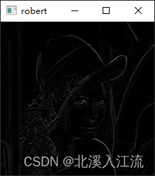
</div>
提取时间：0.0020003318786621094

### （3）prewitt算子

<div style="text-align: center;">
    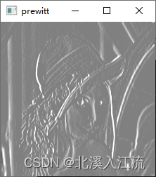
</div>
提取时间：0.0010013580322265625

### （3）sobel算子

<div style="text-align: center;">
    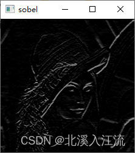
</div>
提取时间：0.002001523971557617

### （4）laplacian算子

<div style="text-align: center;">
    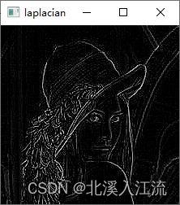
</div>
提取时间：0.001997232437133789

### （5）综合对比

<div style="text-align: center;">
    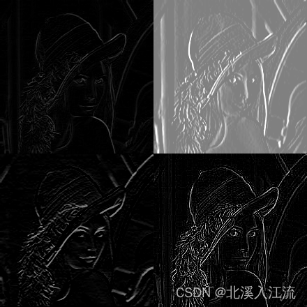
</div>

- robert提取时间：0.0020003318786621094
- prewitt提取时间：0.0010013580322265625
- sobel提取时间：0.002001523971557617
- laplacian提取时间：0.001997232437133789

通过上图可以看出，laplacian二阶算子的边缘提取算子的提取效果明显优于robert，prewitt，sobel等一阶算子。且一阶算子和二阶算子在提取的时间上和算法的复杂度上相差不大，所以在实验中，如果有特征提取需求的话，可以尽量多采用二阶算子进行边缘提取。

## （二）特征点检测
### （1）实验原图

<div style="text-align: center;">
    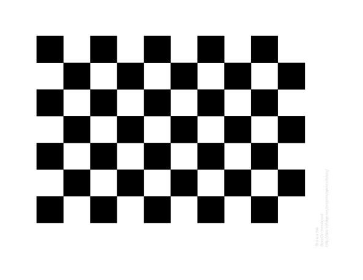
</div>

### （2）susan特征点检测

<div style="text-align: center;">
    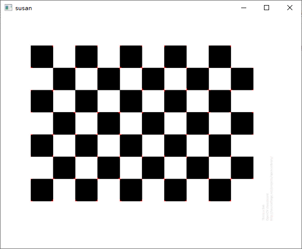
</div>

### （3）harris特征点检测

<div style="text-align: center;">
    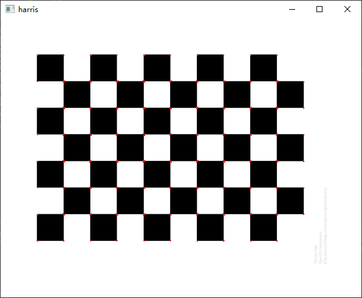
</div>

### （4）sift特征点检测

<div style="text-align: center;">
    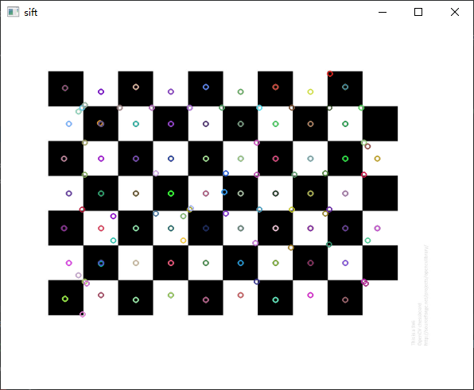
</div>

### （5）综合对比

<div style="text-align: center;">
    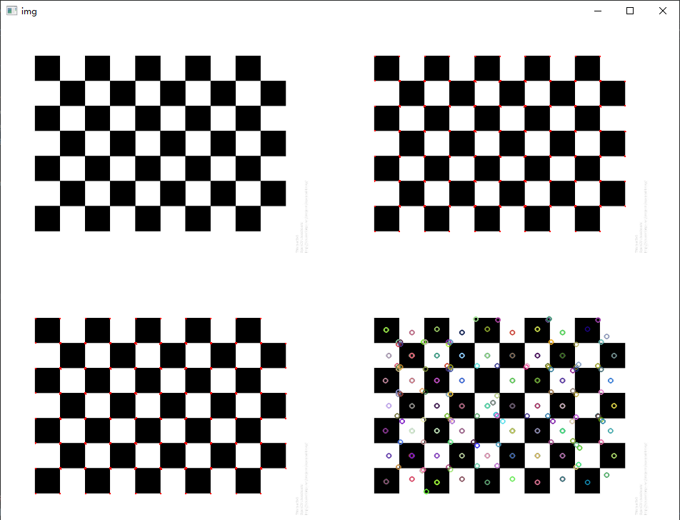
</div>

在实验中，因为opencv不提供（或本人没有找到）有关susan的特征点检测的函数，所以susan特征点检测是自己写的，相比于其他特征点检测直接调用底层库较慢。在三个检测图片中，可以发现sift特征点检测检测到的特征点更多，其他检测是边缘特征点，二sift不仅检测了边缘特征点，也检测出了中心特征点。