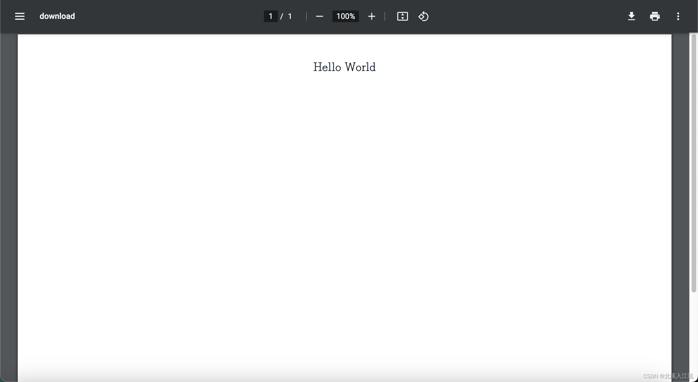

## 安装FPDF
```shell
pip install fpdf2==2.7.4
```

## 生成PDF文档
**通过FPDF生成PDF文档的具体步骤：**
- 初始化：fpdf库的操作主要由`FPDF`对象来处理，在生成PDF文档时，需要初始化`FPDF`对象。
- 添加页面：初始化的`FPDF`对象默认时空白文档，需要在对象中调用`add_page()`方法来添加新的页面。如果页面已经存在，首先调用`footer()`方法来输出页脚，在添加新页面，调用`header()`方法显示页眉。
  - 设置页面方向：在调用`add_page()`方法时可以通过设置`orientation`参数来设置页面的方向。
    - portrait, p, P: 纵向，默认方向
    - landscape, l, L: 横向
- 在页面上打印设置文本之前，需要设置PDF所用的字体，可以调用`add_font()`方法来添加字体，然后调用`set_font()`方法来设置之后打印文本所使用的字体。
- 在页面上打印添加文本内容，需要通过`cell()`或`multi_cell()`方法进行打印
  - cell(): 打印带有可选边框，背景色和字符串的单元格。
  - multi_cell(): 允许使用换行符打印文本。可以说自动的（文本到达单元格的右边框）或显式调用

**参考代码如下所示：**
```python
from fpdf import FPDF

def gen_pdf_file(data):
    pdf = FPDF()
    pdf.add_font('FangSong', '', 'FangSong.ttf', True)
    pdf.set_font('FangSong', size=16)

    pdf.add_page(orientation='L')

    effective_page_with = pdf.w - 2 * pdf.l_margin
    pdf.multi_cell(effective_page_with, 10, txt=str(data).encode().decode('UTF-8'), align='C')
    pdf.output('./test.pdf')

if __name__ == '__main__':
    data = "Hello World!"
    gen_pdf_file(data)
```
调用代码自动生成PDF文件。

## 生成PDF的二进制流
在上面代码的中，我们调用`output()`方法自动生成了PDF文件，但在实际应用中，我们可能不需要直接保存PDF文件，而是直接生成PDF文件的二进制流。由于在进行`multi_cell()`等操作在`FPDF()`对象中添加内容后，此时的`FPDF()`对象仍是一个Python对象，而不是PDF对象，所以需要先将`FPDF()`对象转换为对应的PDF对象，获取其流信息。
观察FPDF库的代码，可以看到，在`FPDF()`对象中执行`output()`函数时，其是通过将`FPDF()`对象的内容进行处理，生成`buffer`内容保存在`FPDF()`对象的属性中，然后写入到文件中。在我们根据`FPDF()`对象生成PDF二进制流时，可以参考其`output()`函数的内容，只生成相应的`buffer`信息，但不将其内容写入到文件中。
```python
import io

from fpdf import FPDF
from fpdf.output import OutputProducer

def _gen_pdf_buffer(pdf: FPDF, output_producer_class=OutputProducer):
    """
    此代码参考FPDF().output()完成，不做深入了解
    """
    # Finish document if necessary
    if not pdf.buffer:
        if pdf.page == 0:
            pdf.add_page()
        # Generating final page footer
        pdf.in_footer = True
        pdf.footer()
        pdf.in_footer = False
        # Generating .buffer based on .pages
        if pdf._toc_placeholder:
            pdf._insert_table_of_contents()
        if pdf.str_alias_nb_pages:
            pdf._substitute_page_number()
        output_producer = output_producer_class(pdf)
        pdf.buffer = output_producer.bufferize()
    return pdf.buffer

def gen_pdf_bytes_io(data):
    pdf = FPDF()
    pdf.add_font('FangSong', '', 'FangSong.ttf', True)
    pdf.set_font('FangSong', size=16)

    pdf.add_page(orientation='L')

    effective_page_with = pdf.w - 2 * pdf.l_margin
    pdf.multi_cell(effective_page_with, 10, txt=str(data).encode().decode('UTF-8'), align='C')
    
    buffer = _gen_pdf_buffer(pdf)
    return io.BytesIO(buffer)
```
上面的代码为生成FPDF对象二进制流的主要代码，通过flask的`send_file()`方法验证如下：
```python
@app.route('/download')
def download_file():
    return send_file(gen_pdf_bytes_io("Hello World"), mimetype='application/pdf')
```
如下图所示，可以看到以上方法成功生成了PDF二进制流。

