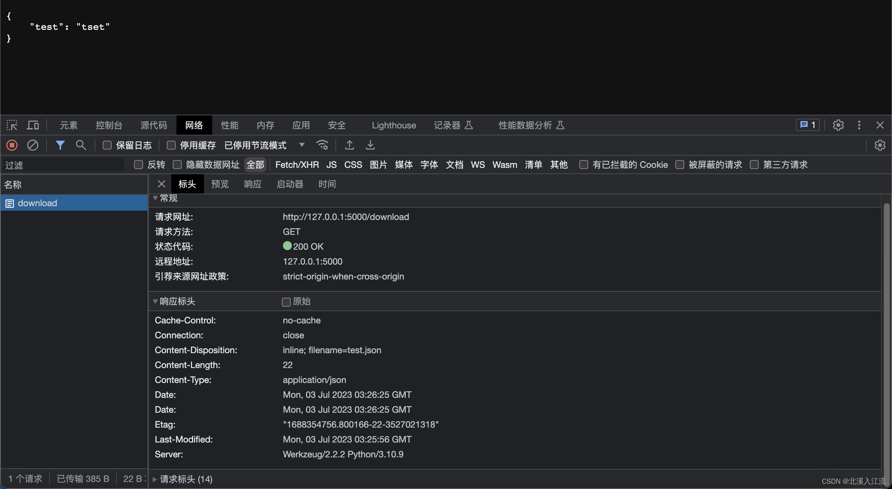

在使用flask框架时，我们有时需要向前端传输文件。或者需要用户访问一个url时直接下载文件。这时可以使用flask.send_file()函数来实现相关的操作。

## flask.send_file函数常用参数描述
- path_or_file：需要发送的文件路径或者二进制文件对象
- mimetype：文件的MIME类型，如果没有设置，会尝试根据文件名进行检测
- as_attachment：布尔类型（默认False），为True表示下载保存文件，为False表示前端显示
- download_name：保存文件时附件的默认名称，默认为文件名

## url直接下载文件
**flask.send_file的简单实现如下：**
```python
from flask import Flask
from flask import send_file

app = Flask(__name__)

@app.route('/download')
def download_file():
    return send_file('test.json')

if __name__ == '__main__':
    app.run(debug=True)
```

可以看到，调用`flask.send_file()`函数返回前端后，前端并没有直接下载文件，而是根据文件的类型显示的文件的具体内容。`flask.send_file()`在不传递`mimetype`参数的情况下，会根据文件名自动尝试判断判断文件的MIME类型。当遇到不常见文档或前端无法正常显示或下载的文档，可以手动进行`mimetype`参数的配置，而不是自动获取。
如果需要前端访问url，自动下载，可以配置`as_attachment`参数为`True`，访问url后，就不会显示文件内容而是自动下载需要的附件。
```python
from flask import Flask
from flask import send_file

app = Flask(__name__)

@app.route('/download')
def download_file():
    return send_file('test.json', as_attachment=True)

if __name__ == '__main__':
    app.run(debug=True)
```

## flask.send_file文件传输
### 本地文件传输
如上面的flask.send_file的简单实现所示，后端设置当前需要传输的文件路径即可将内容传输到前端显示或下载。

### 二进制流传输
通过文件路径的传输方式可以直接进行文件的传输。但是，随着分布式和微服务的发展，我们的后端服务可能并未部署在一台机器上，或有时候我们并没有需要传输的本地文件。此时，就可以合理的通过二进制流传输来实现相关的需求。
对于本地并没有文件，需要远程获取文件的方式有两种实现方式：
- 获取文件，保存到本地，然后本地在转发给前端（不推荐）
- 获取文件的二进制流，将二进制流传输到前端显示（推荐）

在二进制流传输的时候，因为是通过的流传输，flask无法自动判断文件的具体类型和文件名等信息，所以需要自己手动设置`mimetype`和`download_name`等参数信息。
**获取二进制流的参考代码：**
```python
import io

from flask import Flask
from flask import send_file

app = Flask(__name__)

def get_binary_io():
    with open('test.json', 'r', encoding='UTF-8') as file:
        bytes_io = io.BytesIO(file.read().encode())
    return bytes_io

@app.route('/download')
def download_file():
    return send_file(get_binary_io(), mimetype='application/json')

if __name__ == '__main__': 
    app.run(debug=True)
```
为更方便演示，在示例中，通过读取本地文件转换为二进制流的方式进行演示，本质原理是一样的。