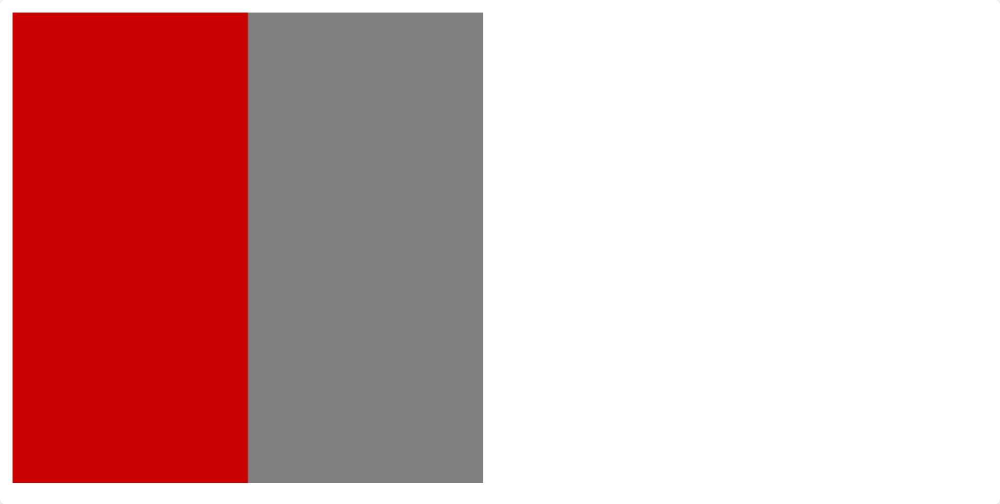
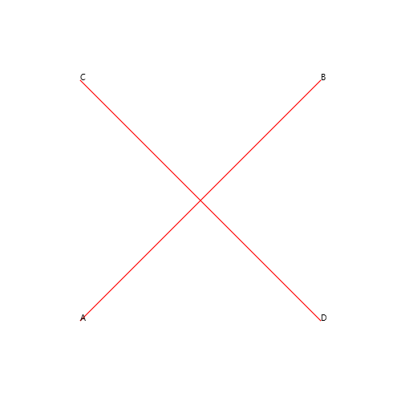
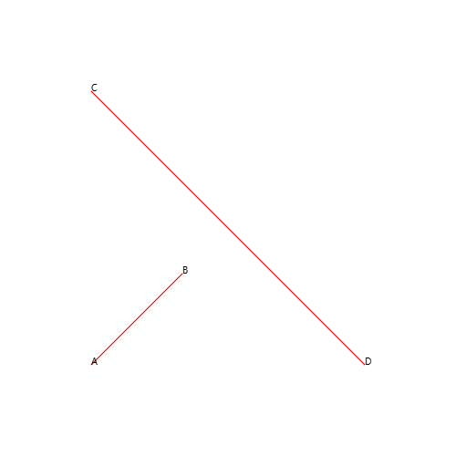

# Canvas
在前端开发中，一般通过`<canvas>`标签和JavaScript脚本来绘制HTML图形元素。如绘制图表，图片，构图，动画等内容。

Canvas 默认大小为 **300px * 150px**，当然也可以通过 HTML 属性来修改 Canvas 的大小。在使用 Canvas 时，通过 Javascript 获取 Canvas 对象进行动态绘制内容。

## Canvas元素
```html
<canvas id="canvas-container" width="300" height="150"></canvas>
```
`<canvas>`标签只有两个可选属性 `width` 和 `height`，当不指定属性时，Canvas 默认大小为**300px * 150px**。

该元素也可以通过 CSS 来定义大小，修改 CSS 尺寸后，Canvas会自动伸缩以适应该尺寸。但请注意：通过`width` 和 `height`指定的为画布尺寸，通过 CSS 指定的为HTML元素尺寸，这两个尺寸不是统一概念。
- 当指定画布尺寸未指定HTML元素尺寸时：Canvas显示尺寸为画布尺寸，在对画布进行绘制时，画布大小和像素坐标以画布尺寸为准。
- 当指定HTML元素尺寸未指定画布尺寸时：Canvas显示尺寸为HTML元素尺寸，但是对画布绘制时，画布大小和像素坐标未画布尺寸。画布内容会被自动拉伸为HTML元素尺寸。在显示时，会造成扭曲现象。

### 示例与画布扭曲现象
```html
<!DOCTYPE html>
<html lang="en">
<head>
    <meta charset="UTF-8">
    <meta name="viewport" content="width=device-width, initial-scale=1.0">
    <title>使用Canvas绘制不规则图形</title>
    <style type="text/css">
        #canvas-container {
            background-color: grey;
            width: 300px;
            height: 300px;
        }
    </style>
    <script text="application/javascript">
        function draw() {
            let canvas = document.getElementById("canvas-container");
            if (canvas.getContext) {
                let ctx = canvas.getContext("2d");
                ctx.fillStyle = "rgb(200, 0, 0)";
                ctx.fillRect(0, 0, 150, 150);
            }
        }
    </script>
</head>

<body onload="draw();">
    <canvas id="canvas-container"></canvas>
</body>
</html>
```


如以上代码示例，通过`ctx.fillRect(0, 0, 150, 150);`方法绘制一个宽150px，高150px的正方形，但是在显示时确为长方形。因为在 Canvas 元素中未设置 Canvas 画布尺寸，所以默认画布尺寸为 **300px * 150px**，但是HTML元素尺寸却为**300px * 300px**，所以 Canva 画布自动将高度进行了拉伸，导致在画布中，实际绘制为正方形，但是显示内容缺位长方形。

### Canvas的基本用法
通过Html标签`<canvas></canvas>`声明画布，但是要对画布上的内容进行绘制却要通过JavaScript进行定义，所以在JavaScript中我们要获取对应 canvas 标签及其上下文以进一步操作。

在 Canva 元素中，通过 `canvas.getContext`属性获取 Canvas 画布的支持性，通过`canvas.getContext()`方法获取 Canvas 画布的渲染上下文信息，并对该内容进行绘制。在 Canvas 画布中支持多种上下文内容，这里我们仅关注2D渲染上下文`CanvasRenderingContext2D`;

```javascript
let canvas = document.getElementById("#canvas-container");

if (canvas.getContext) {
  let ctx = canvas.getContext("2d");
  // 进行后续绘画
} else {
  // 不支持 Canvas 画布，进行其他兼容性操作
}
```

### 常用API
- 矩形：
    - fillRect(x, y, width, height)：绘制一个填充矩形
    - strokeRect(x, y, width, height)：绘制一个矩形边框
    - clearRect(x, y, width, height)：清理指定区域
- 路径：
    - beginPath()：新建一条路径，生成之后，图形绘制命令被指向到路径上生成路径
    - closePath()：闭合路径之后图形绘制命令又重新指向到上下文中
    - stroke()：通过线条来绘制图形轮廓
    - fill()：通过填充路径的内容区域生成实心的图形
    - moveTo(x, y)：将笔触移动到指定的坐标 x 以及 y 上
    - lineTo(x, y)：绘制一条从当前位置到指定 x 以及 y 位置的直线
- 图像视频：
    - drawImage(image, x, y)：在 x 和 y 坐标处绘制图像
    - 获取视频源，通过 drawImage() 进行绘制
- 样式设置：
    - 色彩：
        - fillStyle = color：设置图形的填充颜色
        - strokeStyle = color：设置图形轮廓的颜色
    - 线形：
        - lineWidth = value：设置线条宽度

# 绘制不规则图形
通过Canvas绘制不规则图形时，我们通过鼠标点击事件创建一个点，在多点之间进行连线绘制不规则多边形，当我们的鼠标移动时，自动描绘上一个点与当前鼠标所在位置之间的连线，当鼠标移动时，我们需要清除上一个点与鼠标之前的连线，若是通过`clearRect()`方法进行清除，有可能会将不规则多边形的其他边清除掉，所以在不规则多边形的绘制中，我们采用2个 Canvas 画布进行绘制，一个画布保留以绘制内容，一个画布进行动态绘制。

```html
<!-- 通过position让连个画布的HTML元素重叠 -->
<canvas id="canvas-container" style="position: absolute;"></canvas>
<canvas id="temp-canvas-container" style="position: absolute;"></canvas>
```

## 初始化画布上下文
```javascript
let canvas;
let ctx;
let tempCanvas;
let tempCtx;

function initCanvas(canvasId, tempCanvasId) {
    canvas = document.getElementById(canvasId);
    if (canvas.getContext) {
        ctx = canvas.getContext("2d");
        canvas.addEventListener('mousedown', mousedown);
    }
    tempCanvas = document.getElementById(tempCanvasId);
    if (tempCanvas.getContext) {
        tempCtx = tempCanvas.getContext("2d");
        tempCanvas.addEventListener('mousedown', mousedown);
    }
}
```
> 注意：在初始化画布时，必须要对应元素存在才可以获取画布元素，所以必须要在HTML渲染完成后执行相应操作

## 点击事件
当开始绘制不规则图形时，点击画布，绘制一个点，并与上一个点连线，同时，为保证不规则图形的正确闭合，在绘制结束后，需要判断图形是否有穿线行为，所以在整个不规则图形的绘制过程中，我们需要记录在绘制过程中的所有点位。

```javascript
const CANVAS_WIDTH = 300;
const CANVAS_HEIGHT = 150;
const MAX_POINT_NUM = 8;

// 记录所有点位
let pointList = [];
// 记录当前闭合状态
let closeStatus = false;

// 鼠标按下事件：开始绘制图形
const mousedown = (e) => {
    // 记录当前点击点位，并将其转换为画布尺寸
    let pointDown = {
        x: e.offsetX / canvas.offsetWidth * CANVAS_WIDTH,
        y: e.offsetY / canvas.offsetHeight * CANVAS_HEIGHT
    };

    if (pointList.length === 0) {
        // 是第一个点：初始化绘制事件
        ctx.beginPath();
        ctx.moveTo(pointDown.x, pointDown.y);
    } else if (closeStatus) {
        // 图形已闭合：不再绘制
        return;
    } else {
        // 其他点位，和上一个点进行连线
        ctx.lineTo(pointDown.x, pointDown.y);
        ctx.stroke();
    }

    // 记录所有点位
    pointList.push({
        ...pointDown
    });

    // 最大点数，闭合图形
    if (pointList.length >= MAX_POINT_NUM) {
        // 这里采用限制点数的方式进行图形闭合，也可以采用其他方法闭合，如点击起始点附件 x 个元素时进行闭合
        closeFigure();
        return;
    }

    // 鼠标跟随移动
    document.onmousemove = (event) => {
        tempCtx.clearRect(0, 0, CANVAS_WIDTH, CANVAS_HEIGHT);
        tempCtx.beginPath();
        tempCtx.moveTo(pointDown.x, pointDown.y);
        tempCtx.lineTo(event.offsetX / tempCanvas.offsetWidth * CANVAS_WIDTH, event.offsetY / tempCanvas.offsetHeight * CANVAS_HEIGHT);
        tempCtx.stroke();
    }
}
```

## 闭合图形事件
当触发闭合图形事件时，进行图形闭合，连接最后一个点位与初始点位

```javascript
// 重置画布
function clearRect() {
    document.onmousemove = document.onmouseup = null;
    ctx.clearRect(0, 0, CANVAS_WIDTH, CANVAS_HEIGHT);
    tempCtx.clearRect(0, 0, CANVAS_WIDTH, CANVAS_HEIGHT);
    pointList = [];
    closeStatus = false;
}

// 图形闭合
function closeFigure() {
    if (!closeStatus && checkPointCross()) {
        // 存在点位交叉：不符合绘制要求，重绘
        // ToDo: 错误提示
        clearRect();
    };

    if (pointList.length >= MAX_POINT_NUM && !closeStatus) {
        // 符合要求：结束绘制
        document.onmousemove = document.onmouseup = null;
        tempCtx.clearRect(0, 0, CANVAS_WIDTH, CANVAS_HEIGHT);
        ctx.lineTo(pointList[0].x, pointList[0].y);
        ctx.closePath();
        ctx.stroke();
        closeStatus = true;
    }
}
```

### 检测图形是否符合要求
以上内容已经可以实现多个点位的绘制，但是在实际的绘制过程中，若是存在线条和其他线条相交的情况，则最后绘制的图像不符合不规则多边形的要求。



如图所示，上图中线条AB和线条CD相交，若要判断线条AB是否和CD相交，我们只需要做向量AC、向量AD，则向量AB和向量AC叉乘一定和向量AB和向量AD叉乘异号（两向量AC和AD一定分别在向量AB的顺时针方向和逆时针方向。根据右手定则，则必有一叉乘结果 > 0，一叉乘结果 < 0）。



虽然AB月CD相交可以通过向量叉乘判断，但是实际上，还存在上图这种情况，虽然向量叉乘结果异号，但是仍有AB与CD不相交。针对这种情况，只需要切换原点，以C点位原点，做向量CA、向量CB，则必有向量CD和向量CA的叉乘结果与向量CD和向量CB的叉乘结果同号的情况。所以在实际的判断中，我们只需要判断2次，即可确定线条之间是否存在相交。

```javascript
// 辅助函数：获取以原点为起点的向量坐标表达式
function getPointVector(startPoint, endPoint) {
    return {
        x: endPoint.x - startPoint.x,
        y: endPoint.y - startPoint.y,
    };
}

// 辅助函数：叉乘
const crossLine = (point1, point2) => {
    return point1.x * point2.y - point2.x * point1.y;
}

/**
* 辅助函数：判断两条线段是否交叉
* 以line1_start_point为点A，line1_end_point为点B，line2_start_point为点C，line2_end_point为点D
* 做两线AB、CD
* 若AB与CD相交：AB与CD呈十字交叉状
*    向量AC与AD异号
* 
* 存在AB与CD呈 |- 形状，此时有向量AC与AD异号，但是不相交的情况
* 做向量CA和向量CB，此时向量同号
* 
* 所以：
*    1.计算向量AC和向量AD的叉乘
*    2.计算向量CA和向量CB的叉乘
*    3.若以上两条计算结果同时满足叉乘 < 0, 则线条交叉
*/
function isLineCross(line1_start_point, line1_end_point, line2_start_point, line2_end_point) {
    let line_AB = getPointVector(line1_start_point, line1_end_point)
    let line_AC = getPointVector(line1_start_point, line2_start_point);
    let line_AD = getPointVector(line1_start_point, line2_end_point);

    let line_CD = getPointVector(line2_start_point, line2_end_point);
    let line_CA = getPointVector(line2_start_point, line1_start_point);
    let line_CB = getPointVector(line2_start_point, line1_end_point);

    let AB_cross_AC = crossLine(line_AB, line_AC)
    let AB_cross_AD = crossLine(line_AB, line_AD);

    let CD_cross_CA = crossLine(line_CD, line_CA);
    let CD_cross_CB = crossLine(line_CD, line_CB);

    if (AB_cross_AC * AB_cross_AD < 0 && CD_cross_CA * CD_cross_CB < 0) {
        return true;
    } else {
        return false;
    }
}

// 检查图形有没有横穿
function checkPointCross(crossAllow = false) {
    if (crossAllow) {
        // 允许横穿，直接返回
        return false;
    }
    if (pointList.length < 3) {
        // 2条连续线条直接必不可能存在横穿现象
        return false;
    }
    // 线条直接相互比较判断是否存在横穿
    for (let i = 0; i < pointList.length - 2; i++) {
        for (let j = i + 1; j < pointList.length; j++) {
            let res = isLineCross(
                pointList[i],
                pointList[i + 1],
                pointList[j],
                pointList[(j + 1) % pointList.length]
            );
            if (res) {
                return true;
            }
        }
    }
    return false;
}
```

## 完整示例
```html
<!DOCTYPE html>
<html lang="en">

<head>
    <meta charset="UTF-8">
    <meta name="viewport" content="width=device-width, initial-scale=1.0">
    <title>使用Canvas绘制不规则图形</title>
    <style type="text/css">
        #canvas-container {
            border: 1px solid red;
        }
    </style>
    <script text="application/javascript">
        let canvas;
        let ctx;
        let tempCanvas;
        let tempCtx;

        // 初始化画布
        function initCanvas(canvasId, tempCanvasId) {
            canvas = document.getElementById(canvasId);
            if (canvas.getContext) {
                ctx = canvas.getContext("2d");
                canvas.addEventListener('mousedown', mousedown);
            }
            tempCanvas = document.getElementById(tempCanvasId);
            if (tempCanvas.getContext) {
                tempCtx = tempCanvas.getContext("2d");
                tempCanvas.addEventListener('mousedown', mousedown);
            }
        }

        const CANVAS_WIDTH = 300;
        const CANVAS_HEIGHT = 150;
        const MAX_POINT_NUM = 8;

        // 记录所有点位
        let pointList = [];
        // 记录当前闭合状态
        let closeStatus = false;

        // 鼠标按下事件：开始绘制图形
        const mousedown = (e) => {
            // 记录当前点击点位，并将其转换为画布尺寸
            let pointDown = {
                x: e.offsetX / canvas.offsetWidth * CANVAS_WIDTH,
                y: e.offsetY / canvas.offsetHeight * CANVAS_HEIGHT
            };

            if (pointList.length === 0) {
                // 是第一个点：初始化绘制事件
                ctx.beginPath();
                ctx.moveTo(pointDown.x, pointDown.y);
            } else if (closeStatus) {
                // 图形已闭合：不再绘制
                return;
            } else {
                // 其他点位，和上一个点进行连线
                ctx.lineTo(pointDown.x, pointDown.y);
                ctx.stroke();
            }

            // 记录所有点位
            pointList.push({
                ...pointDown
            });

            // 最大点数，闭合图形
            if (pointList.length >= MAX_POINT_NUM) {
                // 这里采用限制点数的方式进行图形闭合，也可以采用其他方法闭合，如点击起始点附件 x 个元素时进行闭合
                closeFigure();
                return;
            }

            // 鼠标跟随移动
            document.onmousemove = (event) => {
                tempCtx.clearRect(0, 0, CANVAS_WIDTH, CANVAS_HEIGHT);
                tempCtx.beginPath();
                tempCtx.moveTo(pointDown.x, pointDown.y);
                tempCtx.lineTo(event.offsetX / tempCanvas.offsetWidth * CANVAS_WIDTH, event.offsetY / tempCanvas.offsetHeight * CANVAS_HEIGHT);
                tempCtx.stroke();
            }
        }

        // 重置画布
        function clearRect() {
            document.onmousemove = document.onmouseup = null;
            ctx.clearRect(0, 0, CANVAS_WIDTH, CANVAS_HEIGHT);
            tempCtx.clearRect(0, 0, CANVAS_WIDTH, CANVAS_HEIGHT);
            pointList = [];
            closeStatus = false;
        }

        function closeFigure() {
            if (!closeStatus && checkPointCross()) {
                // 存在点位交叉：不符合绘制要求，重绘
                // ToDo: 错误提示
                clearRect();
            };

            if (pointList.length >= MAX_POINT_NUM && !closeStatus) {
                // 符合要求：结束绘制
                document.onmousemove = document.onmouseup = null;
                tempCtx.clearRect(0, 0, CANVAS_WIDTH, CANVAS_HEIGHT);
                ctx.lineTo(pointList[0].x, pointList[0].y);
                ctx.closePath();
                ctx.stroke();
                closeStatus = true;
            }
        }

        // 辅助函数：获取以原点为起点的向量坐标表达式
        function getPointVector(startPoint, endPoint) {
            return {
                x: endPoint.x - startPoint.x,
                y: endPoint.y - startPoint.y,
            };
        }

        // 辅助函数：叉乘
        const crossLine = (point1, point2) => {
            return point1.x * point2.y - point2.x * point1.y;
        }

        /**
        * 辅助函数：判断两条线段是否交叉
        * 以line1_start_point为点A，line1_end_point为点B，line2_start_point为点C，line2_end_point为点D
        * 做两线AB、CD
        * 若AB与CD相交：AB与CD呈十字交叉状
        *    向量AC与AD异号
        * 
        * 存在AB与CD呈 |- 形状，此时有向量AC与AD异号，但是不相交的情况
        * 做向量CA和向量CB，此时向量同号
        * 
        * 所以：
        *    1.计算向量AC和向量AD的叉乘
        *    2.计算向量CA和向量CB的叉乘
        *    3.若以上两条计算结果同时满足叉乘 < 0, 则线条交叉
        */
        function isLineCross(line1_start_point, line1_end_point, line2_start_point, line2_end_point) {
            let line_AB = getPointVector(line1_start_point, line1_end_point)
            let line_AC = getPointVector(line1_start_point, line2_start_point);
            let line_AD = getPointVector(line1_start_point, line2_end_point);

            let line_CD = getPointVector(line2_start_point, line2_end_point);
            let line_CA = getPointVector(line2_start_point, line1_start_point);
            let line_CB = getPointVector(line2_start_point, line1_end_point);

            let AB_cross_AC = crossLine(line_AB, line_AC)
            let AB_cross_AD = crossLine(line_AB, line_AD);

            let CD_cross_CA = crossLine(line_CD, line_CA);
            let CD_cross_CB = crossLine(line_CD, line_CB);

            if (AB_cross_AC * AB_cross_AD < 0 && CD_cross_CA * CD_cross_CB < 0) {
                return true;
            } else {
                return false;
            }
        }

        // 检查图形有没有横穿
        function checkPointCross(crossAllow = false) {
            if (crossAllow) {
                // 允许横穿，直接返回
                return false;
            }
            if (pointList.length < 3) {
                // 2条连续线条直接必不可能存在横穿现象
                return false;
            }
            for (let i = 0; i < pointList.length - 2; i++) {
                for (let j = i + 1; j < pointList.length; j++) {
                    let res = isLineCross(
                        pointList[i],
                        pointList[i + 1],
                        pointList[j],
                        pointList[(j + 1) % pointList.length]
                    );
                    if (res) {
                        return true;
                    }
                }
            }
            return false;
        }
    </script>
</head>

<body onload="initCanvas('canvas-container', 'temp-canvas-container');">
    <!-- 通过position让连个画布的HTML元素重叠 -->
    <canvas id="canvas-container" style="position: absolute;"></canvas>
    <canvas id="temp-canvas-container" style="position: absolute;"></canvas>
</body>

</html>
```